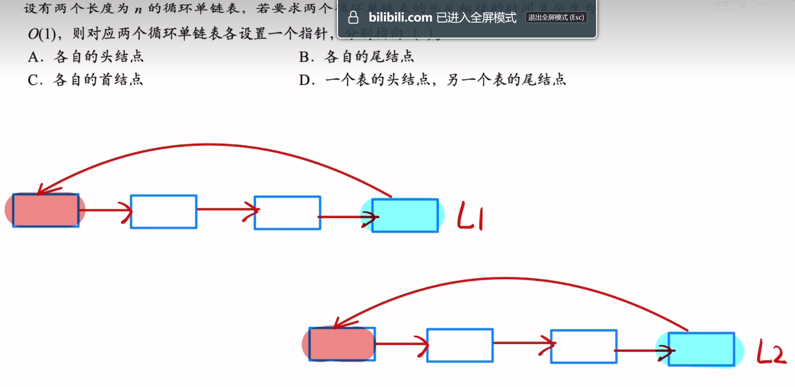
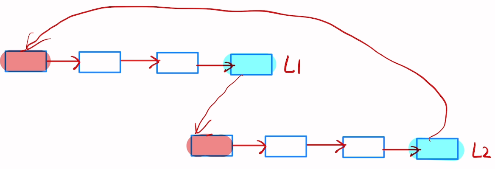
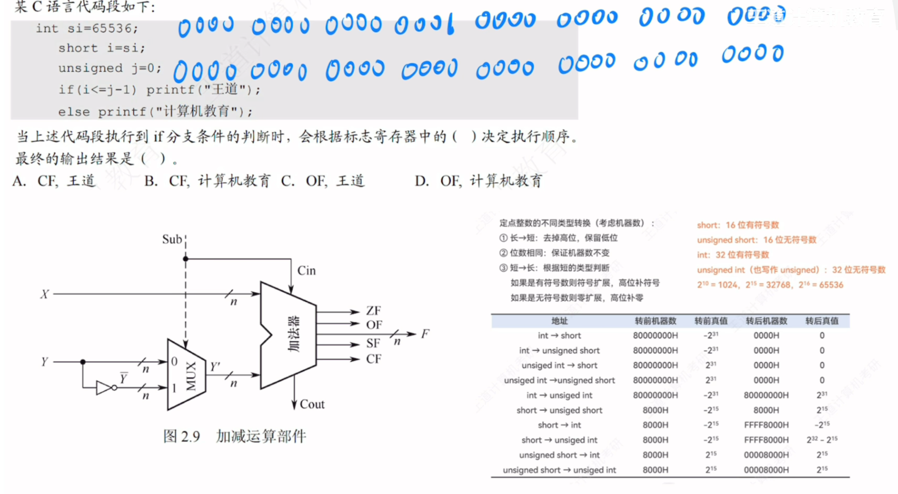
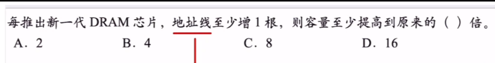

# 数据结构错题
## 链表
- p38_No3
链式存储设计时，结点内的存储单元地址（<u>一定连续</u>）。**注意说的是结点内，结点之间才是可以不连续的**
- p41_No25
- 要求两个循环单链表头尾相接
这道题不能选D，而是选B这是头尾相接后的样子，循环单链表的性质是可以通过尾结点指针找到头结点，如果选了D,那么一个表的头结点，相连之后，为了维持单链表的特性，还需要从头结点往后找到尾结点，时间复杂度就是O(n)了
# 计算机组成原理错题
## 加减运算部件

1. 首先，si的补码如图所示，此时它的值用short型的变量i来接收，也就是长转短，直接高位截断
	1. i=~~0000 0000 0000 0001~~ 0000 0000 0000 0000
2. 第二点，在计算机中判断$if(i \le j-1）$实际上是转换成 i-(j-1)看是否溢出
	1. j是一个无符号数，对于j-1，虽然会发生溢出，但是还是会算出一个数，此时要想到[带标志位加法器（加减运算部件）](带标志位加法器（加减运算部件）.md)加减的原理也就 j-1转换成 j+（1）的补数。1的补数就是：（1111 1111 1111 1111 1111 1111 1111 1111）[补数](原码，反码，补码，补数，移码.md#补数)然后再+j（全0）那么结果就是全1，那么32位全1就是（j-1）的结果
	2. 然后要算 i-(j-1)。i是有符号数，而j-1是无符号数
3. ==无符号数和有符号数一起参与运算时，计算机按无符号数来解释最终的执行结果==
	1. 首先要将i（16位的有符号数）转换成32位的无符号数[整型类型的相互转换](整型类型的相互转换.md)进行符号扩展得到：（i=32位全0）
	2. （j-1）的补数就是32位全1再取反+1，就是（0000 0000 0000 0000 0000 0000 0000 0001）
	3. 逻辑上是if里面（32位全0）-（32位全1）肯定是不够减的,CF=1，实际上根据[CF（Carry Flag）](带标志位加法器（加减运算部件）.md#CF（Carry%20Flag）)的判断逻辑也能算出CF是1
4. 因为CF=1，所以可以知道if条件里 i<j-1的，所以计算机是根据标志寄存器中的CF来进行判断的
5. if条件为真，所以输出 王道
6. 答案为A
---
## p89No19

DRAM芯片是有地址线复用技术的,如果DRAM里地址线是4,那么表示行地址和列地址可表示范围是$2^4$此时总共就会有$2^4\times 2^4=2^8$个存储单元,那么CPU传出的地址就是8位的,现在地址线增加了一根,那么行地址和列地址都变成了$2^5$,总的存储单元就变成了$2^5\times 2^5=2^10$所以容量提高了4