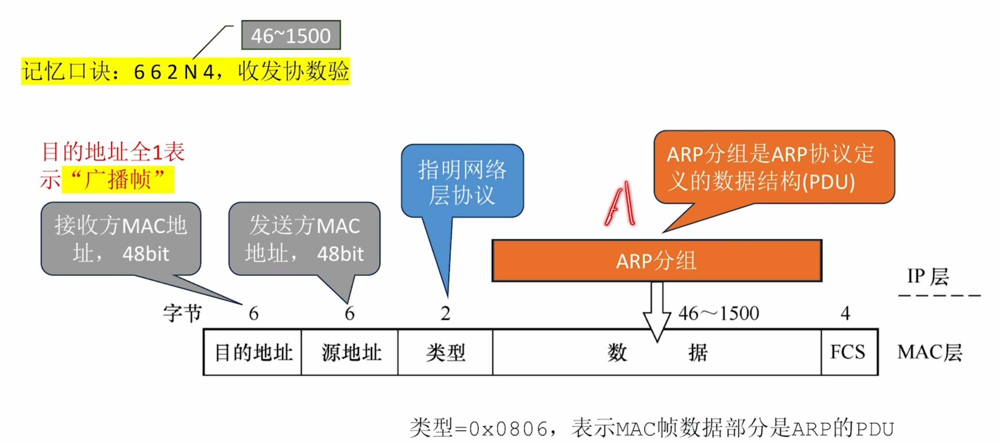
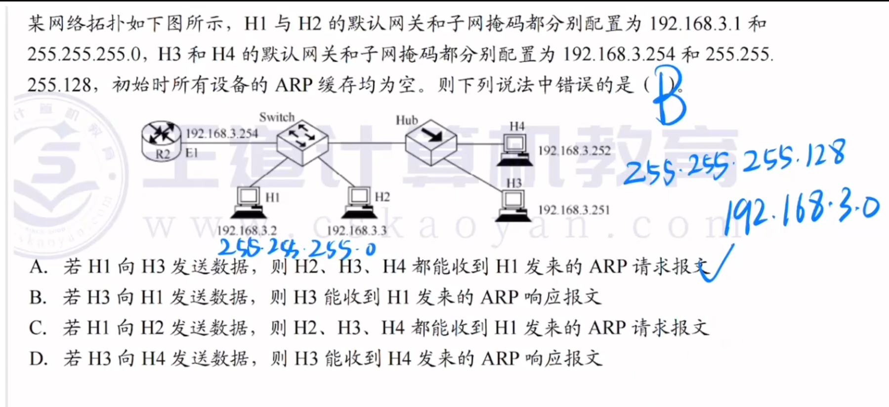

---
tags:
  - 计算机网络
---
# 地址解析协议ARP

ARP的MAC帧

# ARP协议工作原理

>H3->Internet

H3的目的IP是默认网关，但此时ARP表还没有默认网关IP对应的MAC，于是H3会构建一个ARP请求分组（封装成广播帧），里面写上自己的IP和MAC地址
外层：以太网帧头（Ethernet Header

|字段|值|
|---|---|
|目的 MAC|`FF:FF:FF:FF:FF:FF`（广播）|
|源 MAC|发送方自己的 MAC 地址|
|类型（Type）|`0x0806`（表示载荷是 ARP）|
内层：ARP 报文正文

| 字段                  | 值（以 IPv4 over 以太网为例）  |
| ------------------- | --------------------- |
| 硬件类型                | `1`（以太网）              |
| 协议类型                | `0x0800`（IPv4）        |
| 硬件地址长度              | `6`                   |
| 协议地址长度              | `4`                   |
| 操作码                 | `1`（请求）               |
| 发送方硬件地址（Sender MAC） | 发送方自己的 MAC 地址 ← 第一次出现 |
| 发送方协议地址（Sender IP）  | 发送方自己的 IP 地址          |
| 目标硬件地址（Target MAC）  | 全 0（还不知道，填空）          |
| 目标协议地址（Target IP）   | 你想查询的那台机器的 IP         |
>当接收方收到ARP请求分组后，会在自己的ARP表上记录发送方的IP和MAC，然后发送一个ARP响应分组，此时是单播帧

---


>H3-H6,然后H6回应ARP响应的时候，由于连的是集线器，所以H5和H3都会收到ARP响应，不过H5检查单播帧的目的MAC地址和自己的对不上，所以H5的数据链路层不会接收这个帧

# ARP分组的格式

>一个ARP分组只有28B，如果要封装进MAC帧(数据部分46~1500)，则需要填充
>

RARP协议：已知MAC地址->得到IP地址

# 例题

## 分析选项

## A. H1 向 H3 发送数据，H2、H3、H4 都能收到 H1 发来的 ARP 请求报文

判断：

H1：

```
192.168.3.2/24
```

H3：

```
192.168.3.251/25
```

虽然 IP 看起来接近，但是：

H1认为：

```
192.168.3.251 属于自己网段
```

因为 H1 掩码：

255.255.255.0

计算：

```
192.168.3.2 & 255.255.255.0
=
192.168.3.0
```

H3：

```
192.168.3.251 & 255.255.255.0
=
192.168.3.0
```

所以 H1 会认为 H3 在本地网络，直接 ARP 请求 H3 的 MAC。

ARP 广播经过：

交换机 → Hub

所以：

- H2 收到
- H3 收到
- H4 收到

✅ A 正确。

---

## B. H3 向 H1 发送数据，则 H3 能收到 H1 发来的 ARP 响应报文

看 H3：

```
192.168.3.251/25
```

它认为自己的网段：

```
192.168.3.128/25
```

H1：

```
192.168.3.2
```

H3计算：

```
192.168.3.2 不属于 192.168.3.128/25
```

所以 H3 不会 ARP 找 H1。

它会认为 H1 在其他网络，需要发送给默认网关。

但是题目给：

H3默认网关：

```
192.168.3.254
```

而 R2 E1：

```
192.168.3.254/24
```

注意：

R2接口并没有配置 /25。

因此 H3 发给 H1 时：

会 ARP 请求网关192.168.3.254。

不是请求 H1。

所以不会收到 H1 的 ARP 响应。

❌ B 错误。
H3 会发给路由器，然后得到路由器的ARP响应，然后再一次发送目的IP为H1的数据报，可是路由器收到数据报后，发现H1，也就是要转发出去的地址和数据报进来的地址一样，就会直接丢弃这个数据报