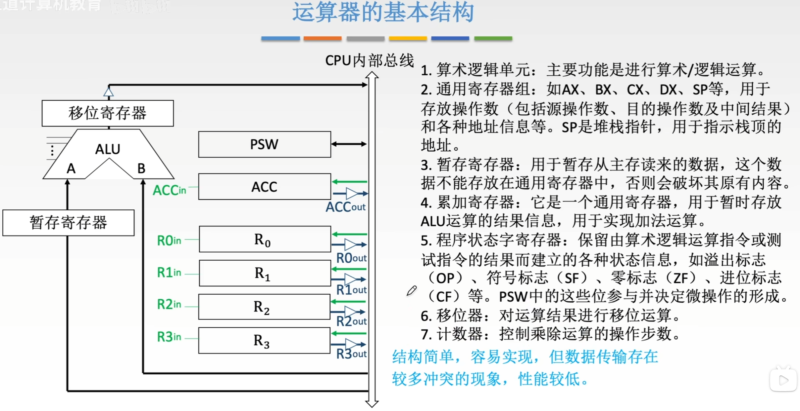
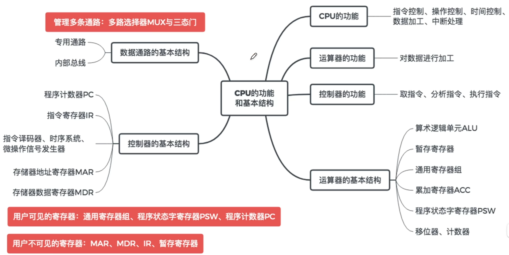

---
tags:
  - 计算机组成原理
---
# CPU的基本结构

>指令[译码器](译码器.md)，时序系统，微操作信号发生器这一块属于控制单元CU
# 运算器的基本结构

[算术逻辑单元（ALU）](算术逻辑单元（ALU）.md)
# 控制器的基本结构

>MDRoutE表示输出到CPU外部的数据总线是否有效
>MDRout表示输出到CPU内部总线的数据是否有效

# 计算机的工作过程

# 总结
