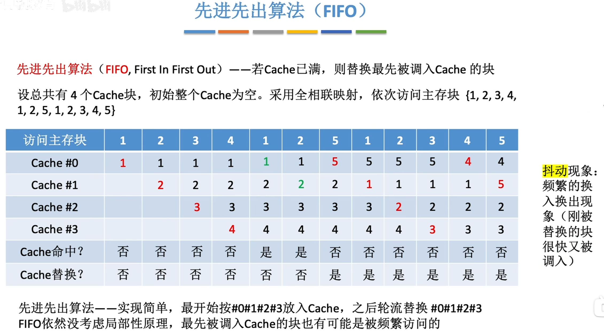
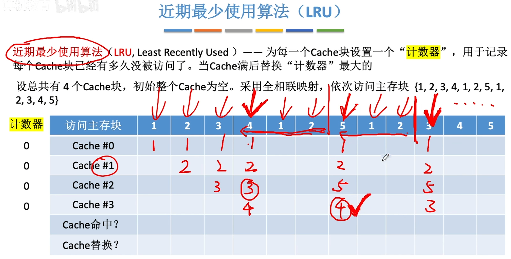
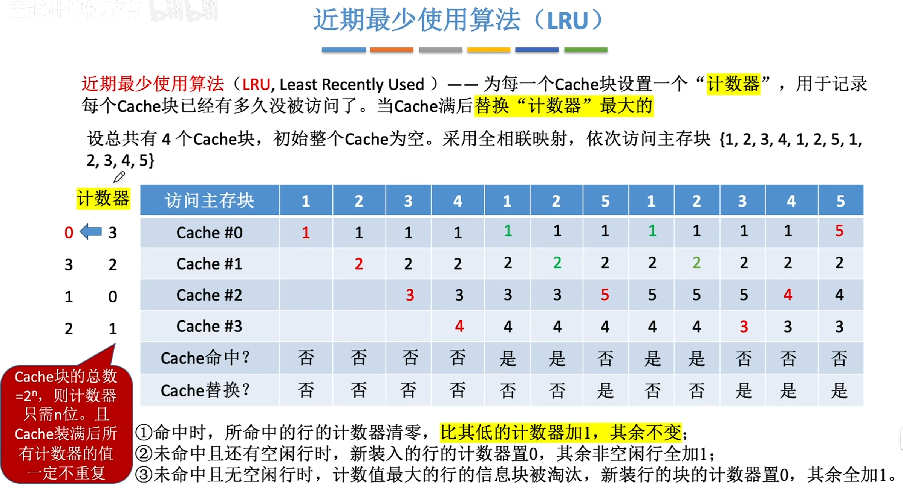
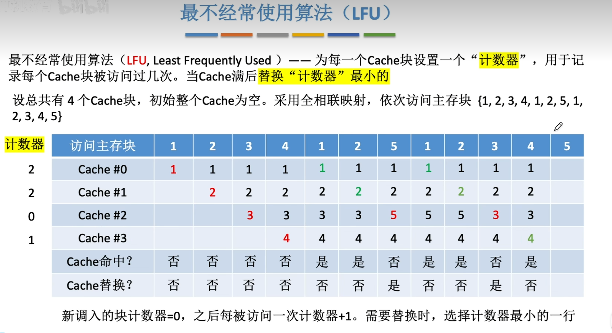
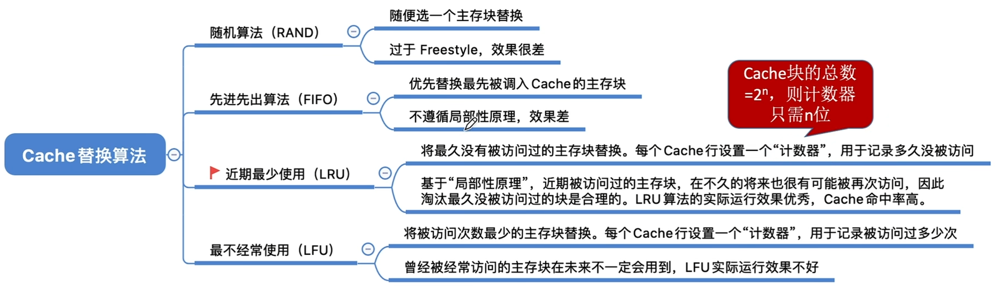

---
tags:
  - 计算机组成原理
---
P114
当Cache未命中时,需从主存块中将该地址所在的一个主存块整体调入Cache
# 随机(RAND)算法

# 先进先出(FIFO)算法

>这个替换是对访问Cache块的顺序来说的,不是访问主存块的顺序
# 近期最少使用算法(LRU)
## 手算做题方法

>访问1,2,3,4,1,2访问到**5**时,需要替换
>从5这个位从后往前数是,2,1,4,(总共4个Cache块,留3个换一个)那么最久没被访问的就是3,所以5是替换主存块3所在的位置

## 计算机内部实现

>命中时,比其低的计数器加1,其余不变
>这个操作的原因是:替换的时候都是替换计数器最大的,对比其大的计数器再加1没有意义,不去改变它也不会改变谁是计数器最大的.并且这样做的好处是使得计数器的取值范围变小,比如图中是4个Cache块,那么计数器的值只会是0,1,2,3且因为不会同时访问Cache块,所以不会出现计数器值相同的情况

*LRU算法一一基于“局部性原理”，近期被访问过的主存块，在不久的将来也很有可能被再次访问，因此淘汰最久没被访问过的块是合理的。LRU算法的实际运行效果优秀，Cache命中率高。
若被频繁访问的主存块数量>Cache行的数量，则有可能发生“抖动”，如：{1,2,3,4,5,1,2,3,4,5,1,2..}*
# 最不经常使用算法(LFU)

*LFU算法一一曾经被经常访问的主存块在未来不一定会用到（如：微信视频聊天相关的块,在使用微信视频聊天的时候,这些块会被一直加到一个很大的数,后面可能不再用到这些块,但这些块因为之前计数器加到很大,所以一直留在Cache里），
并没有很好地遵循局部性原理，因此实际运行效果不如LRU*

# 小结
