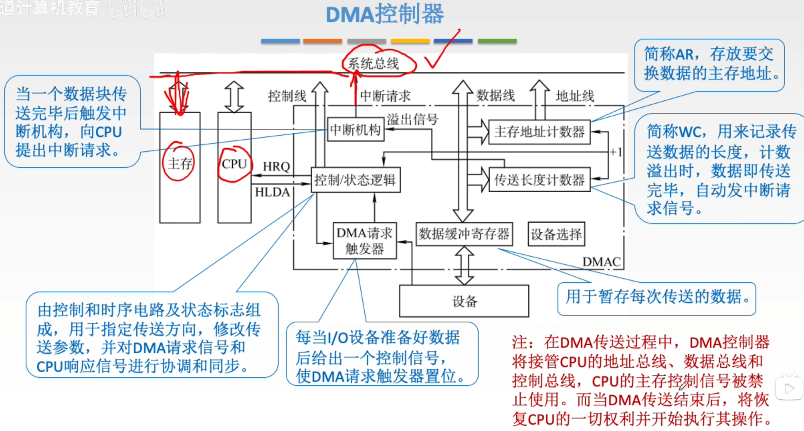
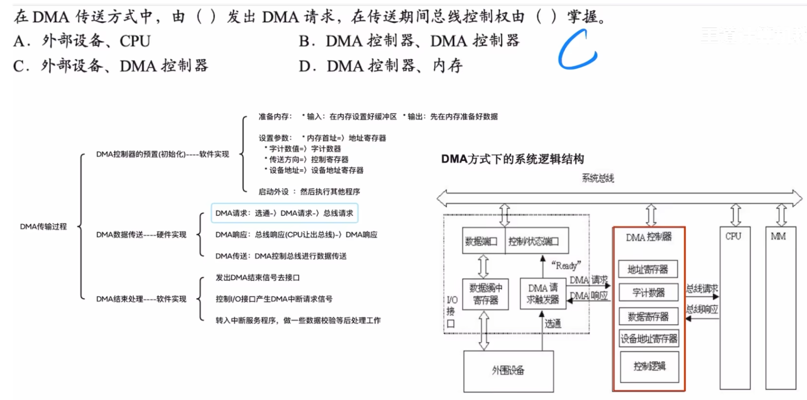
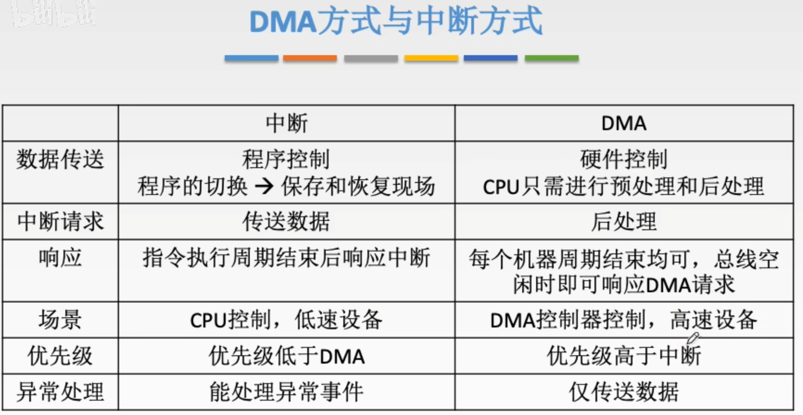
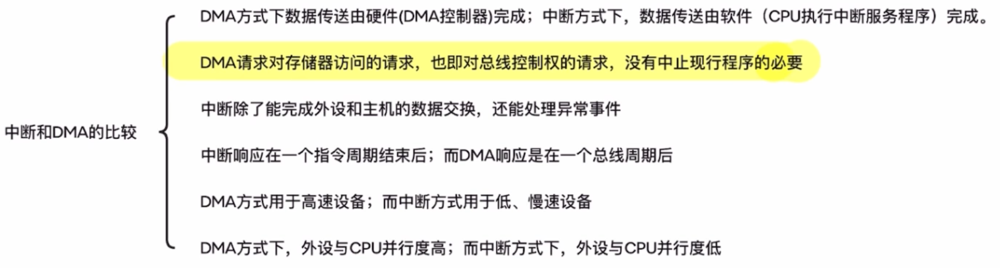
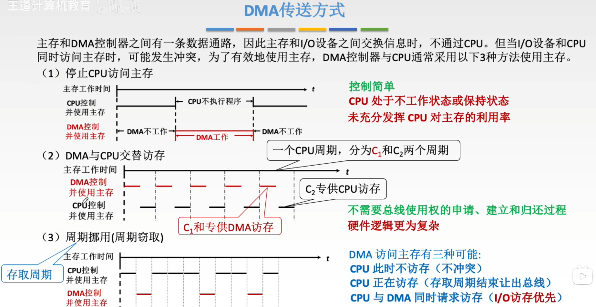
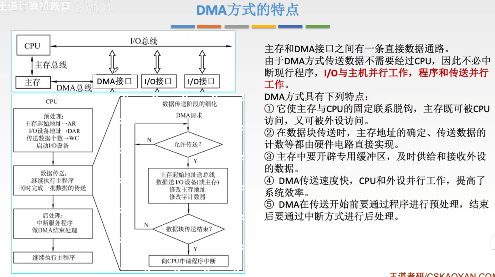

---
tags:
  - 计算机组成原理
---
# DMA控制器

# DMA传送过程

>注意区分DMA请求和中断请求，每传一个字发出DMA请求，每传完一整块数据发出中断请求
>DMA请求是将一个字传送到主存
>中断请求是：CPU响应中断，执行中断服务程序（比如检查传输是否出错、更新程序逻辑等），之后继续执行主程序。

 >对外（宏观）：是外部设备发出了DMA请求（因为它有数据要传）
>对内（微观）：外部设备的信号先打到了DMA请求触发器上，由触发器通知DMA控制器开始工作。

所以，不用纠结，外部设备是发起者，DMA请求触发器是执行这一动作的硬件开关。 在做选择题时，优先选“外部设备”。
## 一、DMA vs 程序中断：关键区别对比

| 对比维度            | 程序中断方式                              | DMA方式                             |
| :-------------- | :---------------------------------- | :-------------------------------- |
| **每字传输是否中断CPU** | ✅ 是，每传一个字或一个字符，CPU必须暂停当前程序，执行中断服务程序 | ❌ 否，每传一个字只发“总线请求”，CPU继续执行主程序，不被中断 |
| **CPU介入频率**     | 高，每个数据单元都需CPU参与搬运                   | 极低，仅在初始化（设置地址、长度）和结束时介入           |
| **数据传输主体**      | CPU亲自搬运数据（通过寄存器中转）                  | DMA控制器直接控制总线，数据从外设→内存，不经过CPU      |
| **适用场景**        | 低速、小数据量设备（如键盘、鼠标）                   | 高速、大数据量设备（如磁盘、网卡、显卡）              |
| **系统效率**        | CPU大量时间被占用，利用率低                     | CPU几乎全程空闲，可并行处理其他任务，系统吞吐率高        |

## 二、为什么“每字发DMA请求”不等于“每字中断CPU”？

这是最容易混淆的点。DMA请求的本质是**硬件级的总线仲裁信号**，不是软件级的中断信号：

- **DMA请求（HRQ）**：是DMA控制器向**总线仲裁器**发出的“我要用总线”的申请。CPU在当前总线周期结束后，会自动释放总线控制权（发出HLDA信号），过这个程对CPU程序是透明的，CPU不会被打断。
- **中断请求（IRQ）**：是DMA控制器在**整块数据传输完毕**后，向CPU发出的“任务完成，请处理”的信号。此时CPU才会暂停当前程序，执行中断服务程序。

可以类比为：

- **程序中断**：你（CPU）正在写报告，每收到一个快递（数据），你必须停下笔，亲自拆包、登记、放好，再继续写报告。
- **DMA方式**：你雇了个快递员（DMA控制器），他每收到一个包裹就向你打个招呼（DMA请求），但你不用停笔，他直接把包裹送到指定位置（内存）。等所有包裹送完，他才敲门告诉你“全部送达”（中断请求），你再出来签收一下。

## 三、DMA的核心优势总结

1. **解放CPU**：CPU从“搬运工”变成“监工”，只在开始和结束时出现，中间完全自由。
2. **提高系统吞吐率**：CPU和I/O设备真正实现了并行工作，系统整体效率大幅提升。
3. **支持高速设备**：对于磁盘、网卡等高速设备，程序中断方式根本无法跟上其数据速率，而DMA可以轻松应对。
4. **减少上下文切换开销**：程序中断每次都要保存/恢复现场，DMA只在最后中断一次，开销极小。

所以，虽然DMA“每字发请求”，但这个请求是硬件自动处理的总线仲裁，不干扰CPU运行；而程序中断是“每字必中断”，CPU必须亲自下场干活。这就是DMA方式在高效率I/O传输中不可替代的原因。

# DMA 传送方式

%%周期挪用（周期窃取）%%
>P307
>解决DMA和CPU的访存冲突
>在总线周期结束后就可以进行周期窃取

# DMA方式的特点

>只有像这个图里的[三总线结构](总线的分类.md#三总线结构)才需要考虑[DMA 传送方式](DMA方式.md#DMA%20传送方式)里的访存冲突问题，因为这个时候有一个单独的DMA总线，不归CPU管了
>而[DMA 传送方式](DMA方式.md#DMA%20传送方式)里的单总线结构是没有这个问题，DMA什么时候访存都是CPU说的算的
