---
tags:
  - 计算机网络
---
网际控制报文协议ICMP
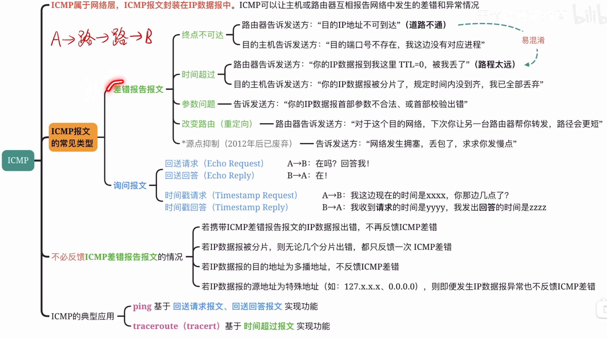
# ICMP报文和IP数据报的关系
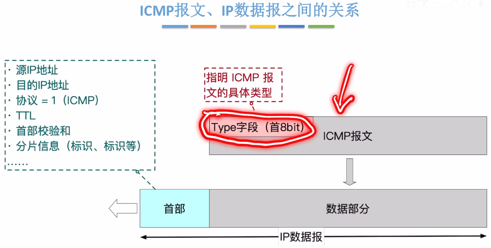
>ICMP需要借用IP的服务，也就是ICMP报文封装在IP数据报的数据部分
>ICMP属于网络层[各种协议之间的服务关系](IPv4分组.md#各种协议之间的服务关系)

# ICMP差错报告报文
## 终点不可达
### 目的IP不可到达
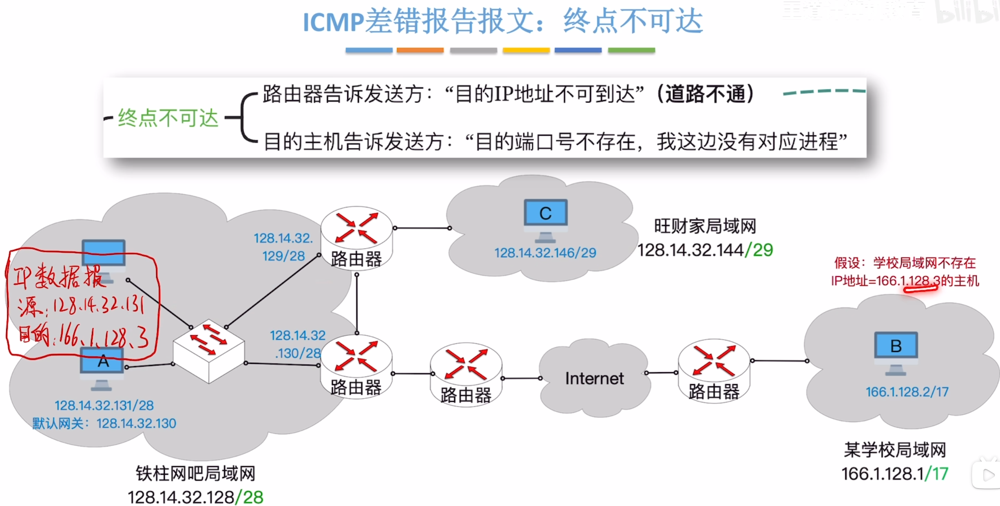
>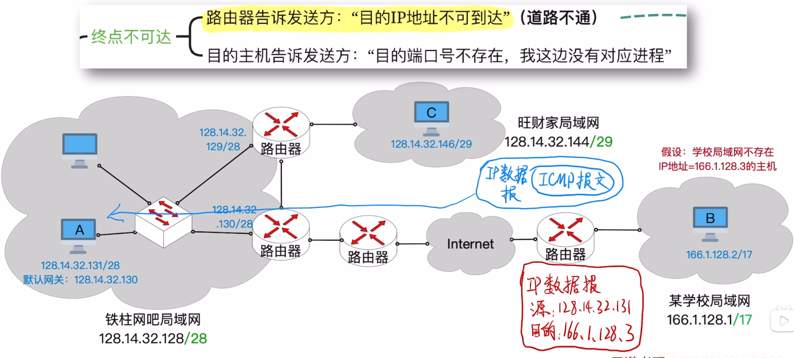
>到达学校的路由器之后，路由器发现IP地址不可到达，会构造一个ICMP报文并封装进IP数据报中然后发回发送方

### 目的端口号不存在
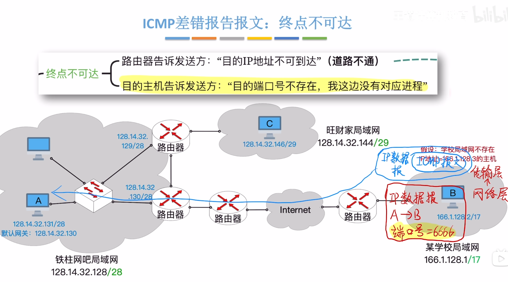
>此时IP数据报可以到达主机，但在网络层到传输层的时候会发现目的端口号不存在，此时目的主机发回ICMP报文

## 时间超过
### 路程太远
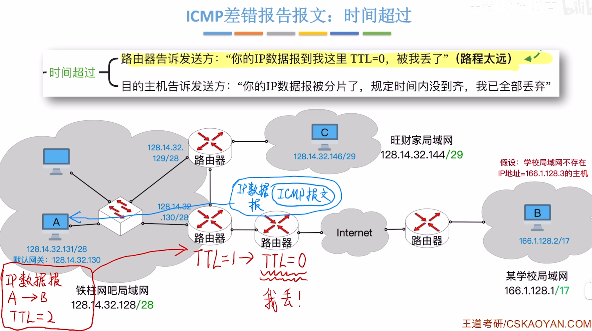
>[IP数据报的生存时间TTL](IPv4分组.md#IP数据报的生存时间TTL)
>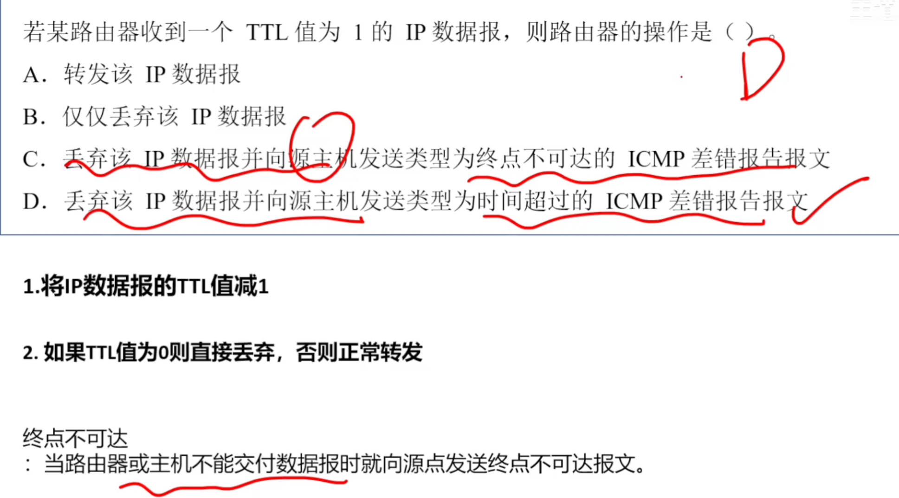

### 分片未到齐
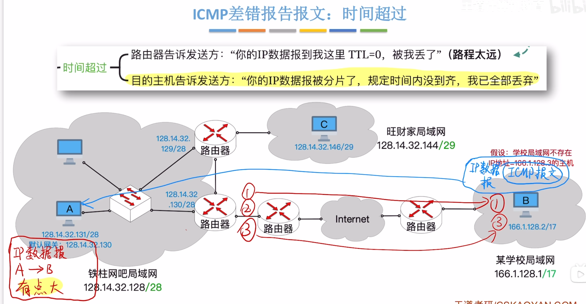

## 参数问题
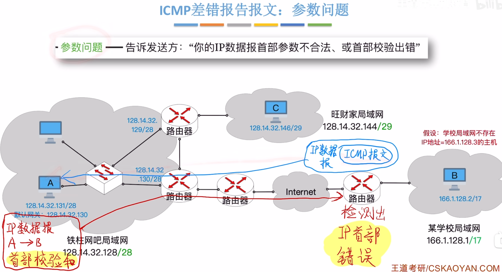

## 改变路由
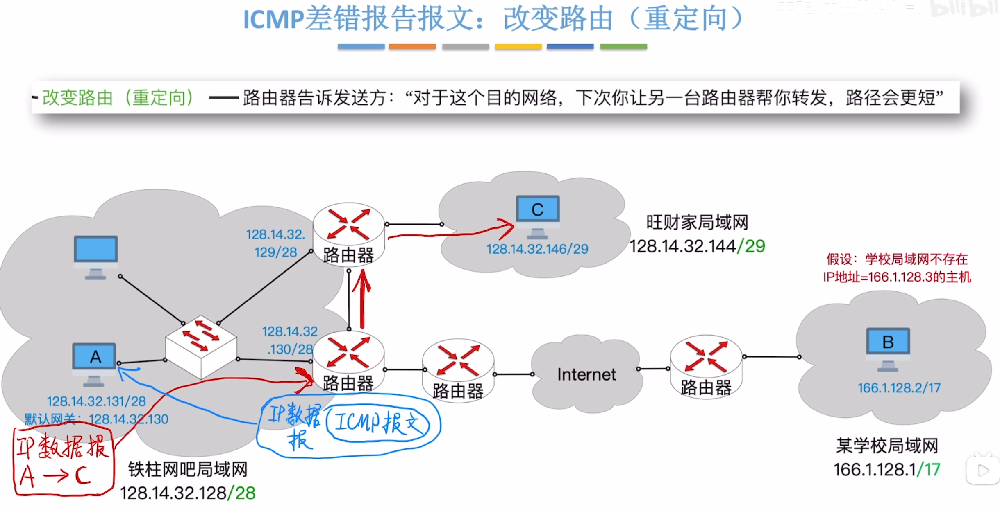

# ICMP询问报文
## 回送请求，回送回答
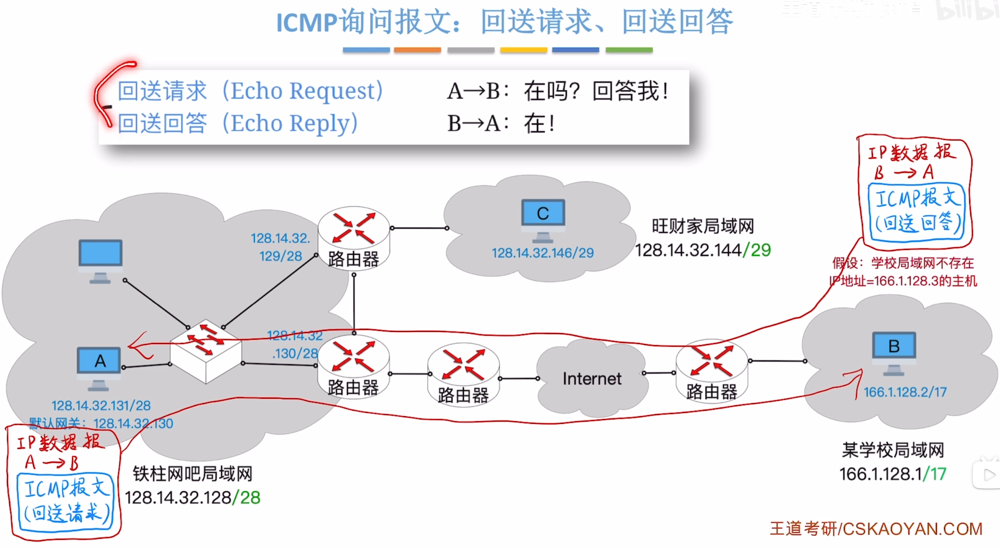
>ping基于这个实现
## 时间戳请求，时间戳回答
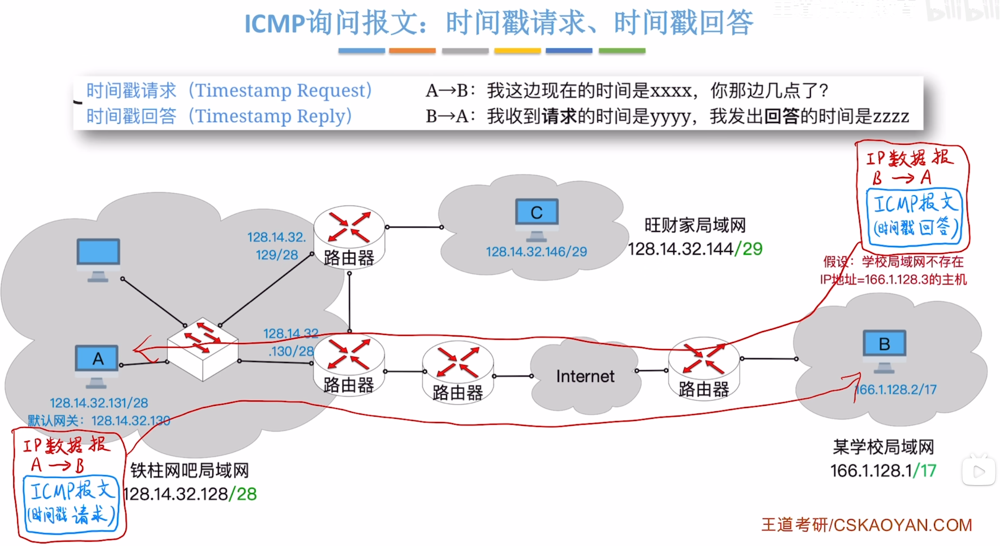

# 不必反馈ICMP差错报文的情况
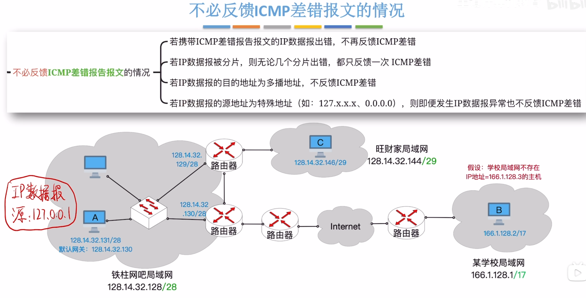
