---
tags:
  - 操作系统
---
[IO方式（计组）](IO方式（计组）.md)
# 程序直接控制方式
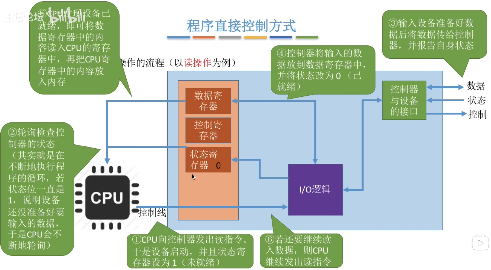
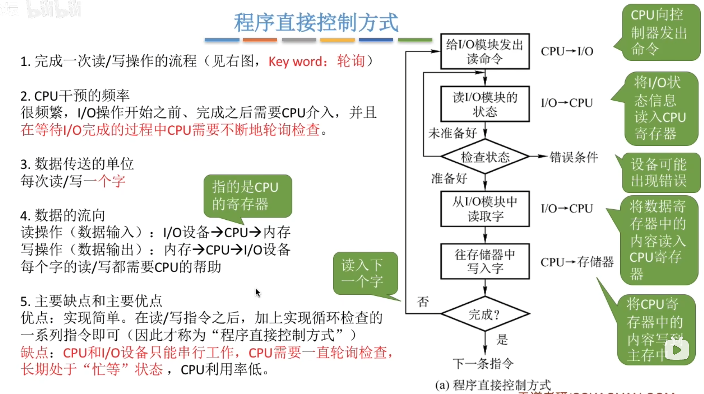

# 中断驱动方式
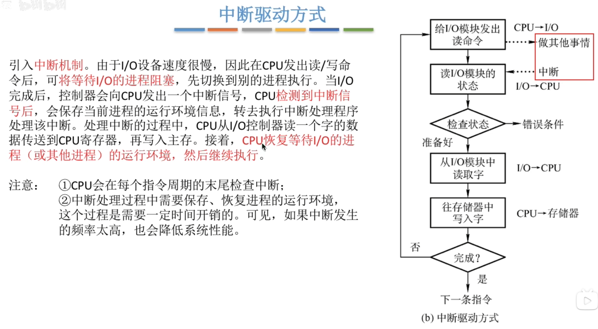
>在中断IO方式下，由中断服务程序来完成数据的输入和输出
>中断处理程序将设备控制器中的数据传送到内存的缓冲区（读入），或将要输出的数据传送到设备控制器（输出）。

>中断IO数据流向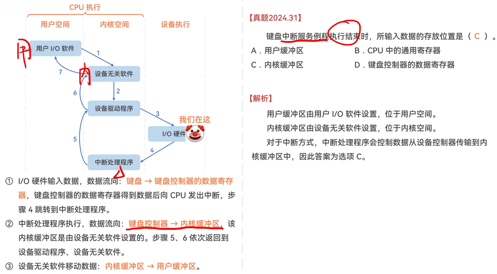
# [DMA方式](DMA方式.md)
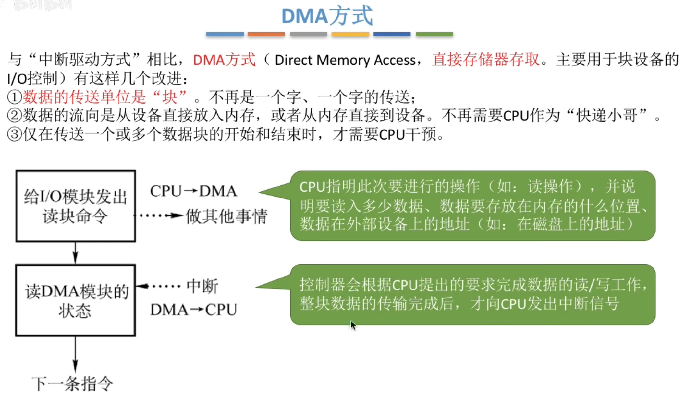

## DMA传输过程
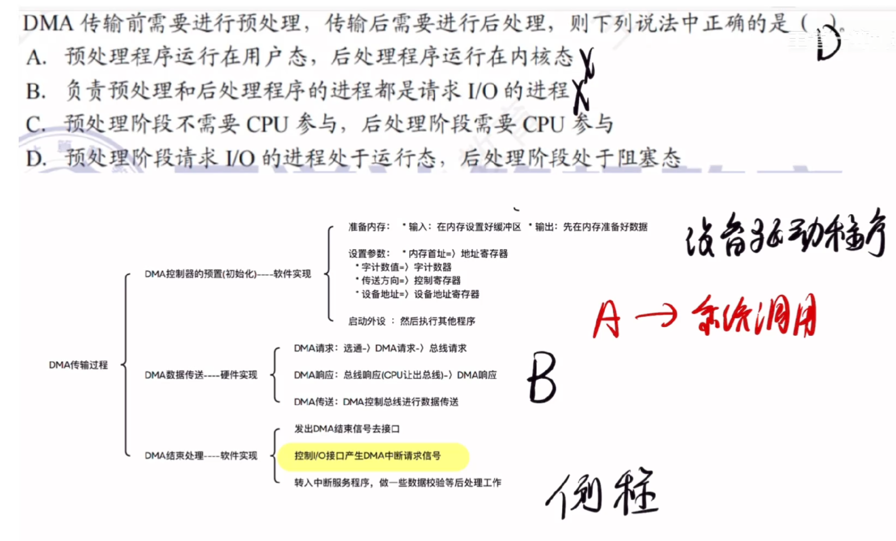
>在DMA初始化之后启动外设，CPU就去执行了其他进程了，然后等到发出中断之后，注意此时CPU不是立即切换到原来的进程，而是执行中断处理程序之后将原来的进程唤醒放到就绪态队列
>预处理阶段请求IO的进程就是设备驱动程序
>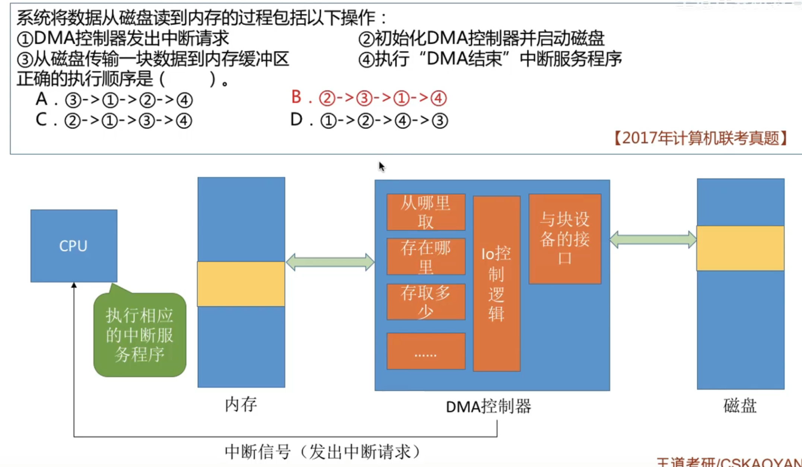
## DMA控制器
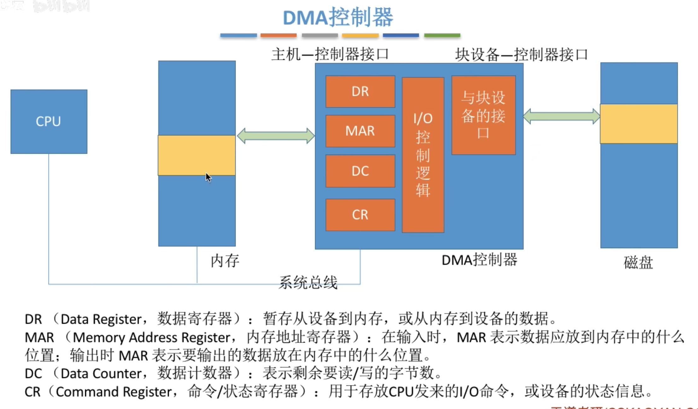
## DMA特点

# [通道控制方式](IO控制方式.md#通道控制方式)
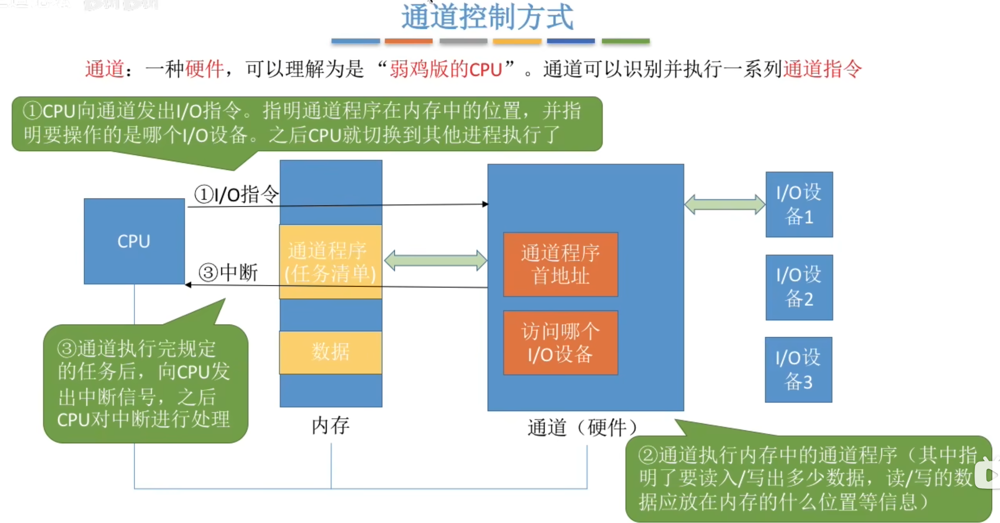
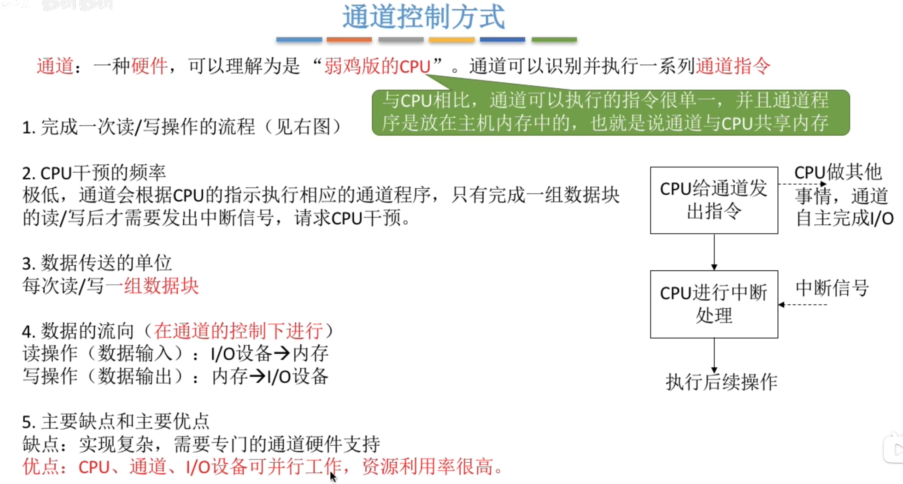
>一个通道，可以控制多个IO控制器，一个IO控制器又可以控制多个IO设备
>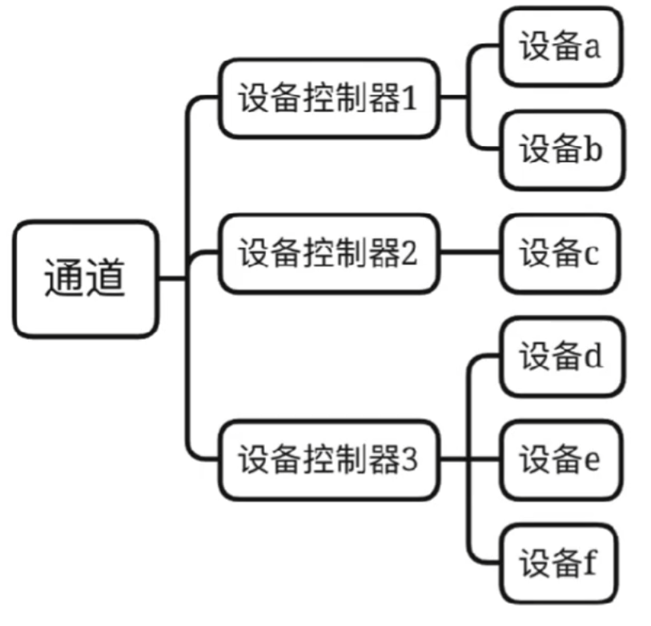

# 总结
