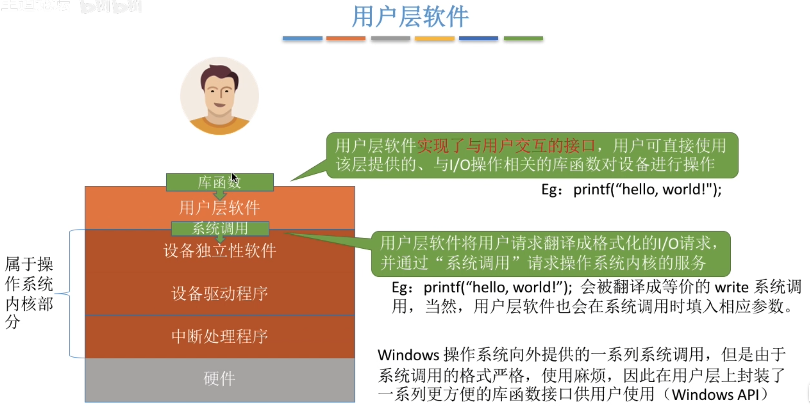
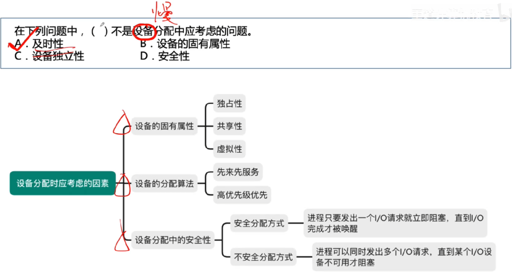
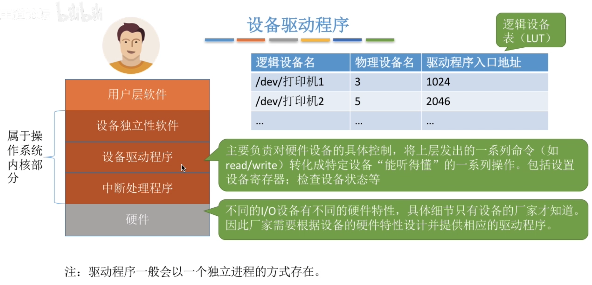
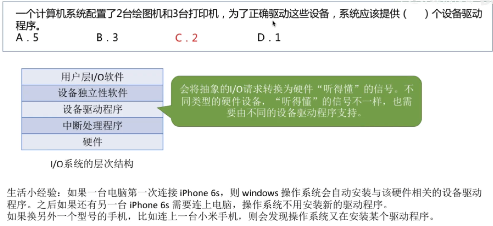
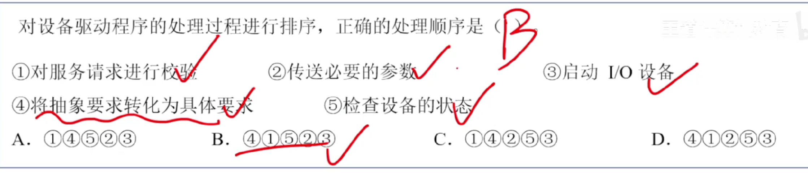
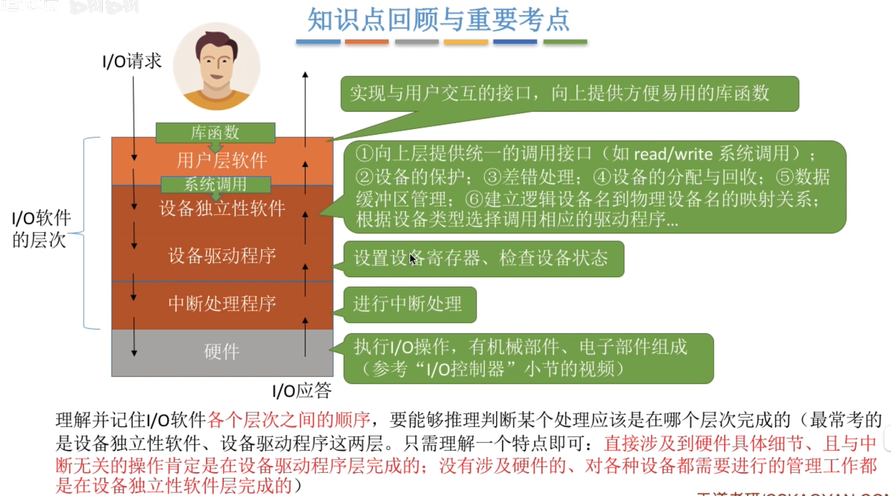
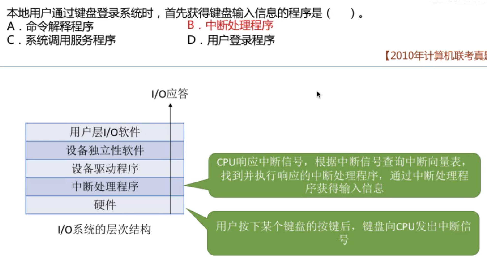

---
tags:
  - 操作系统
---
P311有更详细的说明
# 用户层软件

# 设备独立性软件

>设备独立性软件也叫设备无关软件
>逻辑设备表（LUT）
## 设备分配时应考虑的因素

# 设备驱动程序
不同设备的内部硬件特性也不同，这些特性只有厂家才知道，因此厂家须提供与设备相对应的驱动程序，CPU执行驱动程序的指令序列，来完成设置设备寄存器，检查设备状态等工作

>物理设备名也称绝对号
>
>同一种设备只要一个驱动程序
>设备驱动程序负责处理磁盘调度
>设备驱动程序处理过程
# 中断处理程序

# 总结

## IO应答

>处理IO应答是自下而上的顺序