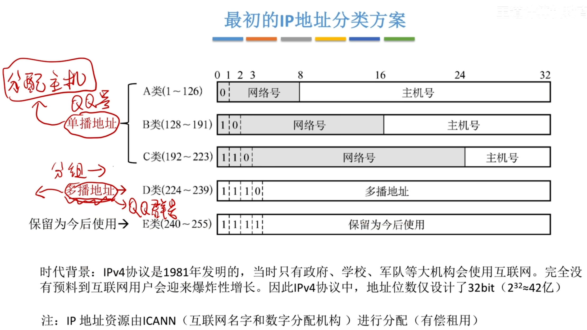
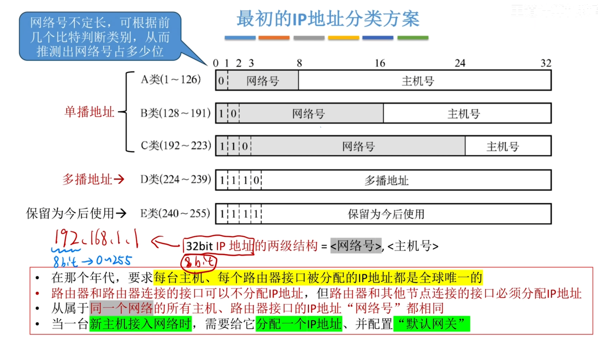
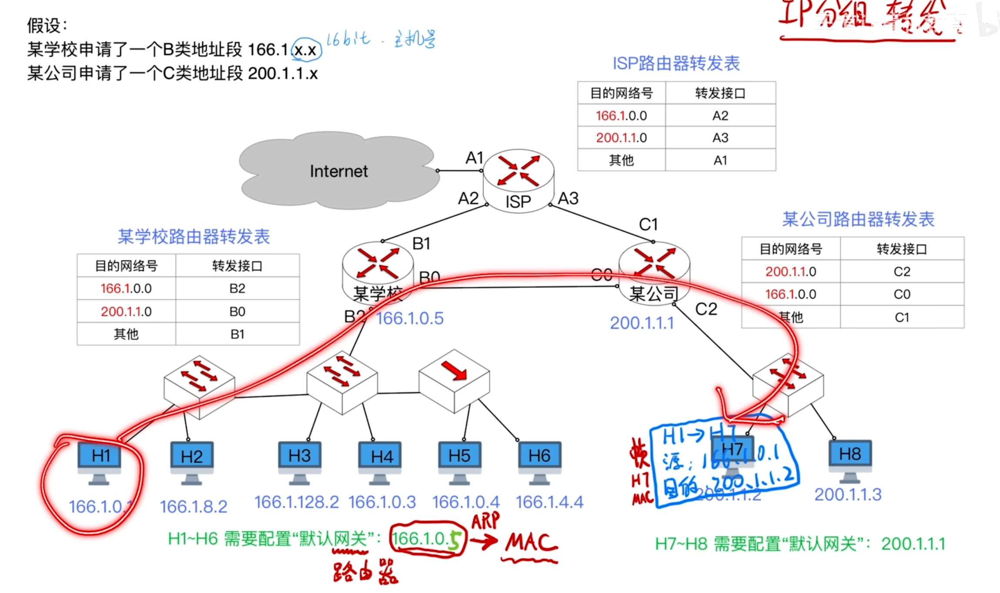
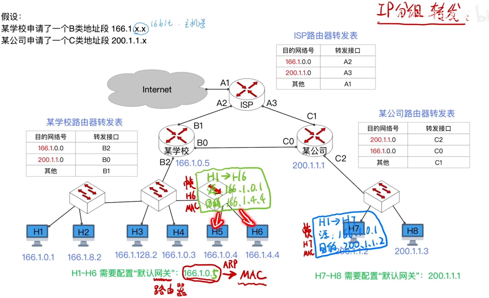
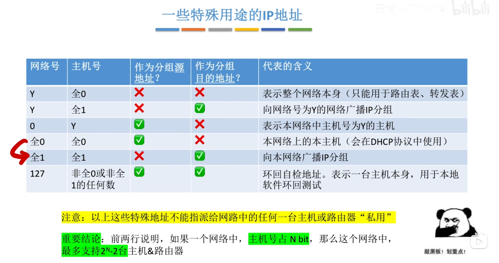
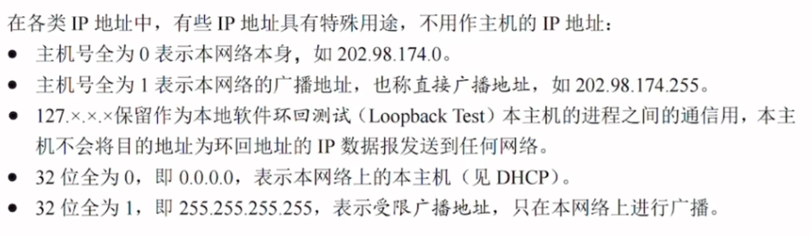
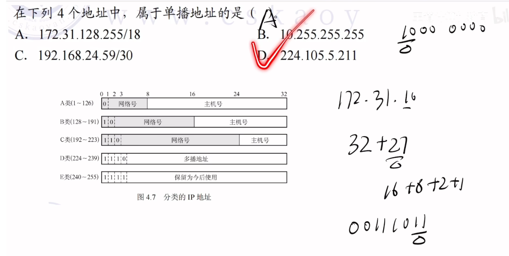

---
tags:
  - 计算机网络
---
# 最初的IP地址分配方案

>单播地址，多播地址，IP地址占4B

>被虚线固定的位**不是网络号的一部分**，它是**类别标识位**（用来告诉路由器：“我是一个 A 类地址”）。
**后 7 位（bit 1 ~ bit 7）：** 这才是真正的 **网络号**。
网络号 0（0.x.x.x）： 被保留，用来表示“本网络”或默认路由，不分配给任何具体网络。
网络号 127（127.x.x.x）： 被保留作为环回测试地址（也就是大家最熟悉的 127.0.0.1 本机地址），也不分配给实际网络

>在B类地址的前16个bit（前两个字节）中，划分如下：前2 位： 固定为 10，这是B类地址的类别标识位。
后 14 位： 真正的网络号（16 - 2 = 14位）。

## 配置默认网关

>默认网关其实就是默认路由器，就是每一台主机需要接入互联网的时候，需要经过哪一台路由器的转发

## IP分组转发流程(不同网络)

1. H1 判断是否在同一网络，检查源地址和目的地址的网络号(B类16bit)
2. H1把数据交给默认网关，通过ARP协议，获取网关的MAC地址
3. H1将数据封装成帧，并发送给默认网关

|层次|字段|值|
|---|---|---|
|IP 数据报|源 IP|`166.1.0.1`|
||目的 IP|`200.1.1.2`|
|MAC 帧（第一跳）|源 MAC|`MAC_H1`|
||目的 MAC|`MAC_B2`（网关）|
4. 学校路由器从 **B2 接口**收到帧，拆掉 MAC 帧头，提取 IP 数据报，查转发表：发现**网络号**能够与转发表第二个表项匹配上，于是从B0转发出去，需要修改MAC帧的目的地址

| 目的网络号     | 转发接口 |
| --------- | ---- |
| 166.1.0.0 | B2   |
| 200.1.1.0 | B0 ✅ |
| 其他        | B1   |
然后学校路由器通过 B0 接口连接的公司路由器 C0 接口，需要获取 C0 的 MAC 地址（通过ARP协议）

| 层次         | 字段     | 值                   |
| ---------- | ------ | ------------------- |
| IP 数据报     | 源 IP   | `166.1.0.1`（不变）     |
|            | 目的 IP  | `200.1.1.2`（不变）     |
| MAC 帧（第二跳） | 源 MAC  | `MAC_B0`（学校路由器B0接口） |
|            | 目的 MAC | `MAC_C0`（公司路由器C0接口） |

5. 公司路由器从 C0 接口收到帧，拆掉 MAC 帧头，查转发表：

|目的网络号|转发接口|
|---|---|
|200.1.1.0|C2 ✅|
|166.1.0.0|C0|
|其他|C1|
目的 IP 200.1.1.2 匹配 200.1.1.0，决定从 C2 接口转发
修改MAC帧

| 层次         | 字段     | 值                   |
| ---------- | ------ | ------------------- |
| IP 数据报     | 源 IP   | `166.1.0.1`（不变）     |
|            | 目的 IP  | `200.1.1.2`（不变）     |
| MAC 帧（第三跳） | 源 MAC  | `MAC_C2`（公司路由器C2接口） |
|            | 目的 MAC | `MAC_H7`            |

6. H7 收到 MAC 帧，检查目的 MAC 是自己，拆掉 MAC 帧头，提取 IP 数据报，检查目的 IP 是自己（`200.1.1.2`），接收数据。

## IP分组转发流程(同一网络)

>H1->H6，发现是同一网络，封装成帧后发给H6，不用再发给默认网关
>内部网络传送IP数据报不需要经过默认网关

### 一些特殊用途的IP地址

>有n位主机号，就有2^n 个IP地址，可以分配给2^n - 2 台主机和路由器

>255.255.255.255 是“喊给身边所有人听”，出了这个网段就没意义了，路由器一定不转发；
主机号全 1 是“喊给某个远端网络的所有人听”，路由器能把它送到那个网络门口

>判断单播还是多播
>
>B选项，看开头是A类地址，那么前八位是网络号，后面的主机号全1，是多播
>C选项，192开头，C类地址，59展开二进制，后两位是1，也就是主机号全1，多播
>D选项,D类地址，多播

# IP地址标识的是网络接口，而非主机本身
P140
