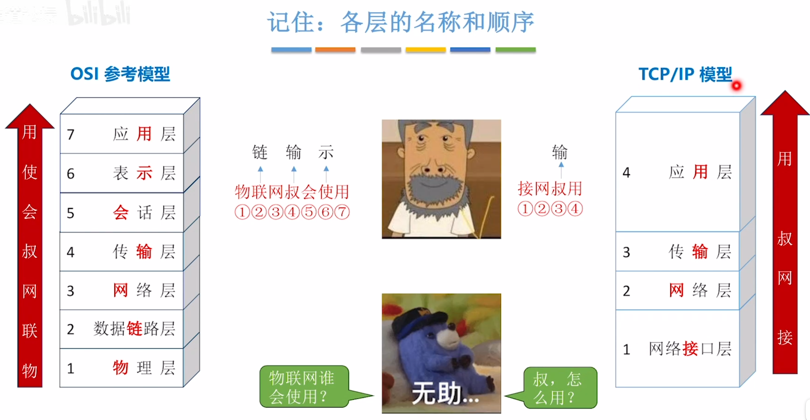
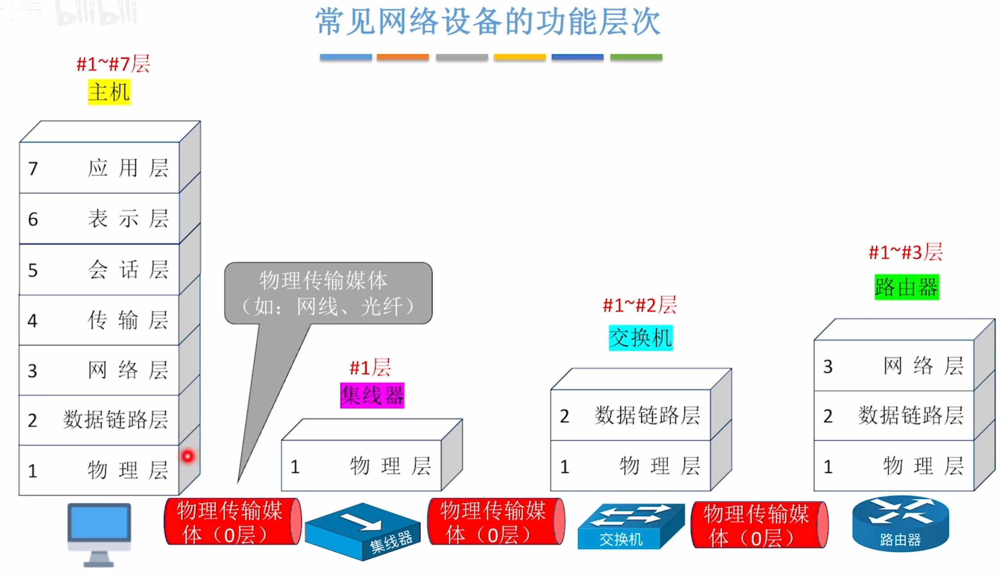
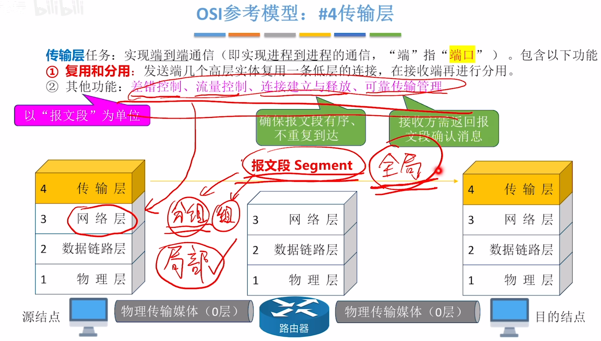
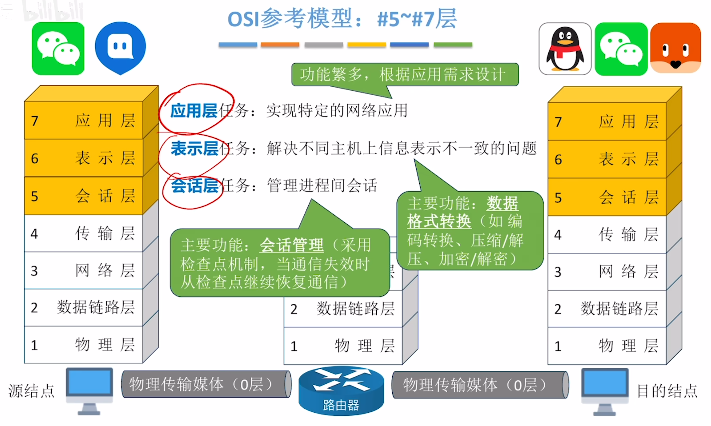
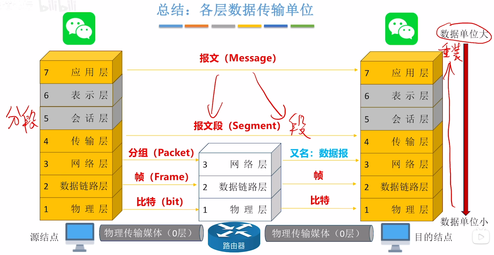
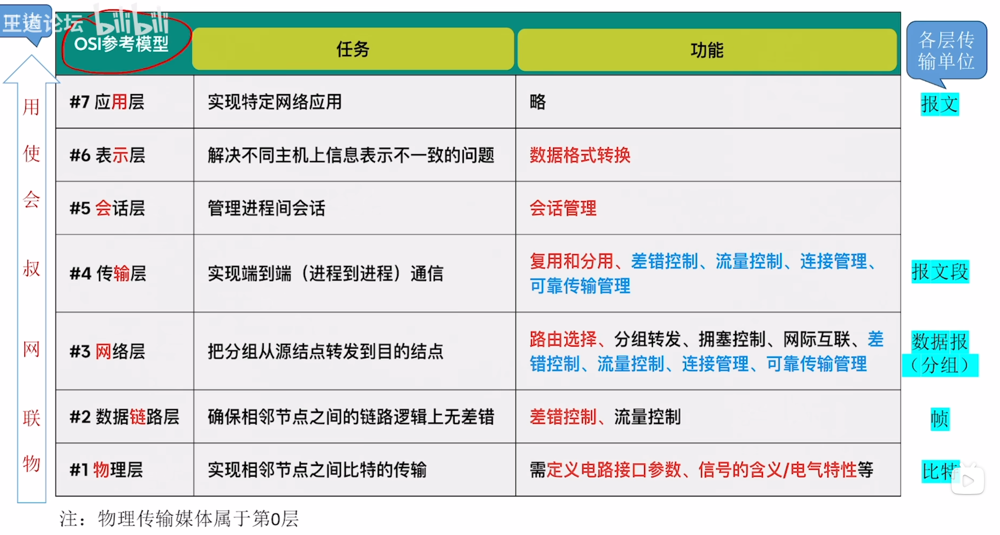

---
tags:
  - 计算机网络
---
OSI三个主要概念：协议，接口，服务
# 各层的名称和顺序

# 常见网络设备的功能层次

# 各个层次的功能
## 1物理层

>以比特为单位的传输是有可能出错的，并且接收方无法发现这种错误，此时就需要数据链路层
>7层中只有物理层不参与数据封装工作

## 2数据链路层

>最重要的功能是差错控制
## 3网络层

>异构网络互联的意思是，路由器实现了多个不同的网络的互联，每一个网络内部的实现方式可能是不一样的可能是以太网也可能是令牌环网
>网络层的差错控制：网络层以分组为单位，比如一组有三个帧，[2数据链路层](OSI参考模型.md#2数据链路层)只能检测每一个帧，如果这一组里的三个帧里丢失了一个，是检测不出来的，所以需要网络层对分组进行整体的差错控制，检测出这三帧里少了一帧

>OSI在网络层同时支持无连接（UDP）和面向连接（TCP）两种模式

## 4传输层

>OSI 在传输层仅提供面向连接（TCP）的服务
## 5~7层

# 各层数据传输单位

# 总结
