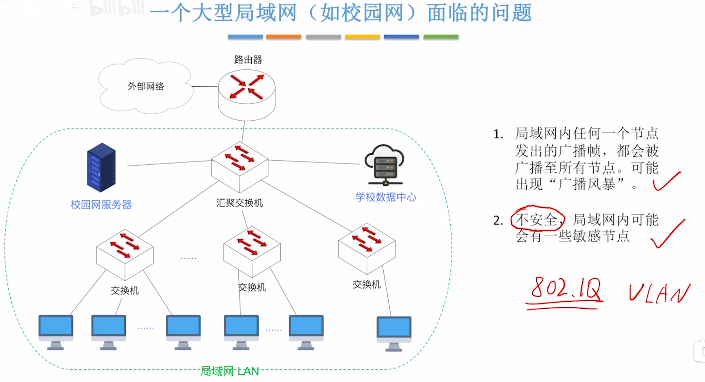
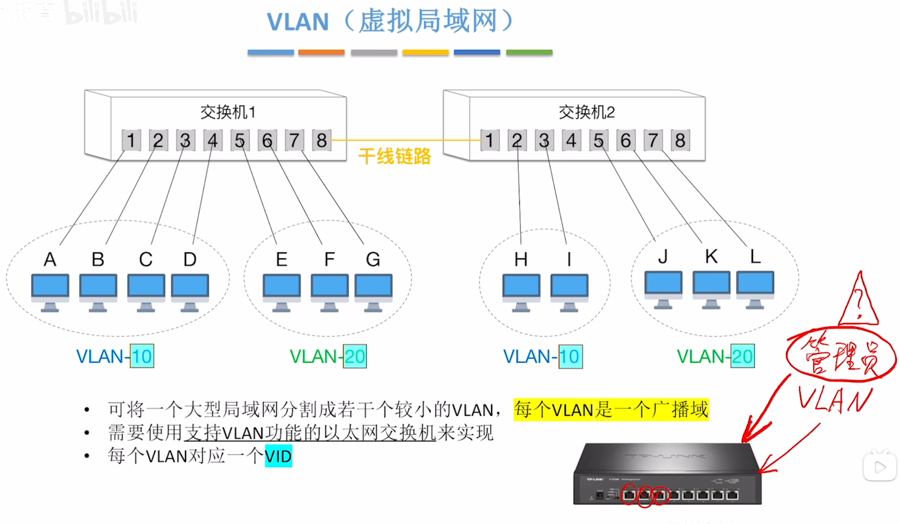
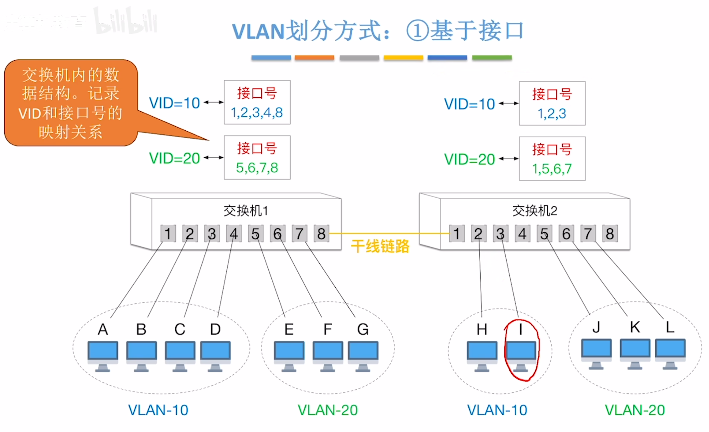
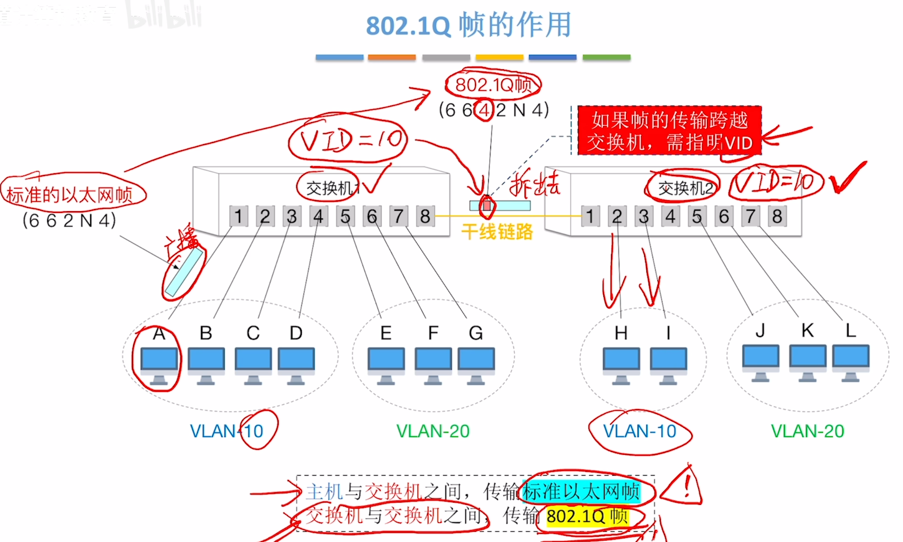
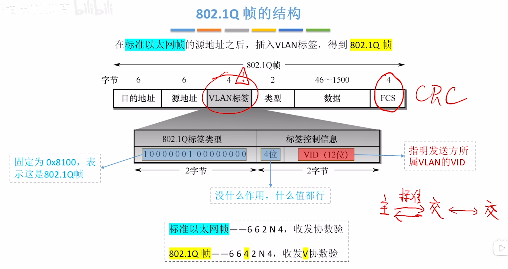
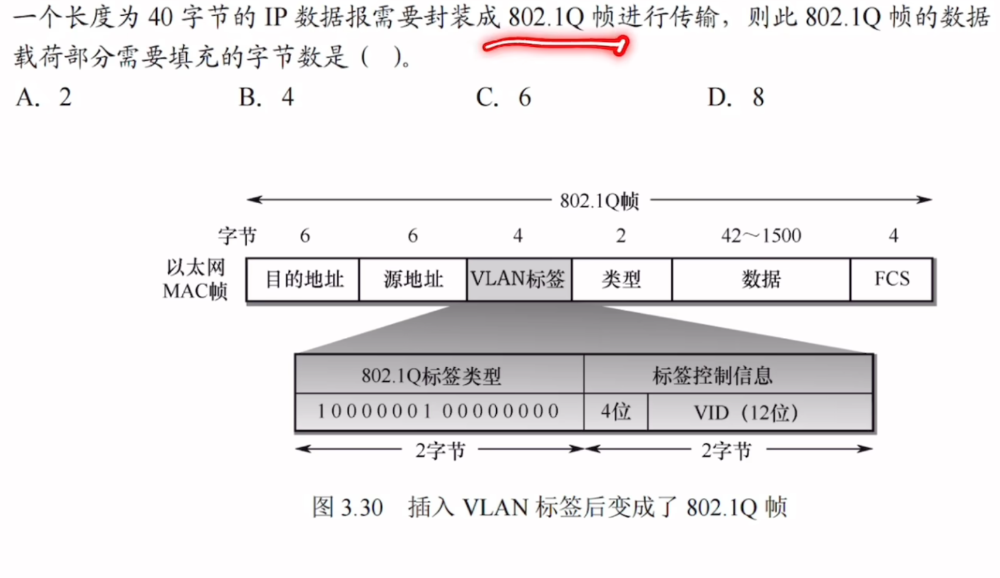

---
tags:
  - 计算机网络
---

# VLAN概念

# VLAN划分方式
## 基于接口

## 基于MAC地址

## 基于IP地址

# 802.1Q帧

## 结构

>在标准以太网帧([V2标准的以太网MAC帧](以太网与IEEE802.3.md#V2标准的以太网MAC帧))插入VLAN标签后，末尾的CRC校验码就需要重新生成
>
>这张图才是对的,**整张以太网帧的最小长度必须达到 64 字节**（为了保证能检测到冲突）。这个“64字节”的底线，无论加不加VLAN标签，都是绝对不能突破的
>标准以太网帧：
    目的MAC(6) + 源MAC(6) + 类型(2) + 数据(46) + FCS(4) = 64 字节（所以标准帧数据最小是46）。
>802.1Q 帧（插入了4字节的VLAN标签）：
    目的MAC(6) + 源MAC(6) + VLAN标签(4) + 类型(2) + 数据(X) + FCS(4) = 64 字节。
因为VLAN标签强行占用了4个字节，为了凑够64字节的总底线，数据部分的下限自然就减少了4个字节：
>X=64−(6+6+4+2+4)=42字节。

