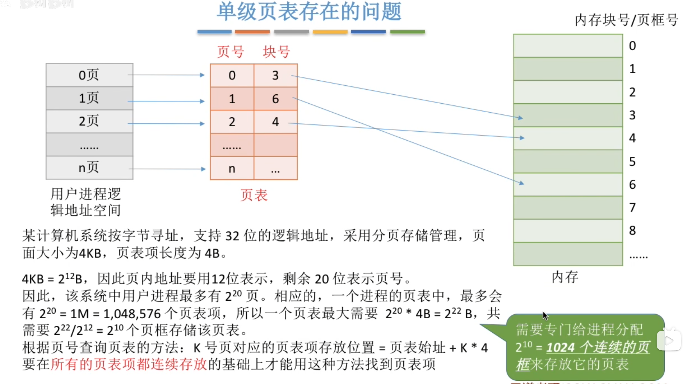
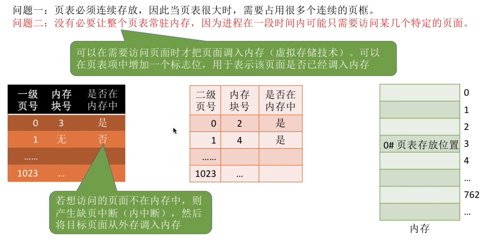
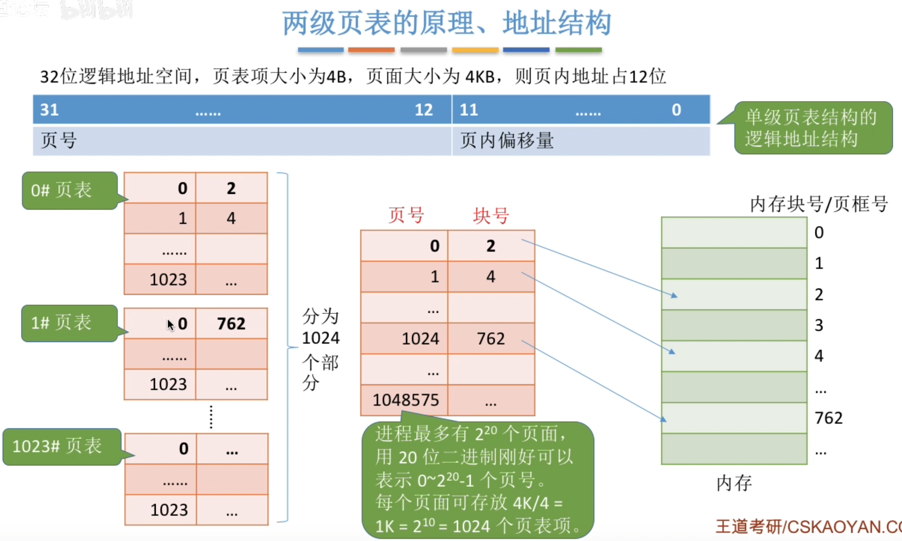
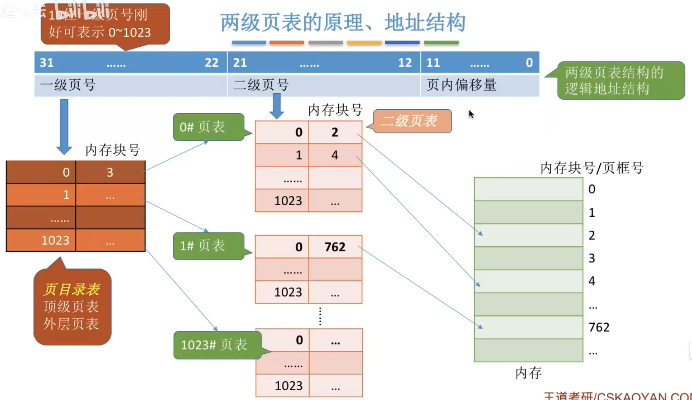
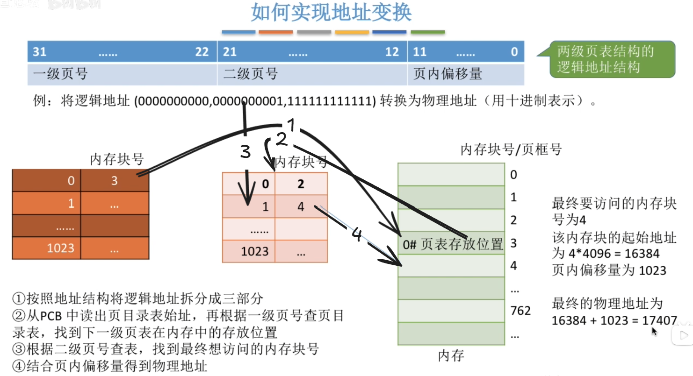
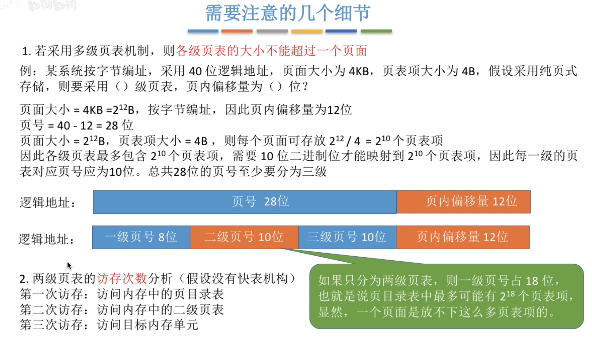
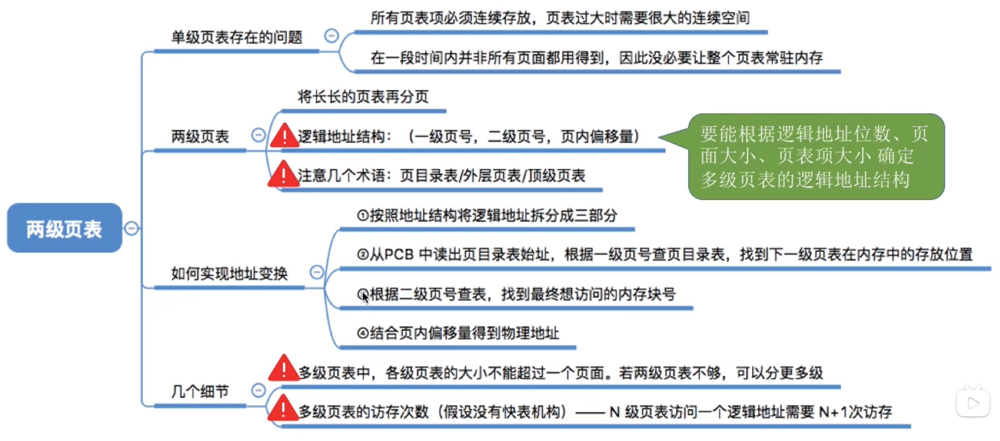

---
tags:
  - 操作系统
---

# 单级页表的问题

# 两级页表的结构

>大页表有2^20个页表项，一个页面4KB,一个页表项4B，所以一个页面存2^10个页表项，拆分成$2^{10}\times 2^{10}$的小页表

### 页目录表

# 实现地址变换
![[../assets/两级页表/两级页表地址变换图]]

>最终要访问的内存块
>号为4该内存块的起始地址为 4096= 16384页内偏移量为1023最终的物理地址为16384 + 1023 = 17407

# 各级页表大小不超过一个页面

>有n级页表，则访存次数是n+1次

# 小结
