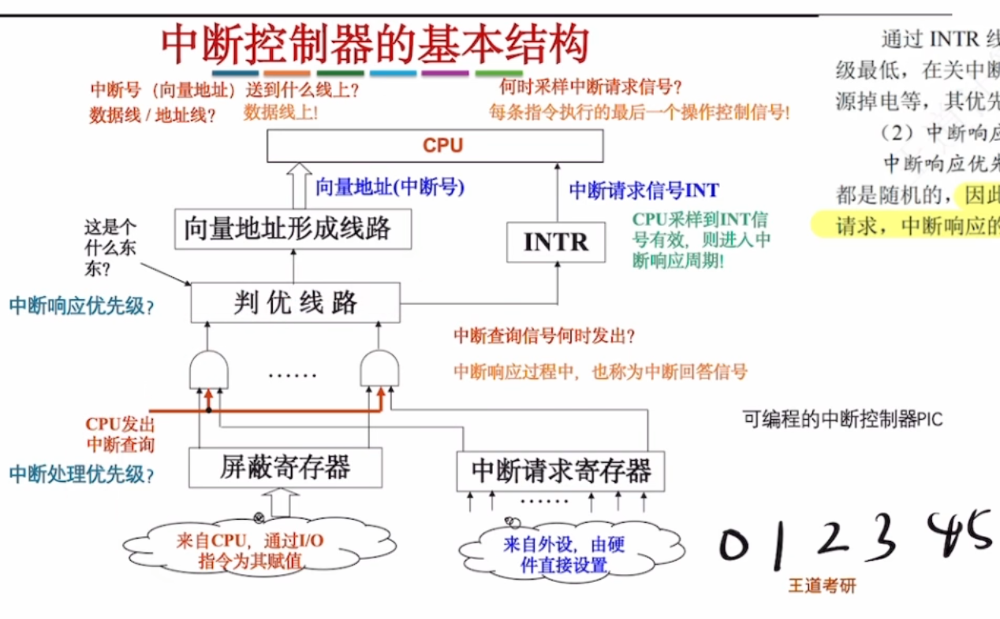

---
tags:
  - 计算机组成原理
---
## 中断基本概念

## 中断请求的分类

>通过[程序状态字寄存器PSW](带标志位加法器（加减运算部件）.md#程序状态字寄存器PSW)内的IF来表示当前是开中断还是关中断

## 中断请求标记

>通过中断请求标记触发器INTR来表示哪个设备中断源有请求

## 中断判优

### 优先级设置

## 中断处理过程

>中断响应过程
### 中断隐指令
中断响应过程的第一步（P301），执行中断隐指令

>硬件向量法是中断隐指令中“引出中断服务程序”这一环节的具体实现方式之一
### 硬件向量法

>存放中断向量的内存区域（图上向量地址12H,13H,14H）称为中断向量表
>通过向量地址（中断类型号）找到对应的中断向量存储的地址->中断向量->中断服务程序

### 中断服务程序

### 总结-中断处理过程

# 中断控制器（PIC）

>这张图表示了请求->判优->送向量。是CPU响应中断周期的前一半
>**只有未被屏蔽的中断才能够被送去响应**

### 第一阶段：中断请求的产生与登记（图的右下角）

1. **外设发起请求：**
    - 当I/O设备（比如键盘、硬盘）工作完成或需要CPU处理时，它会向中断控制器发送一个电信号。
    - **对应图中：** “来自外设，由硬件直接设置” -> **中断请求寄存器**。
    - **动作：** 中断请求寄存器的对应位被置为 **1**，表示“我有事找CPU”。

### 第二阶段：中断屏蔽

2. **软件屏蔽（IMR）：**
    - CPU之前可能通过指令设置了哪些中断是“不想理”的。这个设置存在**屏蔽寄存器**中。
    - **对应图中：** “来自CPU，通过I/O指令为其赋值” -> **屏蔽寄存器**。
    - **逻辑判断（与门）：** 请看图中的两个圆圈（与门）。
        - 输入1：来自中断请求寄存器（是否有事？）。
        - 输入2：来自屏蔽寄存器（允许汇报吗？）。
        - **结果：** 只有当“有事”且“允许汇报”时，信号才能通过。如果屏蔽寄存器把某一位设为0（屏蔽），那么无论外设怎么请求，信号都会被截断，无法向后传递。

### 第三阶段：[中断判优](#中断判优)

3. **硬件排队（判优线路）：**
    - 通过了屏蔽检查的请求可能有多个（比如键盘和鼠标同时请求）。这时候就需要决定谁先谁后。
    - **对应图中：** **判优线路**。
    - **动作：** 判优线路根据硬件设定的优先级（通常是物理连线决定的，比如0号口优先级最高），从所有通过的请求中选出一个**优先级最高**的。
    - **输出：** 选中后，它会做两件事：
        1. 向CPU发送 **INTR** 信号（告诉CPU：有个急事，而且是最急的那个，请处理）。
        2. 启动向量地址形成线路。

### 第四阶段：CPU响应与获取入口地址（图的上半部分）

4. **CPU采样与响应：**
    
    - **对应图中：** CPU内部有一个机制，在**每条指令执行的最后一个操作控制信号**（通常是取指周期结束或执行周期结束）去采样 INTR 线。
    - 如果此时 **IF=1**（开中断）且 **INTR=1**，CPU就会进入中断响应周期。
5. **获取中断向量（入口地址）：**
    
    - CPU需要知道去哪里执行中断服务程序。
    - **对应图中：** **向量地址形成线路**。
    - **动作：** 判优线路选出的那个最高优先级的中断源，会提供一个编号（中断号）。这个号码送入“向量地址形成线路”，计算出中断服务程序的入口地址（向量地址）。
    - **传输：** 这个地址通过**数据线**发送给CPU（注意图中红字标注：送到数据线上！）。

根据这张图的逻辑流向：

1. **源头：** 外设 -> 中断请求寄存器（记录请求）。
2. **第一道关卡（屏蔽）：** 中断请求寄存器 & 屏蔽寄存器。只有没被屏蔽的请求才能通过。**（先屏蔽）**
3. **第二道关卡（判优）：** 通过筛选的请求 -> 判优线路。选出老大。**（后判优）**
4. **终点：** 判优结果 -> INTR信号 -> CPU。