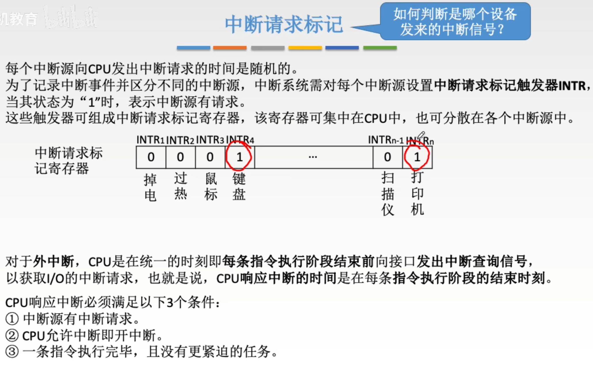
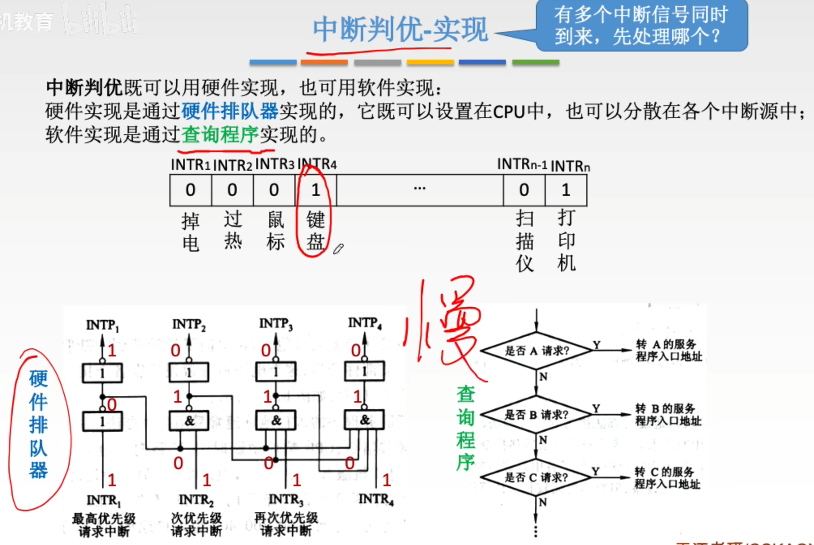
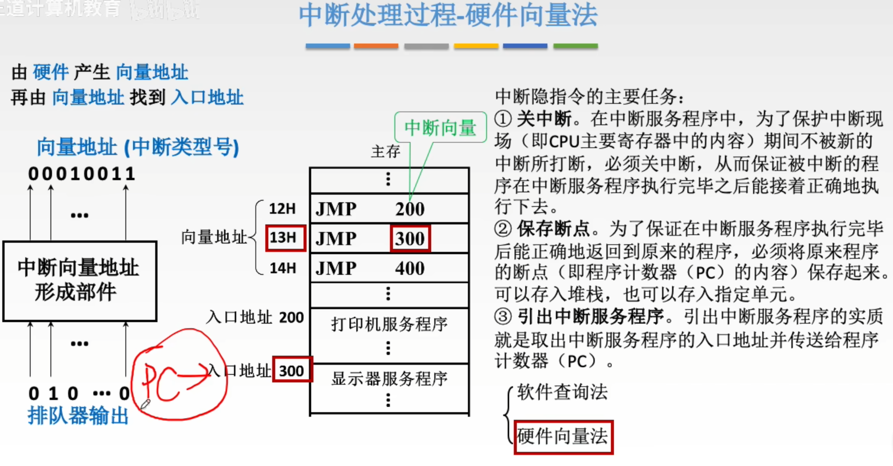
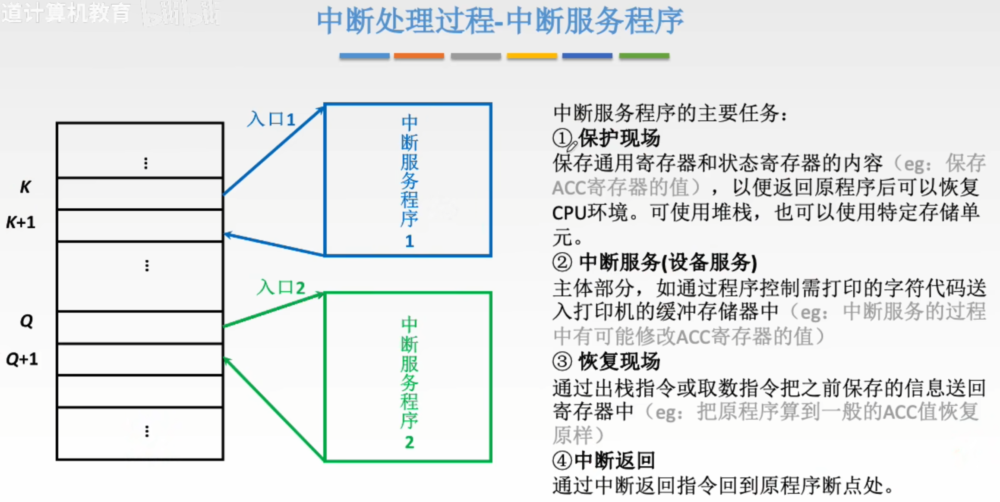
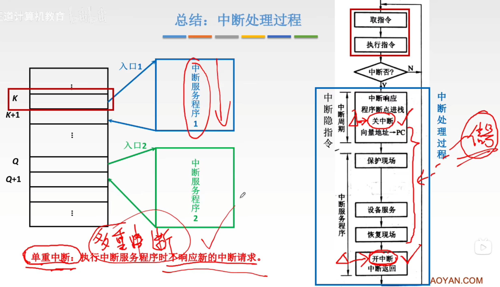

---
tags:
  - 计算机组成原理
---
## 中断基本概念

## 中断请求的分类

>通过[程序状态字寄存器PSW](带标志位加法器（加减运算部件）.md#程序状态字寄存器PSW)内的IF来表示当前是开中断还是关中断

## 中断请求标记

>通过中断请求标记触发器INTR来表示哪个设备中断源有请求

## 中断判优

### 优先级设置

## 中断处理过程

### 中断隐指令

>硬件向量法是中断隐指令中“引出中断服务程序”这一环节的具体实现方式之一
### 硬件向量法

>存放中断向量的内存区域（图上向量地址12H,13H,14H）称为中断向量表
>通过向量地址（中断类型号）找到对应的中断向量存储的地址->中断向量->中断服务程序

### 中断服务程序

### 总结-中断处理过程
