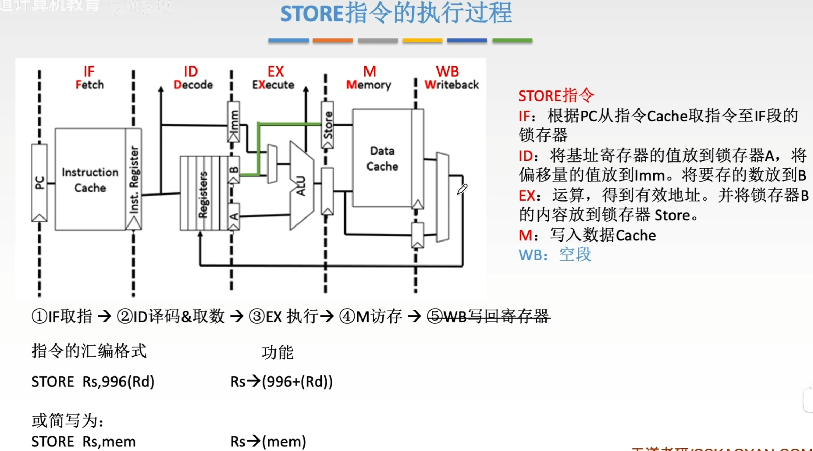
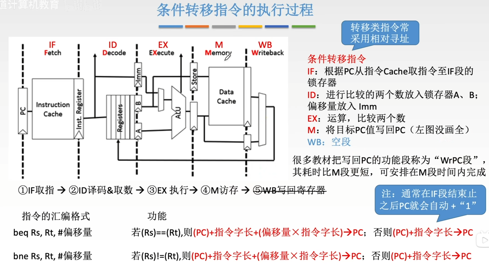
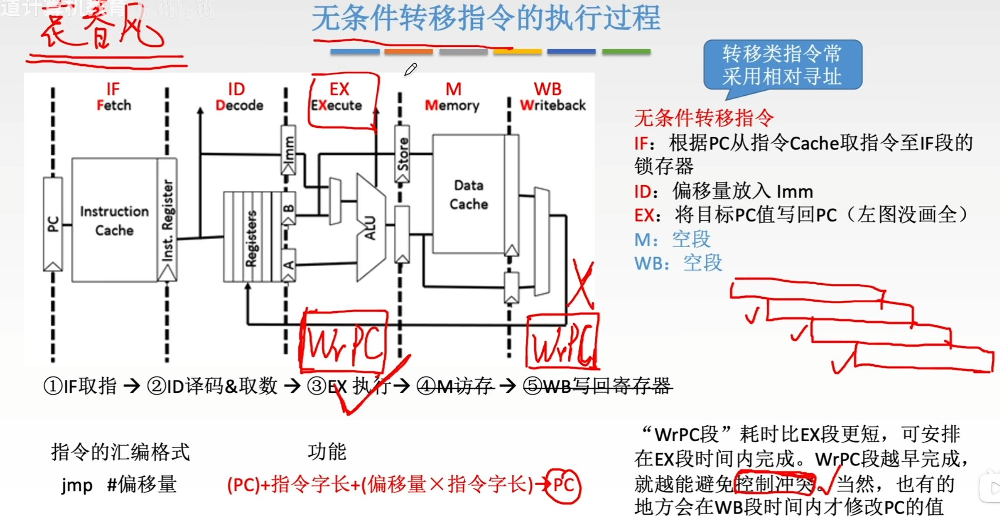
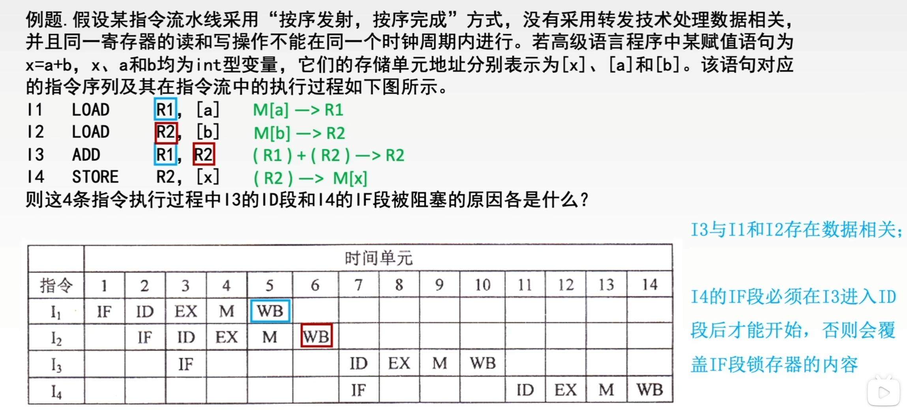

---
tags:
  - 计算机组成原理
---

# 运算类指令的执行过程

>在ID段里，锁存器有A,B,Imm三个。Imm表示的是存立即数的
>在RISC（精简指令集系统）中，所有的运算类指令，运算的两个操作数一定是来自于某个寄存器或者是立即数，运算的结果也一定是存回某个寄存器，不会直接存回主存。所以M是空段，但是时间还是要消耗的，为了方便流水线的安排

# LOAD指令的执行过程

>(996+(Rs))->Rd：意思是取出Rs寄存器(基址寄存器)里的地址，加上偏移量996作为数据在主存中的地址，取出主存中地址为996+(Rs)的数据存入Rd
>M阶段一般数据都在Data Cache中，所以这里写的是从数据Cache中取数

# STORE指令的执行过程

# 条件转移指令的执行过程

>（PC）指的是当前这条指令的地址
>注意是下个指令的地址加偏移量得到跳转的目标地址

# 无条件转移指令的执行过程

# 例题

>$I_3的ID被阻塞原因：$在$I_3$行中，ID本来应该在IF的后面，可是一直推迟到了$I_2$的WB之后
>这是因为[LOAD指令的执行过程](五段式指令流水线.md#LOAD指令的执行过程)在WB时才会将取出的数放回寄存器，而ADD指令需要用寄存器$R_1,R_2$的值
>$I_4的IF被阻塞原因：$在$I_3$的IF进入下一个阶段之前，取出的指令一直放在IF的锁存器里，如果在$I_3的ID$之前就启动$I_4的IF$，那么$I_4$的指令就会覆盖掉原来存在IF段锁存器内的$I_3$的指令，而此时$I_3$的ID还没开始指令就被覆盖掉了