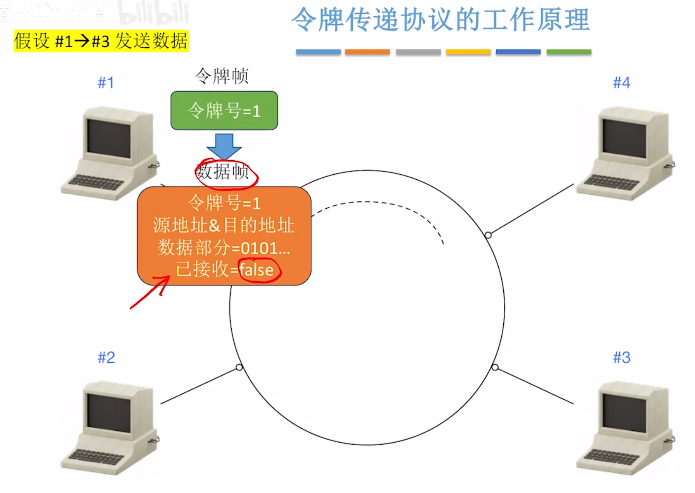
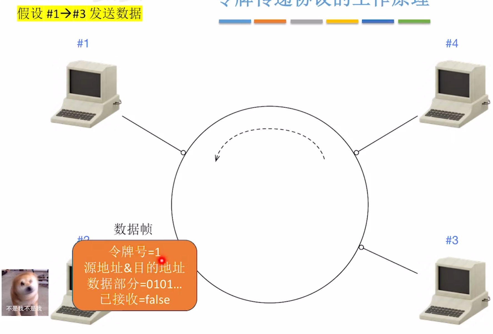
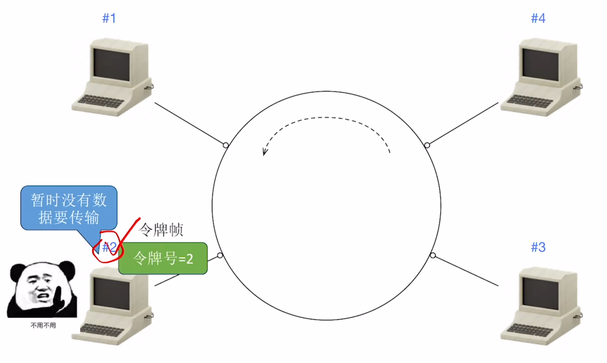
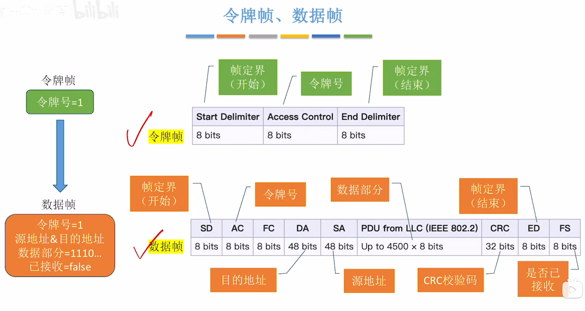
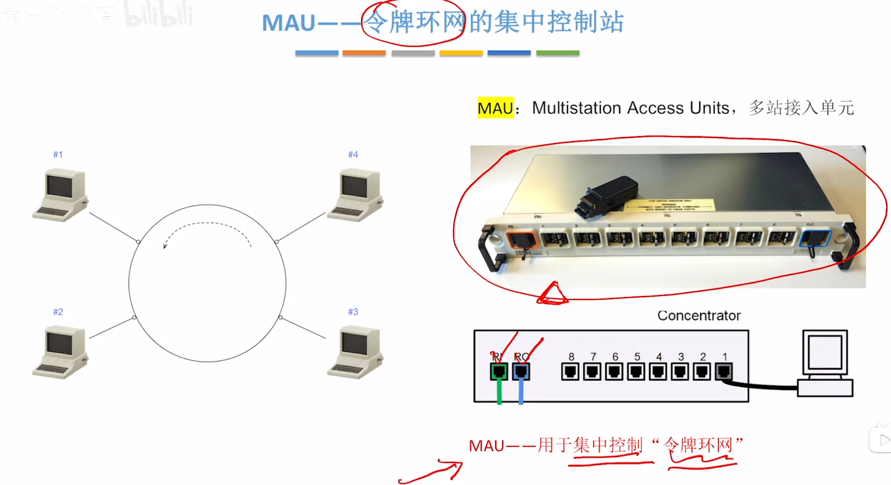
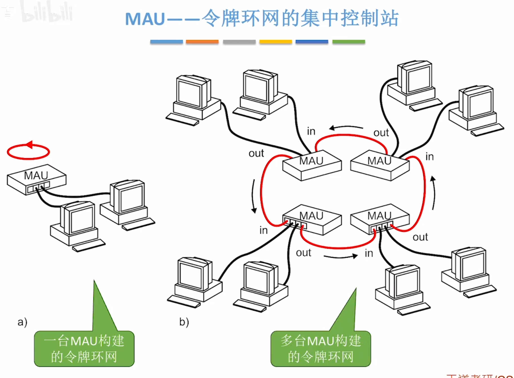
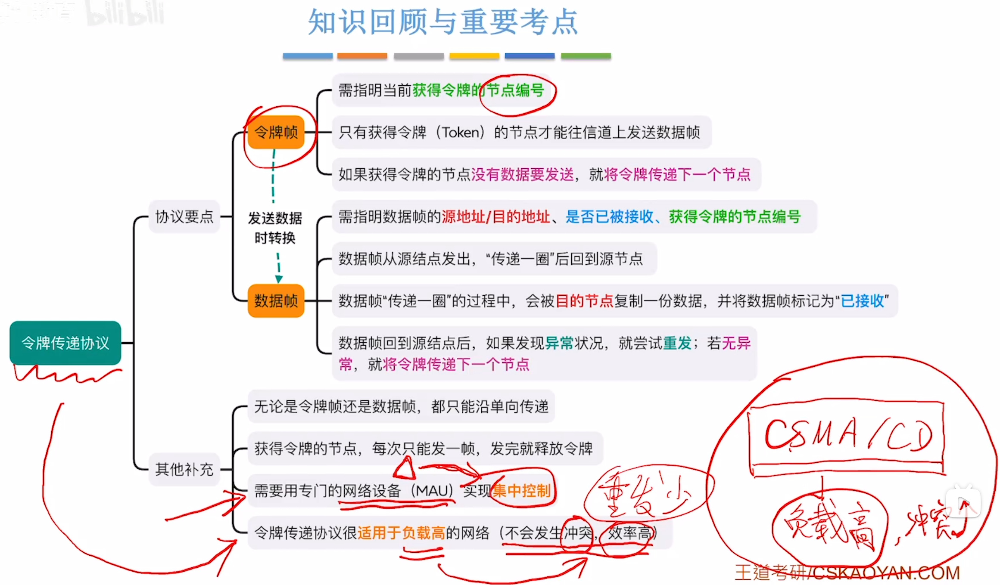
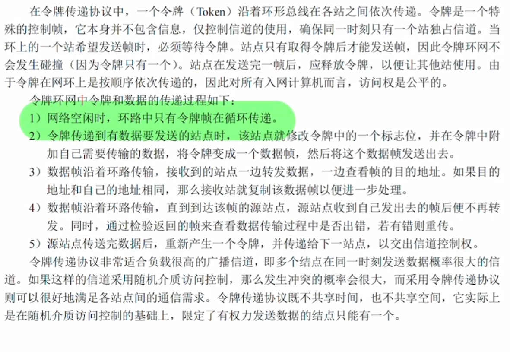

---
tags:
  - 计算机网络
---
令牌环网技术
# 工作原理

>
>
>
>
>传一圈后已接收=false 的情况：接收方差错控制后拒接数据

然后生成新的令牌号并传给下一个结点

>
>如果这个结点没数据要传输，则立即释放这个令牌并生成一个新的令牌
>无论是令牌帧还是数据帧，都只能沿着单向传递

# 令牌帧和数据帧

# MAU

>

# 总结

>CSMA CD协议 不太适用于负载高的网络
>
>