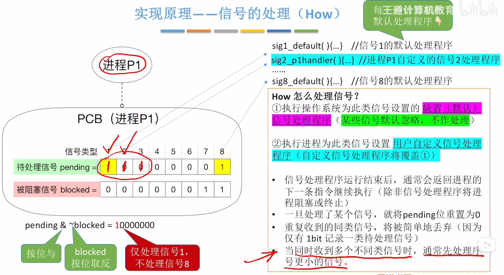
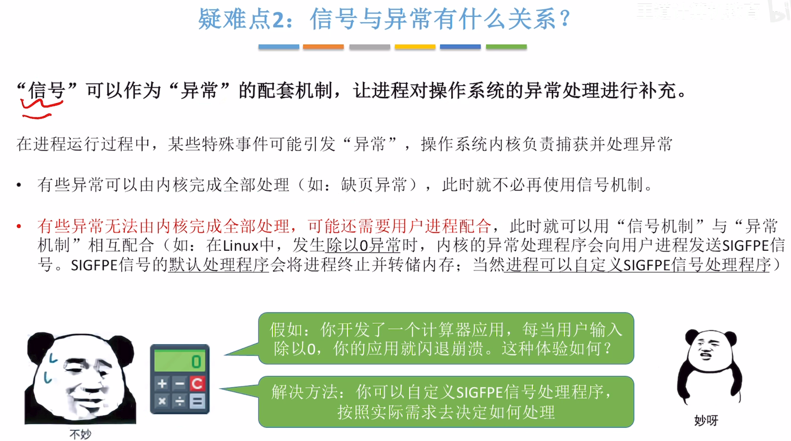
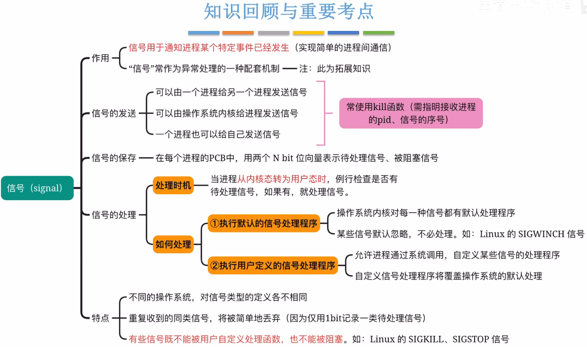

---
tags:
  - 操作系统
---
# 信号的发送

>信号是一种用于通知进程某个事件已发生的机制（P45）
# 信号的处理
## 信号处理的时机

## 信号的具体处理

>pending位为1，表示处理信号1（1号信号），每个信号都对应着处理程序，可以是系统默认的，也可以是进程自己自定义的

## 各个进程的信号处理的区别

>每个进程都可以有自己的自定义信号处理程序和自己选择阻塞哪些信号

## 信号与异常的关系

# 小结
