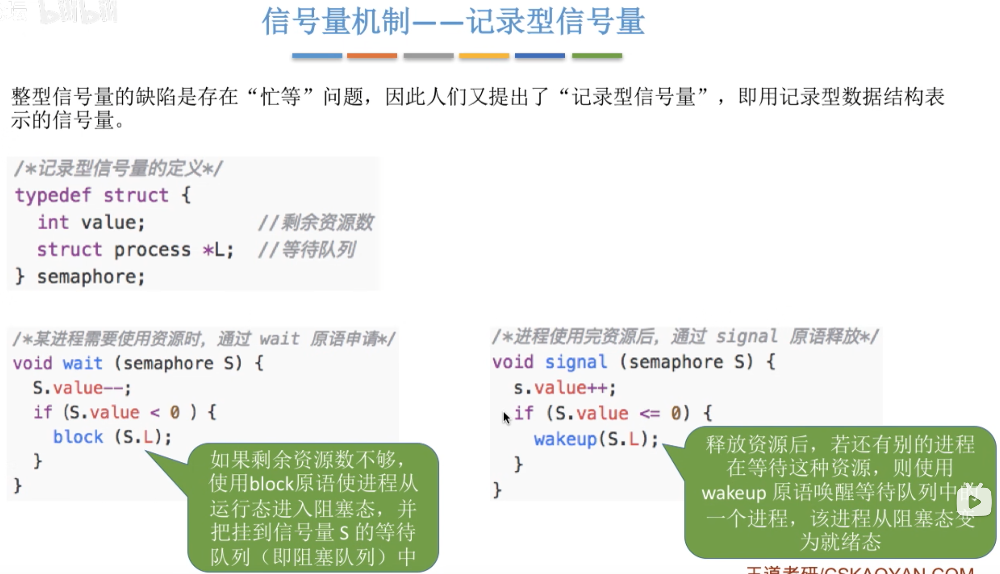
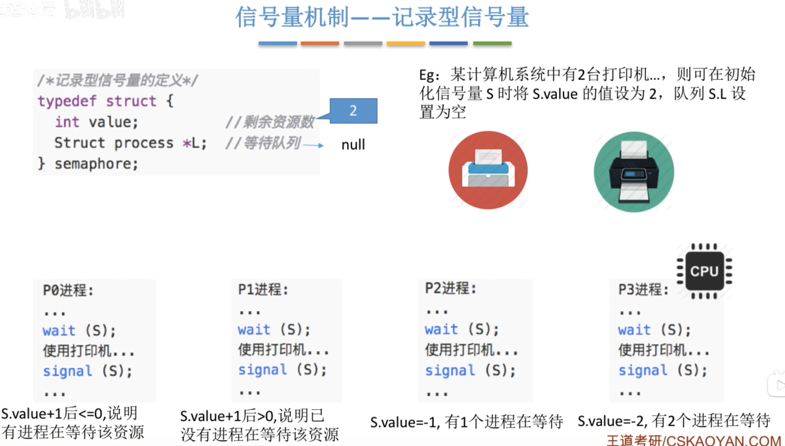
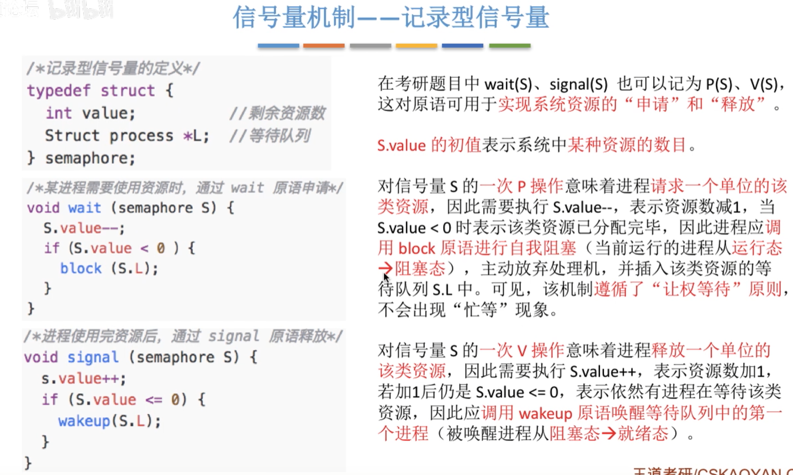
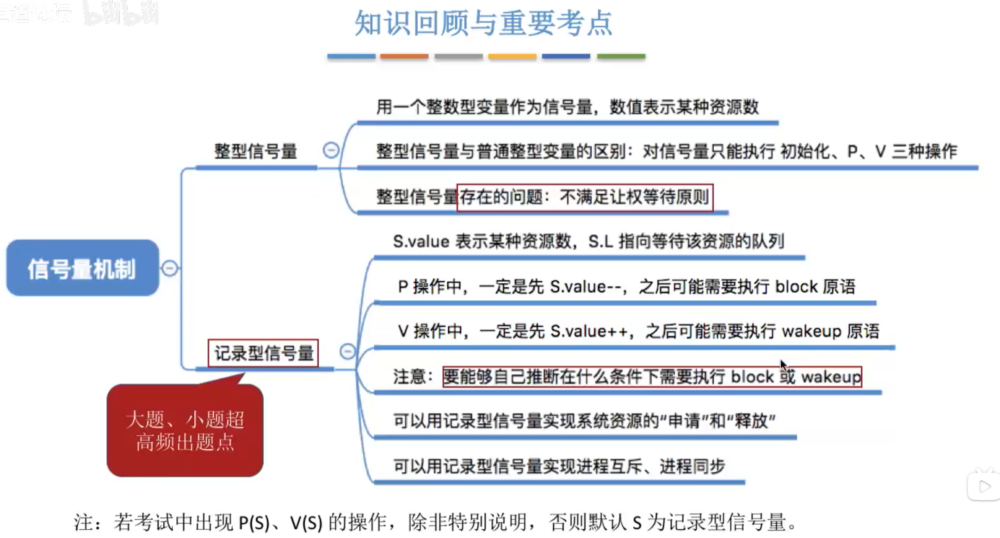

---
tags:
  - 操作系统
---
# 概念

>只有信号量机制能实现让权等待，其他都是忙等
# 整型信号量

>缺点是会发生忙等
>和[双标志先检查法](进程互斥的实现方法.md#双标志先检查法)很像，但是这个是一气呵成的
# 记录型信号量

>if(S.value <= 0)的解释：执行一次V操作，返还了一个资源，此时S.value的值应该是1，但是value的值却是0，说明value原来的值是-1，还有一个进程在等待队列中。
>此时V操作是确实的释放了一个资源，而又通过value的值知道了还有进程在等待队列，于是实行wakeup操作，将这个等待队列里的第一个进程由阻塞态唤醒到就绪态，然后处理器会将此资源分配给这个进程

## 小结

>P操作，V操作
>信号量≥0时，信号量初值-信号量的当前值=已经进入临界区的进程数量
>信号量<0时，信号量的绝对值=等待进入临界区的进程数量；信号量的初值=已经进入临界区的进程数量