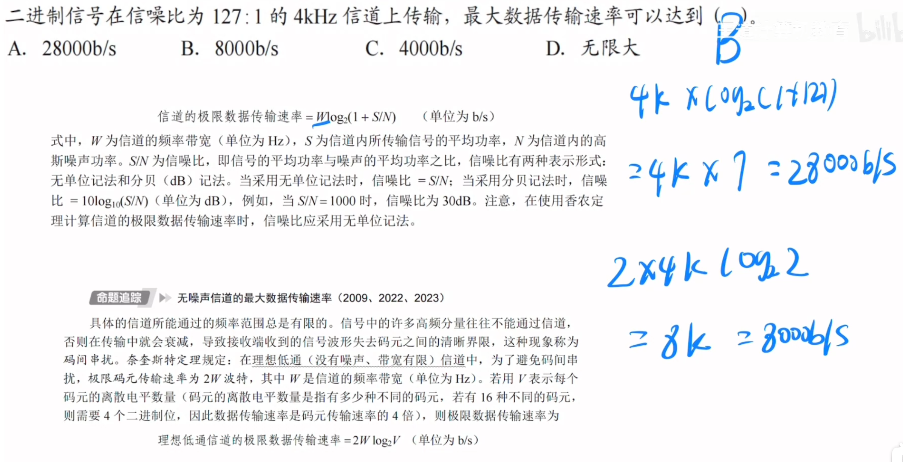

---
tags:
  - 计算机网络
---
# 噪声

# 奈奎斯特定理（奈式准则）

>例题
>例题
>
>这道题虽然给了信噪比，但是答案取的是用奈奎斯特算的，由条件二进制信号，得出每个码元1bit，
>取两个定理中较小的那个结果值
>在条件足够的时候，要用时考虑奈氏准则和香农定理，取结果较小的那个值

# 香农定理

>例题
>分贝转无单位，先除以10，然后剩下的数字表示是10的几次幂
## 信噪比

>信噪比的分贝记法
>

# 总结

