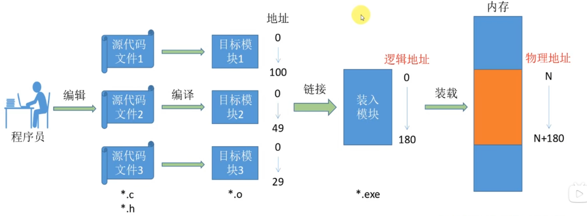
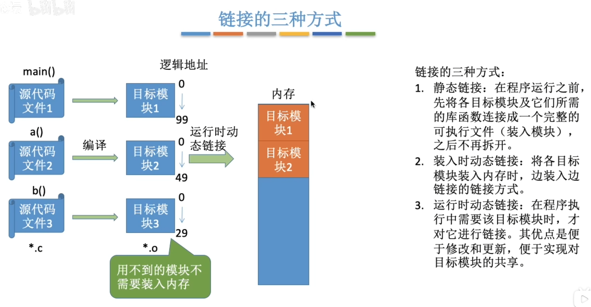

---
tags:
  - 操作系统
---
# 链接的三种方式
程序执行：编译->链接->装入

>逻辑地址是在链接的时候形成
>物理地址是在装载的时候形成

- 静态链接
	- 在装入内存之前就产生了完整的逻辑地址
- 装入时动态链接
	- 再装入内存的时候产生完整的逻辑地址
- 运行时动态链接
	- 程序要执行的时候产生相应的逻辑地址
# 总结

>三种装入方式
>静态重定位，动态重定位

# 静态重定位
[单一连续分配](连续分配管理方式.md#单一连续分配)
[固定分区分配](连续分配管理方式.md#固定分区分配)
# 动态重定位
[基本分页存储管理](基本分页存储管理.md)
[动态分区分配](连续分配管理方式.md#动态分区分配)
页式虚拟存储管理
>这三个都需要硬件地址变换机构，因为动态重定位需要定位寄存器