---
tags:
  - 操作系统
---
# 分段
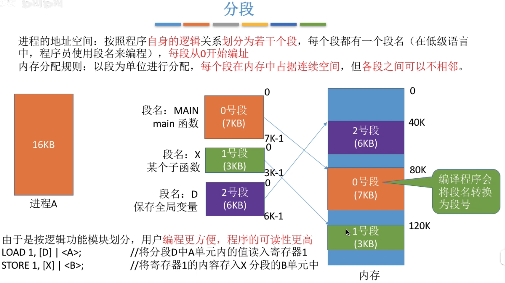
## 分段系统的逻辑地址组成
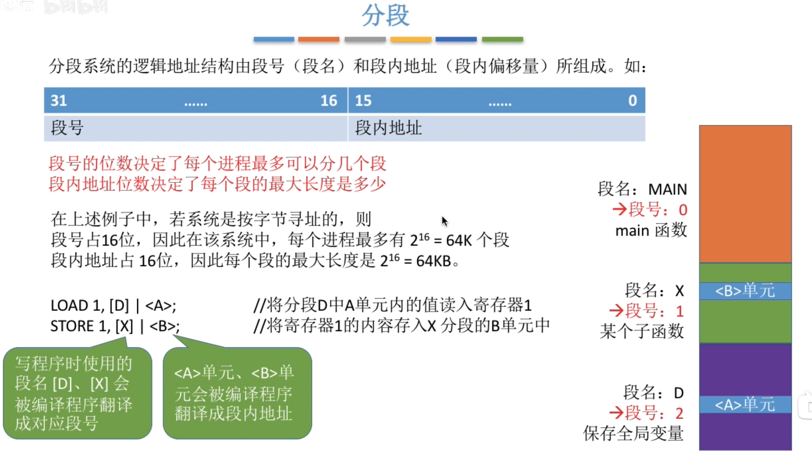

# 段表
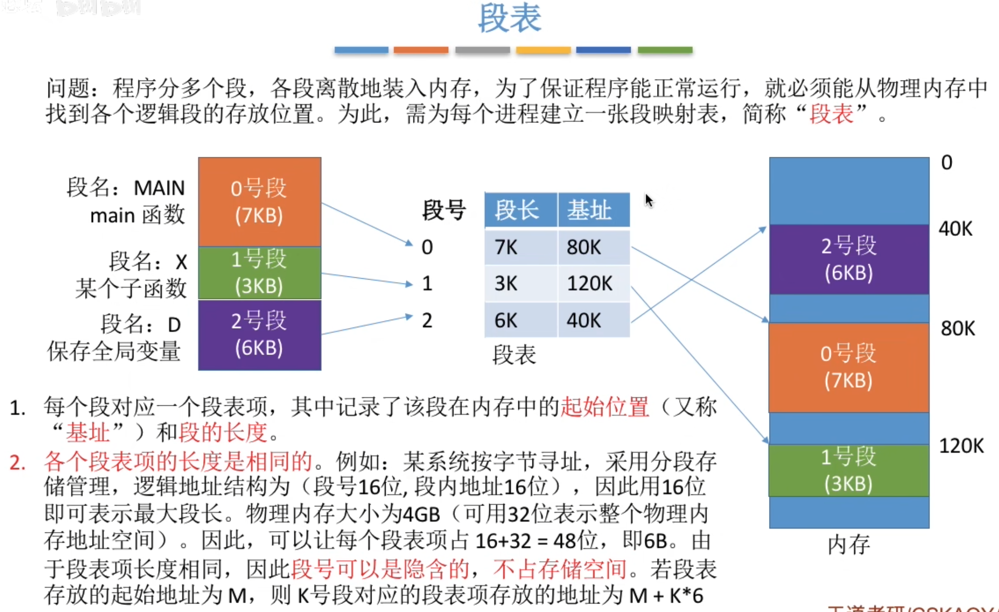

# 地址变换
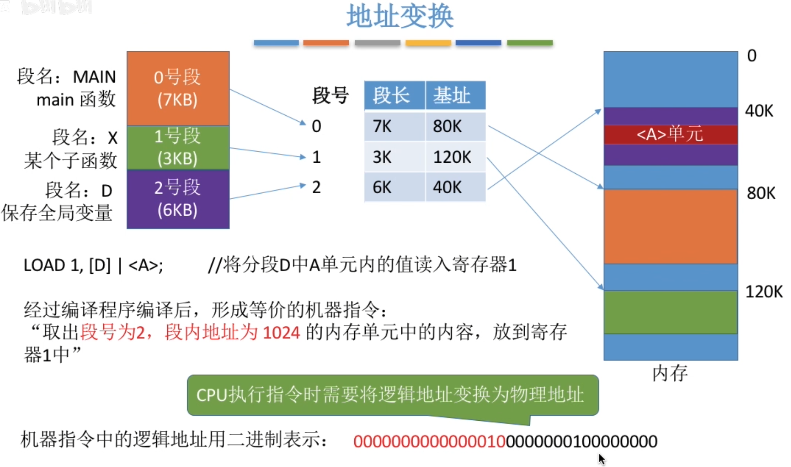
>逻辑地址：红色的表示段号，黑色的表示段内地址

## 地址变换具体流程
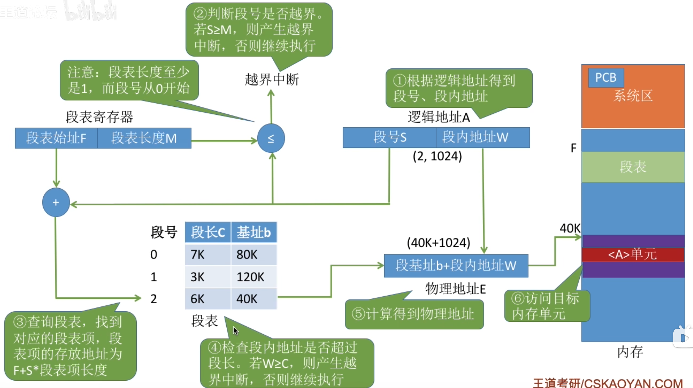
>与分页不同的是，分页每一页都相同，而分段每一段都不相同，所以需要额外检查段内地址是否超过段长

#### 共享段表
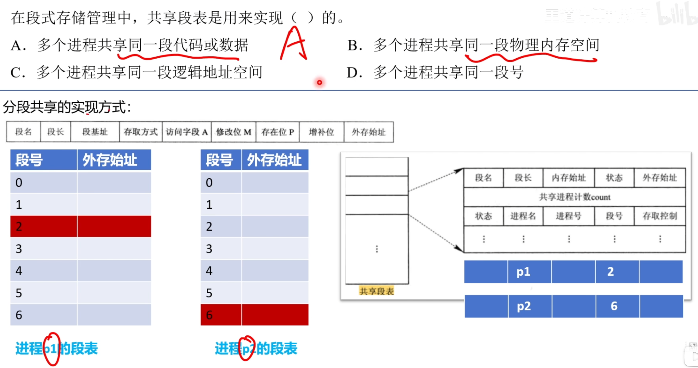
# 分段和分页管理的对比
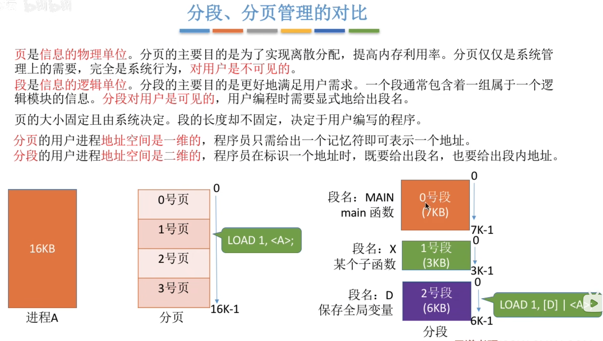
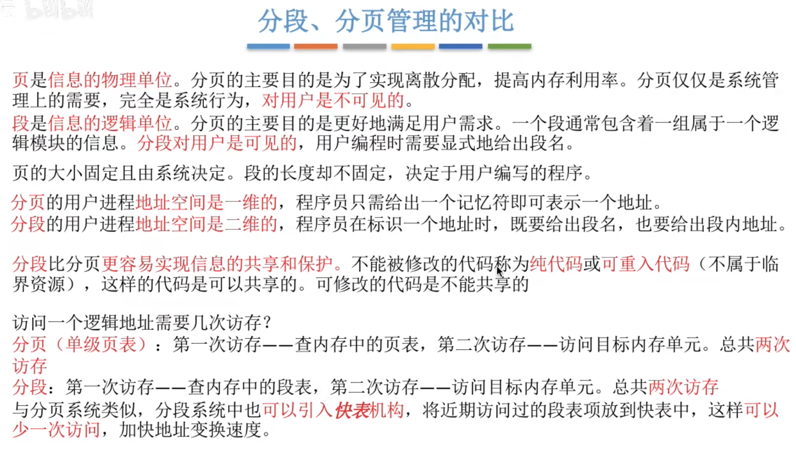
### 分段比分页更容易实现信息的共享和保护
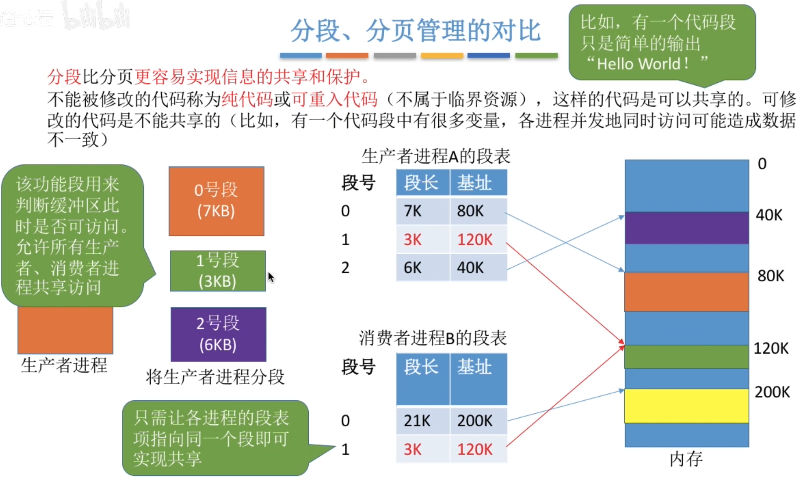
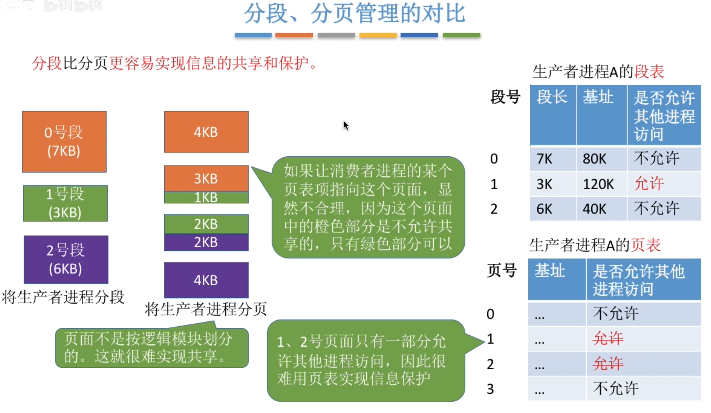

# 分段的特点
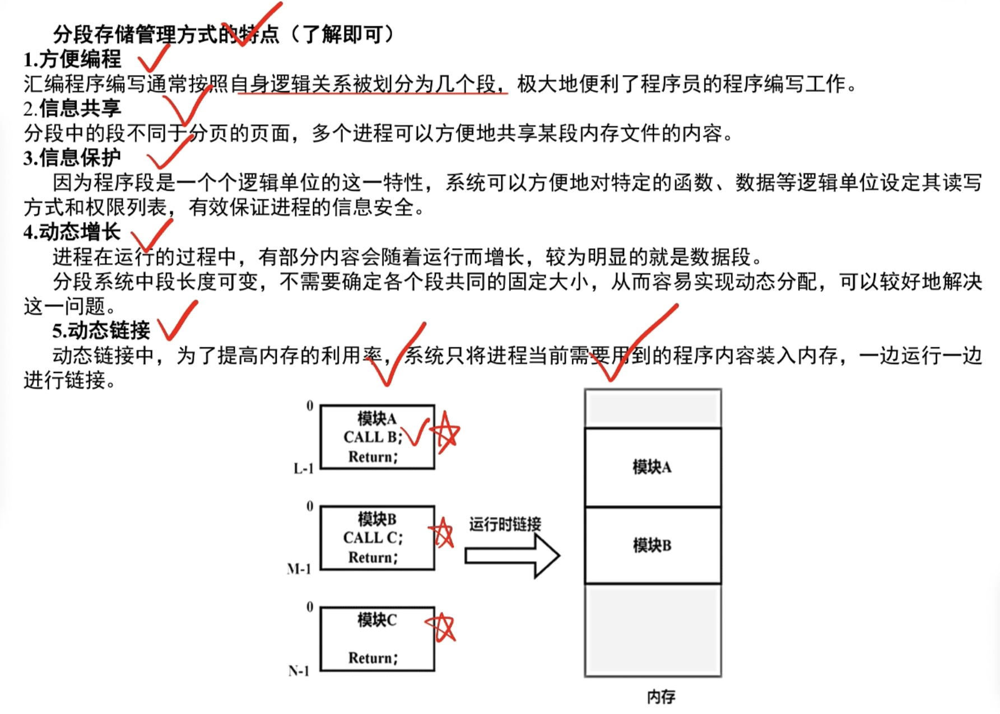