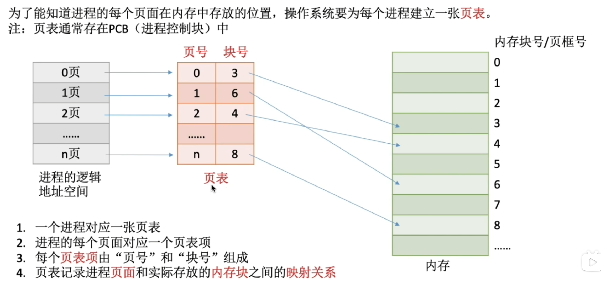
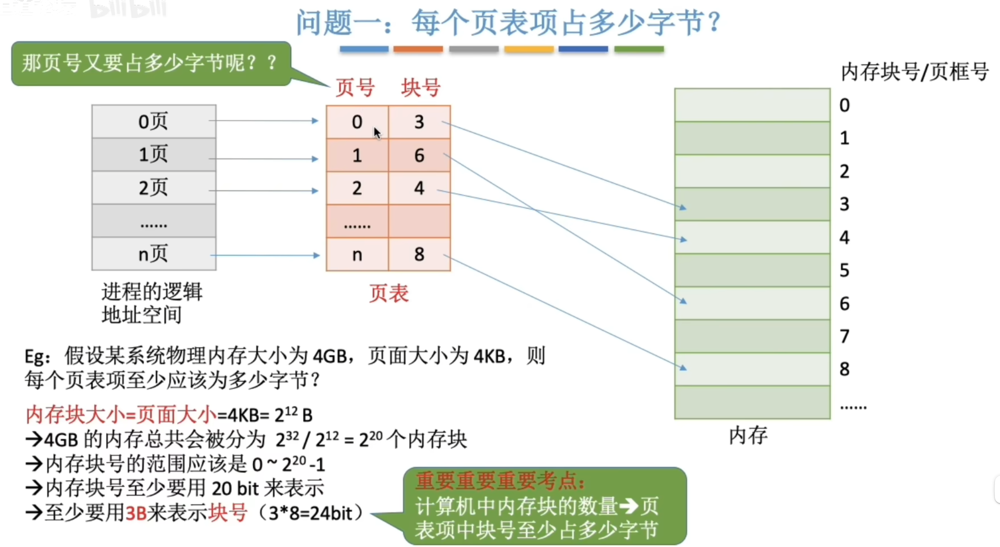
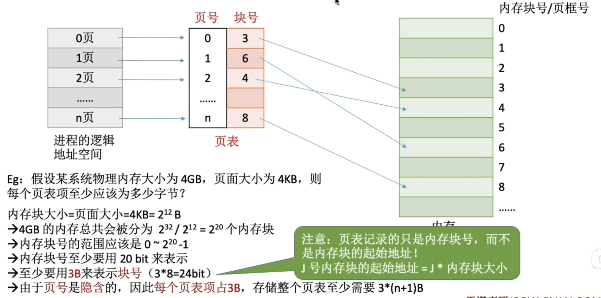
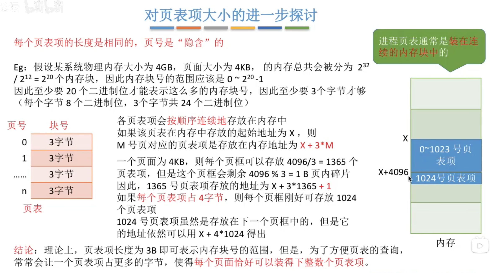
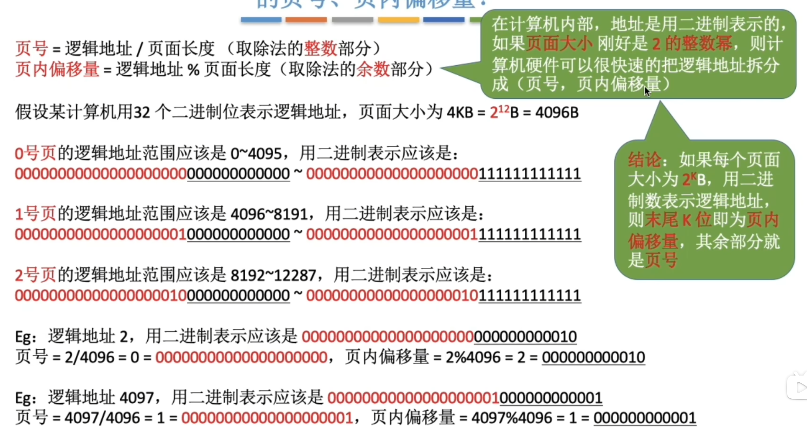
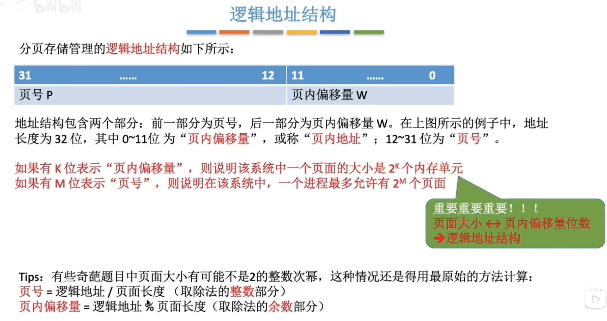
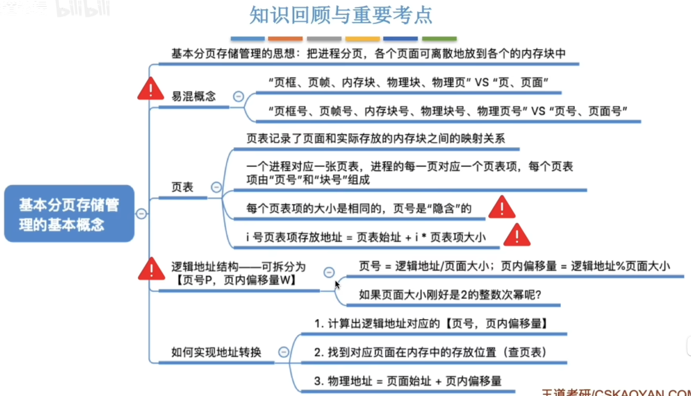

---
tags:
  - 操作系统
---
# 分页存储概念

>页框和页帧指的是内存在物理上被划分成一个一个的部分
>页和页面指的是进程在逻辑上被划分成的一个一个的部分
>页存储的是进程的

# 页表

>页表本身并不直接存储在PCB（进程控制块）内部，而是由PCB中的一个指针指向其物理位置。PCB和页表都存储在内存中，但它们位于不同的区域
## 计算页表项大小
### 计算块号占多少字节

### 页号不占字节

>页号就像数组下标一样，是隐含的，不占用存储空间
>
>从0到n共n+1个页表项，每个页表项占3B

### 页表项大小与查询的关系

## 确定页号和页内偏移量

>页面大小是2^12 B，那么逻辑地址的末尾12位就是页面偏移量，前面的部分则是页号

>确定了页号就可以找到实际存储的内存块号，在加上指导页内偏移量就可以对应内存块的块内偏移量，就可以得到对应的物理地址
>页面大小取2的整数次幂的好处
>

# [[基本地址变换机构]]
从逻辑地址->内存地址的更具体过程
### 分页存储管理的逻辑地址结构

# 总结
