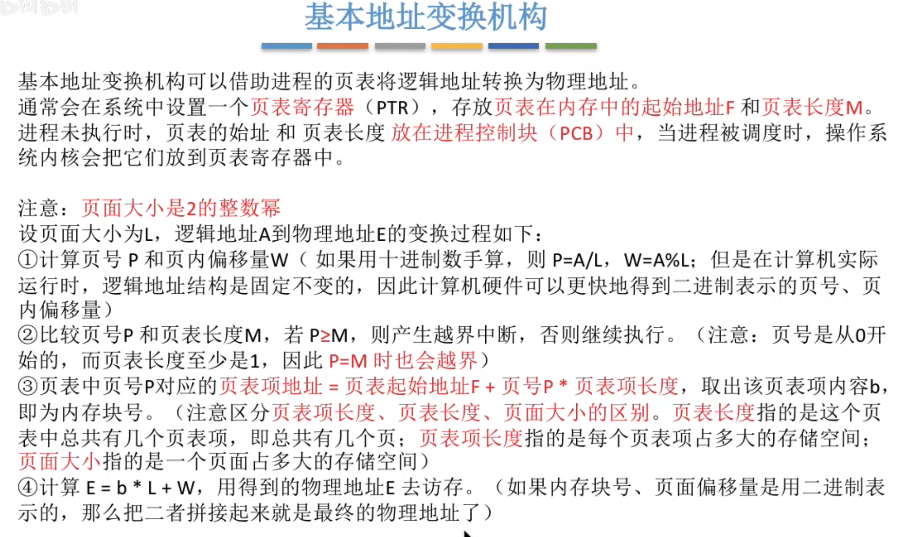
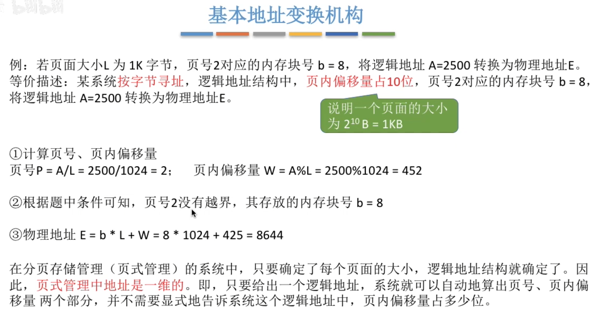
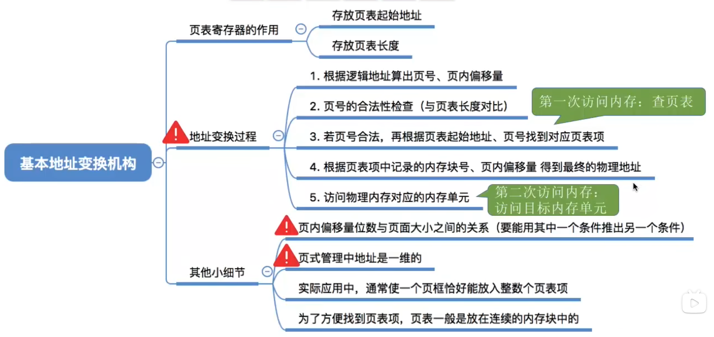
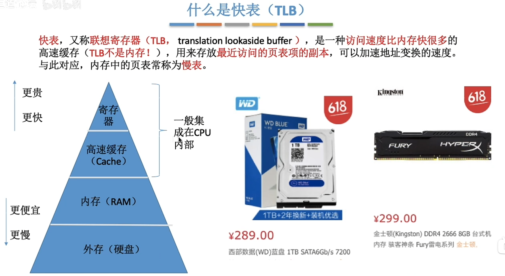
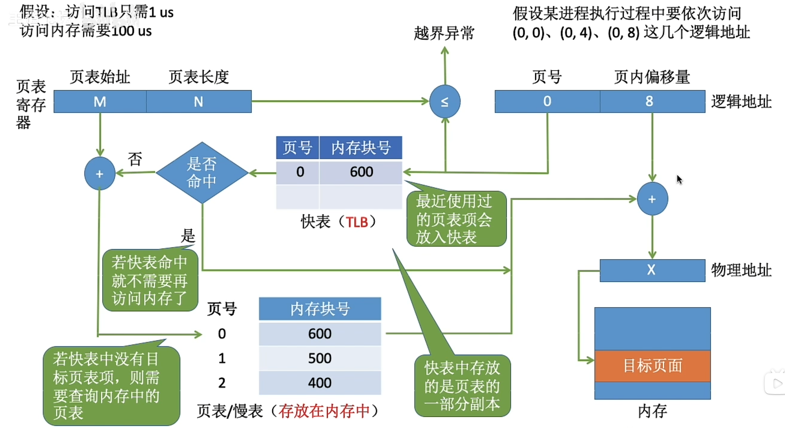
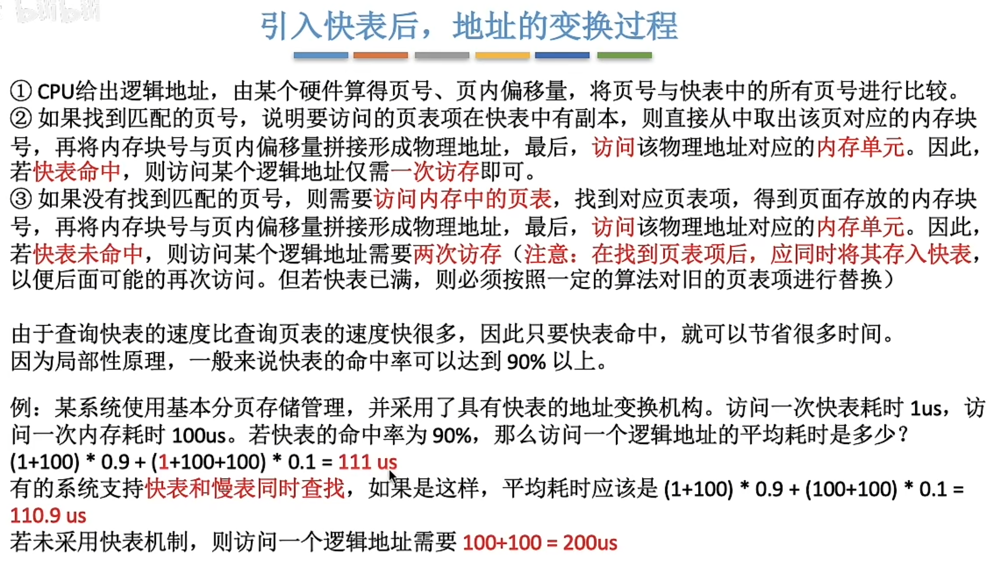
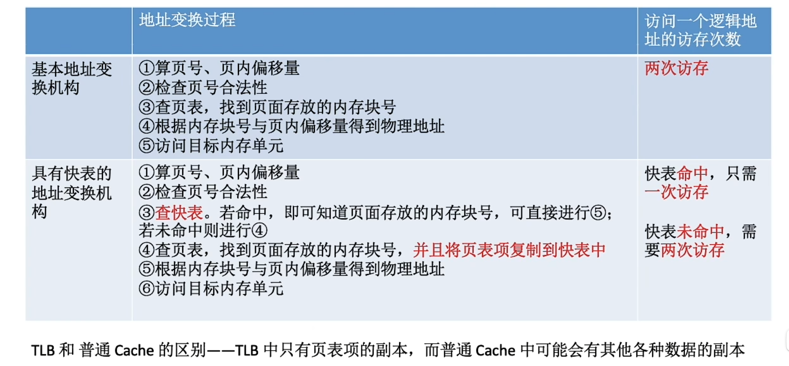

---
tags:
  - 操作系统
---
# 逻辑地址转换成实际地址

>页表长度M表示的是有多少个页表项，所以如果页号P超过了M，则说明发生了越界
>页号P加上页表起始地址，得到对应的实际内存块号（页面大小是2^12 B，那么逻辑地址的末尾12位就是页面偏移量，前面的部分则是页号）

## 文字描述

>页面大小：页面存的是数据，比如4GB物理内存，页面是4kb
>页表项长度：与内存被分为内存块的数量有关，内存块号的表示范围大则需要更多bit来存储内存块号[计算页表项大小](基本分页存储管理.md#计算页表项大小)

## 计算例题

# 总结

# 具有快表的地址变换机构
## 快表

## 有快表后的访问过程

>快表是硬件，每次进程切换的时候会清空

## 引入快表后的访问内存次数

>TLB和Cache存的东西是不一样的