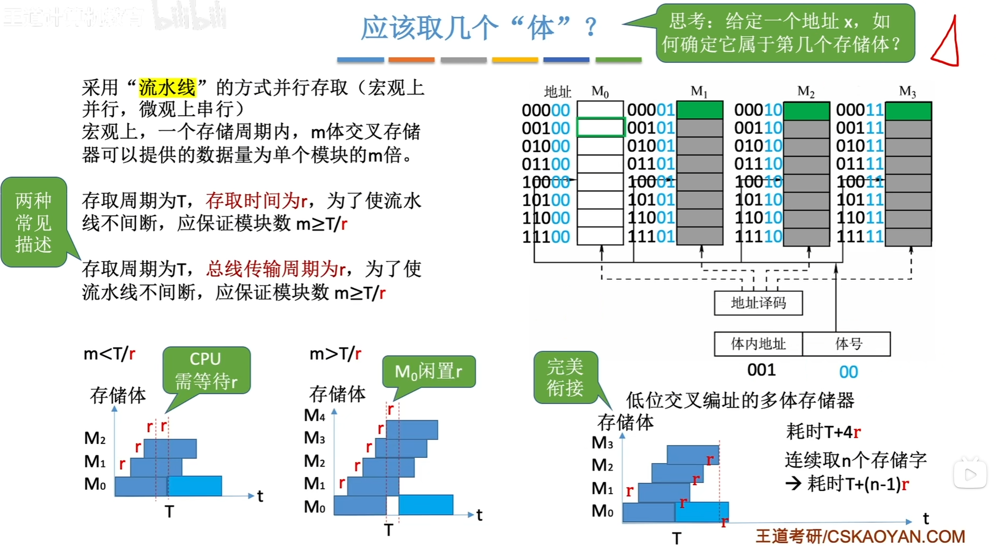
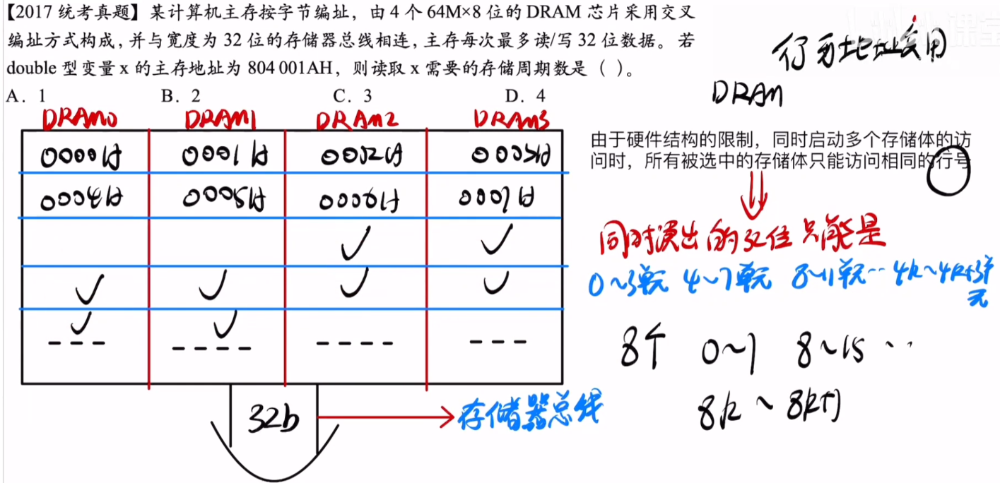

---
tags:
  - 计算机组成原理
---
p86
# 轮流启动方式
**每个模块一次读/写的位数正好等于数据总线位数**

>为什么要讨论连续访问的情况?
>在实际情况中,很多数据都是存放在连续的地址的,例如数组

## 多体并行存储器该取多少个模块

>取少了,CPU要等待
>取多了,由模块会闲置,而模块多会增加成本
>CPU经过一个存取时间r拿到数据之后就会去下一个存储体(存储芯片)拿数据,不会等到它恢复,被读取的存储体在后台自己恢复等待下一次被CPU访问

# 同时启动方式

如图所示,里面每个格子是8bit,但是**主存每次最多读/写32位数据**所以当存储体的的数量乘以每个存储单元的位数等于主存每次读写的位数(**所有存储模块一次并行读/写的总位数恰好等于存储器数据总线宽度时**)可采用同时启动的方式,
>此时就是一行一行的读/写(一行是32位)