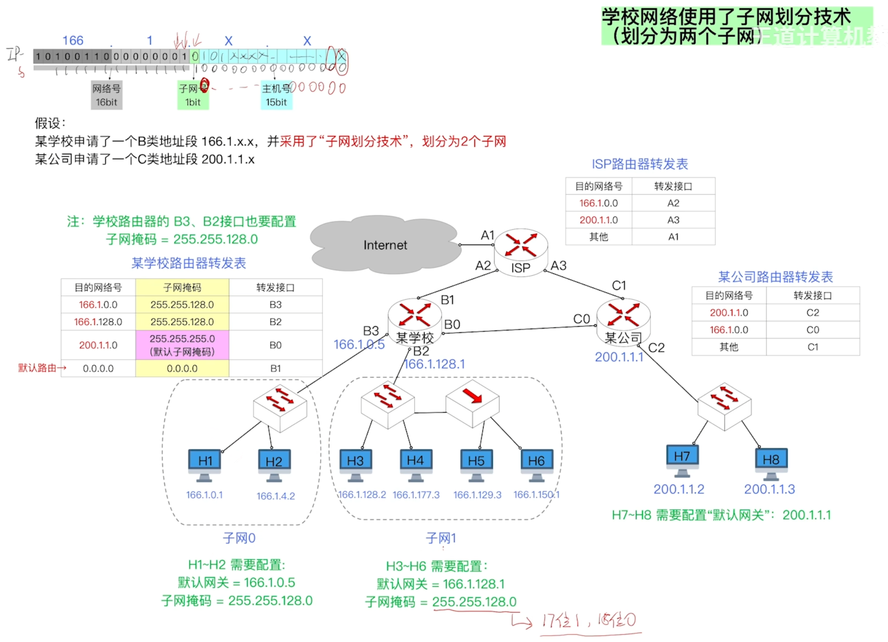
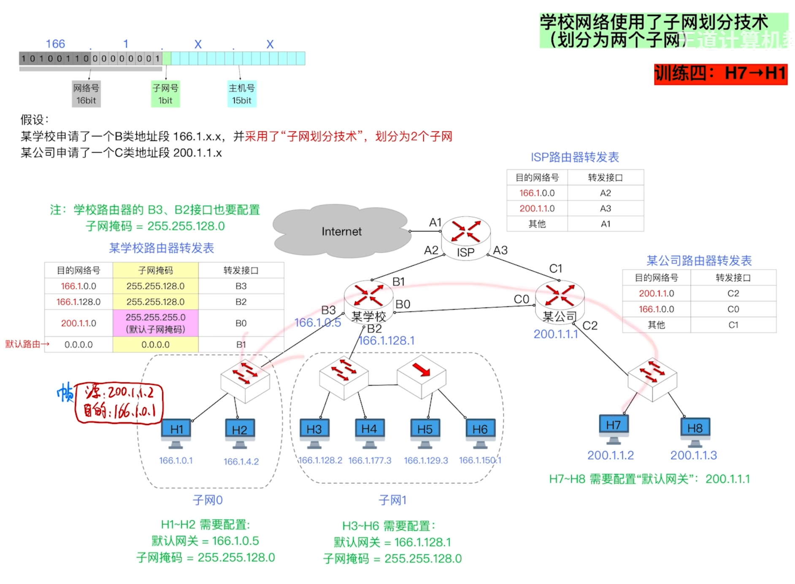
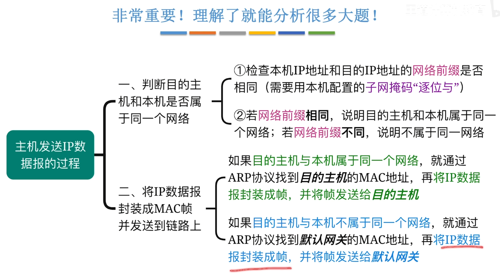
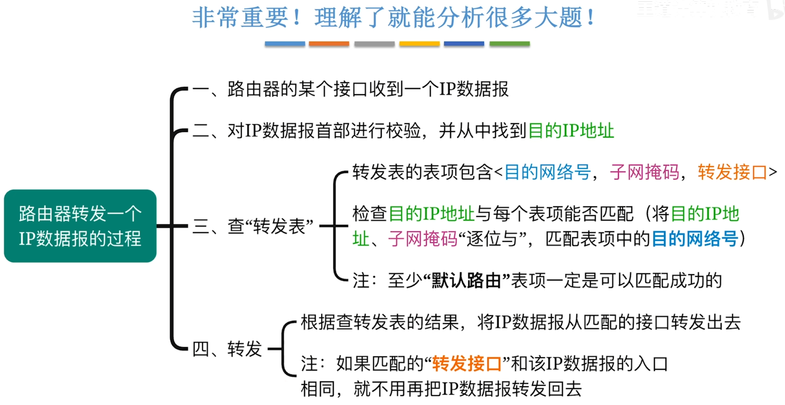
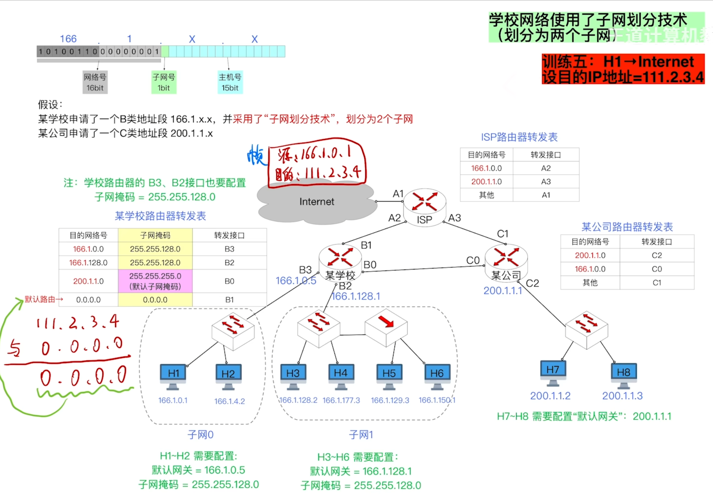
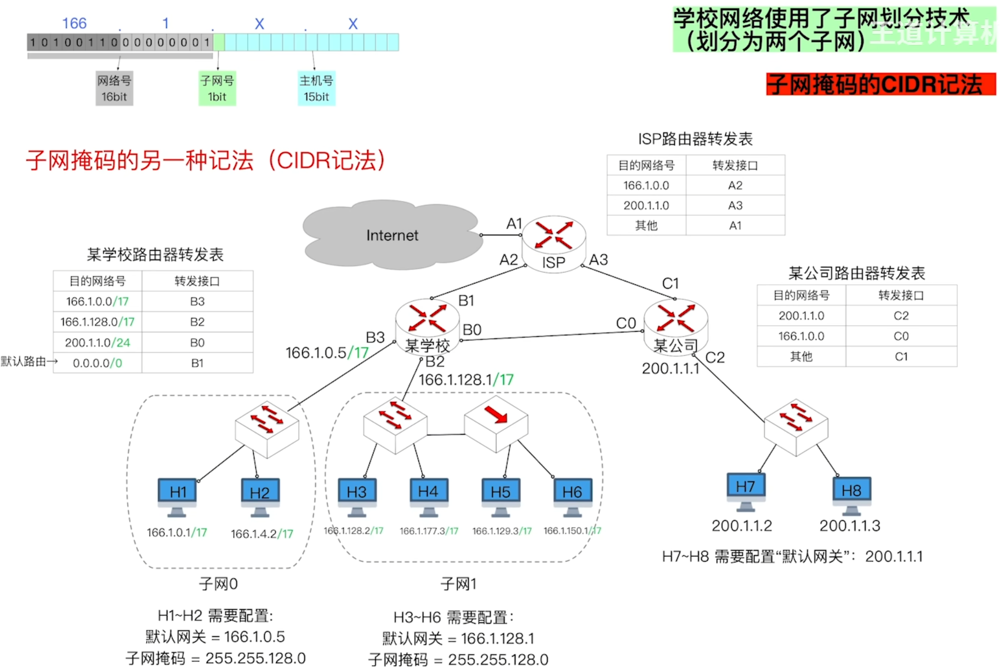
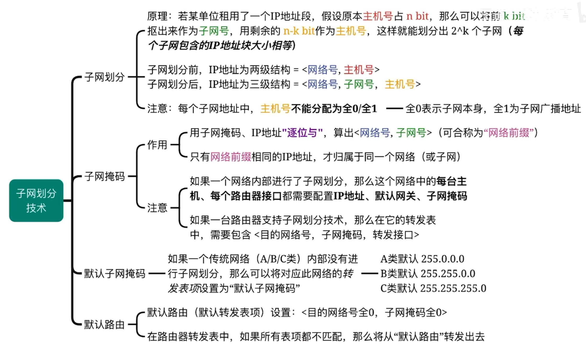

---
tags:
  - 计算机网络
---
# 子网掩码

>当需要判断两台主机是否在同一个子网时，就不止要看网络号，还要加上子网号，图中是分了2个子网，也就是子网号占1bit，那么子网掩码就是17位1,15位0。其中17位1刚好对应，网络号和子网号的总共的位数。网络号和子网号在一起称为网络前缀
>用子网掩码与IP地址逐位相与得到网络前缀

## 传送过程

>其实相比[IP分组转发流程(不同网络)](IP地址.md#IP分组转发流程(不同网络))就是多了一步，在支持子网掩码路由器那里会先对目的IP地址与子网掩码相与，再去对比是否与目的网络号相同

### 主机发送IP数据报的过程

>采用[无分类编址CIDR](无分类编址CIDR.md)技术后过程雷同
### 路由器转发一个IP数据报的过程

>首部校验:通过[IP数据报（分组）的格式](IPv4分组.md#IP数据报（分组）的格式)里首部校验和的部分进行校验
>采用[无分类编址CIDR](无分类编址CIDR.md)和[路由聚合](路由聚合.md)之后，需要[最长前缀匹配原则](路由聚合.md#最长前缀匹配原则)

### 默认路由的作用

>当所有的转发表项都匹配不上的时候，默认路由的那项是一定能匹配上的

### 子网掩码的另一种记法（CIDR记法）

>166.1.0.0/17  17表示子网掩码是17个1，32-17=15个0
# 子网划分技术

>默认子网掩码由A或B或C类IP地址决定，通过[IP地址](IP地址.md)里前面固定的几位判断属于哪类

