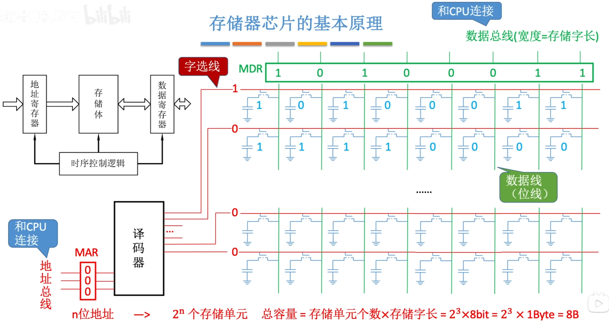
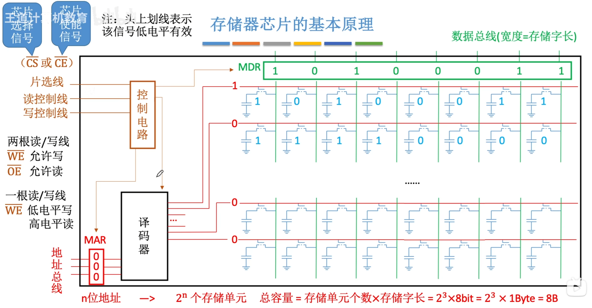
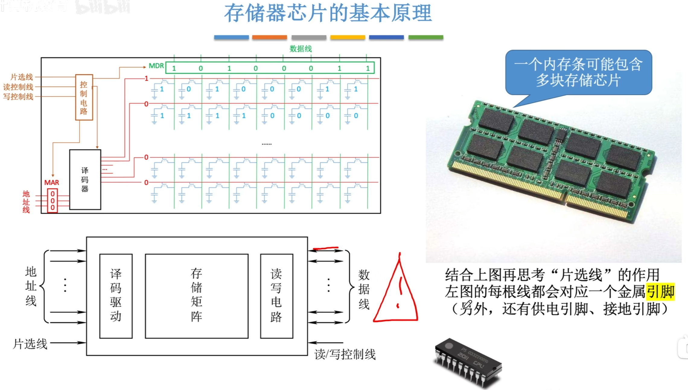
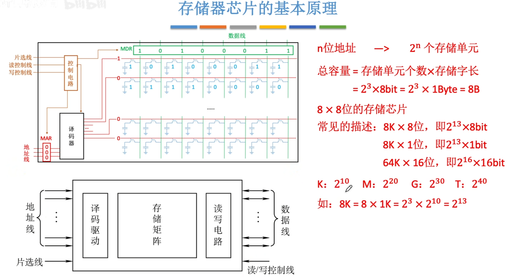
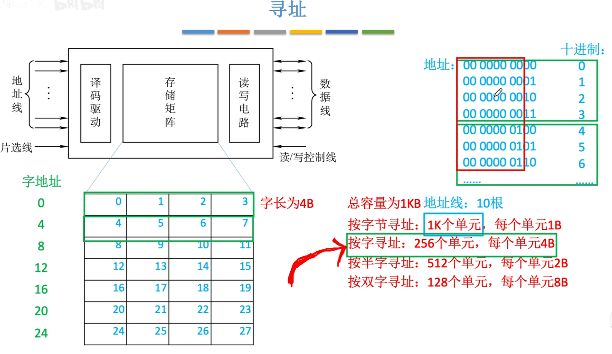

---
tags:
  - 计算机组成原理
---
p82补充
# 存储芯片的内部

%%MOS管,存储元,存储体,存储单元图%%
>图片解释了为什么计算机每次访存都是以存储字为单位,一个存储字连的都是同一根MOS管
>存储单元就是绿色框的一行

## 存储器芯片的基本原理

%%存储芯片的构成%%
>CPU给MAR地址,MAR交给译码器,译码器会找到对应的字选择线,此时每一位数据通过数据线传送到MDR当中再通过数据总线将MDR里的数据传送到CPU

%%一块存储芯片的构造,片选线(CS/CE)%%

%%引脚%%
>存储矩阵:一个一个的存储元在一起
>译码驱动:译码器和驱动器
>片选线的作用:一个内存条可能有多块存储芯片,片选线的作用就是让要访问的那块存储芯片工作,其他的存储芯片不工作,就是要让这块存储芯片的片选线有效,也就是给$\overline{CS}$一个低电平
>每根地址线,数据线,片选线都会对应一个金属引脚,读/写控制线看有几根(可能有两根或一根),就对应几根金属引脚
## 存储容量的不同描述

>8X8位的存储芯片,第一个8表示存储单元的个数,第二个8表示存储字长
>$M\times N$:N其实代表了总线宽度

## 寻址

>总容量1KB对应10根地址线:$2^{10}$刚好就是1K,10位二进制所能表示的范围$0到2^{10}-1$