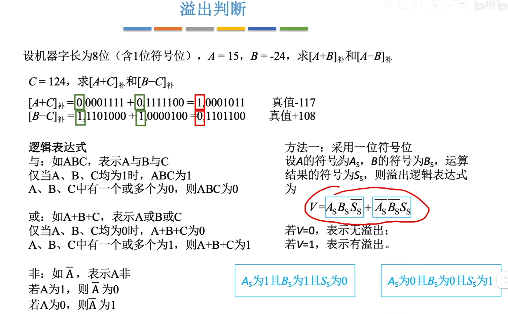
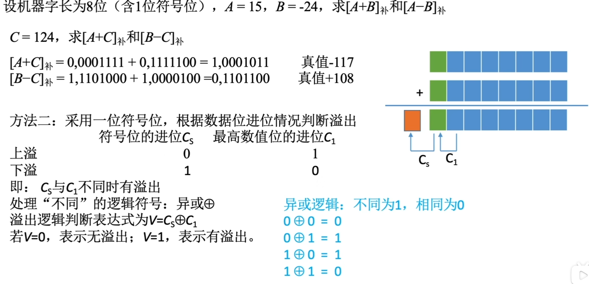
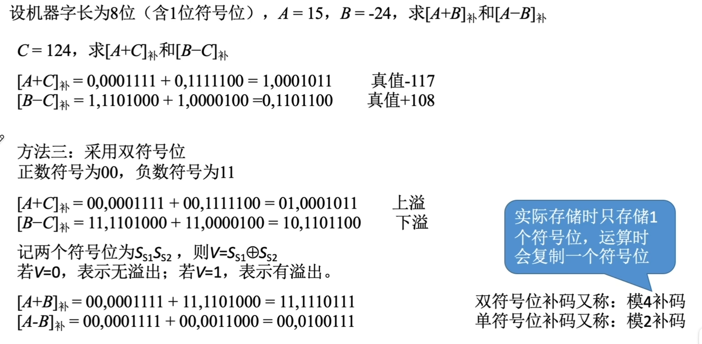

---
tags:
  - 计算机组成原理
  - 溢出
---

# 三种溢出判别方法
## 1.采用一位符号位
其中$A_s$表示被加数的符号位，$B_s$表示加数的符号位，$S_s$表示运算结果的符号位。
- 根据**性质**：正数+正数，才会上溢——正+正=负
- 只有负数+负数，才会下溢——负+负=正
- $$A_sB_s\bar{S_s}\quad 表示的是正+正=负的情况$$
- $$\bar{A_s}\bar{B_s}S_s表示的是负+负=正的情况$$
## 2. 采用1位符号位并结合进位情况

- $C_s$表示符号位相加后向更高位的进位，$C_1$表示符号位上一位向符号位的进位
- 其实就是带标志位加法器[OF（OverFlow Flag）](带标志位加法器.md#OF（OverFlow%20Flag）)里==OF==的判断方法
- 图中的例子A+C是上溢的情况，也就是==正数+正数=负数的情况==
  
- **其实第二种的方式的式子与第一种的式子是等价的，本质都是正+正=负/负+负=正为溢出**
- **正+正**的情况，两个正数，那么最高位符号位都是0，要使最后的结果为负，也就是符号位变成1，只有可能是最高位前面的一位（次高位）向最高位产生了进位
- $$[ \begin{array}{r} 0XXXXX \\ + 0XXXXX \\ \hline 1XXXXX \end{array} ]$$
- 而最高位没有产生进位，也就是$C_1=1，C_s=0$，
- **负+负**的情况也是同理
- $$[ \begin{array}{r} 1XXXXX \\ + 1XXXXX \\ \hline 0XXXXX \end{array} ]$$
- 要想使结果的最高位是0，那么**次高位**就不能产生进位，并且此时**最高位**产生的进位为1
- 也就是$C_1=0,C_s=1$.
- ## 3. 采用双符号位 

- 这里的双符号位，==最高位的符号位表示的是本来运算正确的符号（如正+正=正）,第二个符号位表示实际的符号==二者不相同说明发生了溢出
- 模2补码
- 模4补码