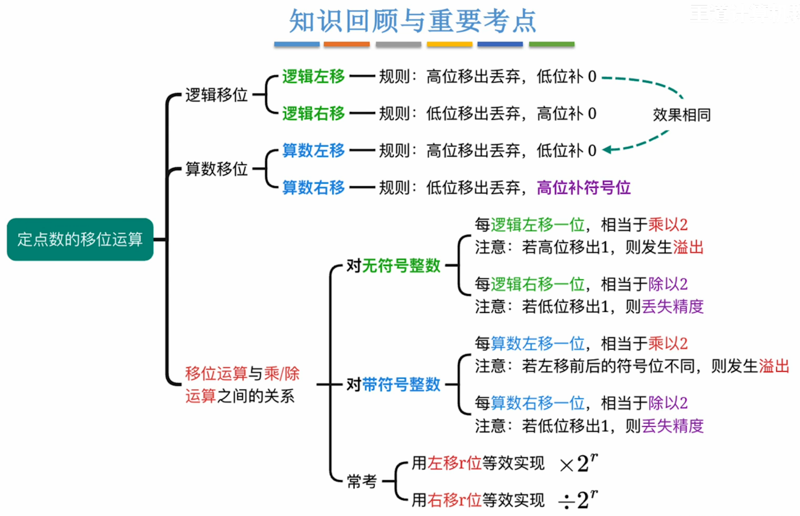

---
tags:
  - 计算机组成原理
---
	

- 注意逻辑==算术右移和逻辑右移==的区别，以及无符号整数和带符号整数在==左移时判断溢出的条件的区别==。
# 逻辑移位
## 逻辑左移
高位移出，低位补0
相当于乘2，若高位的1移出，则发生**溢出**
## 逻辑右移
低位移出，高位补0
# 算术移位
## 算术左移
高位移出，低位补0
若移出的高位与原符号位不同（**左移号后符号位改变**），则发生溢出
## 算术右移
低位移出，高位补符号位
若低位的1移出，则影响精度