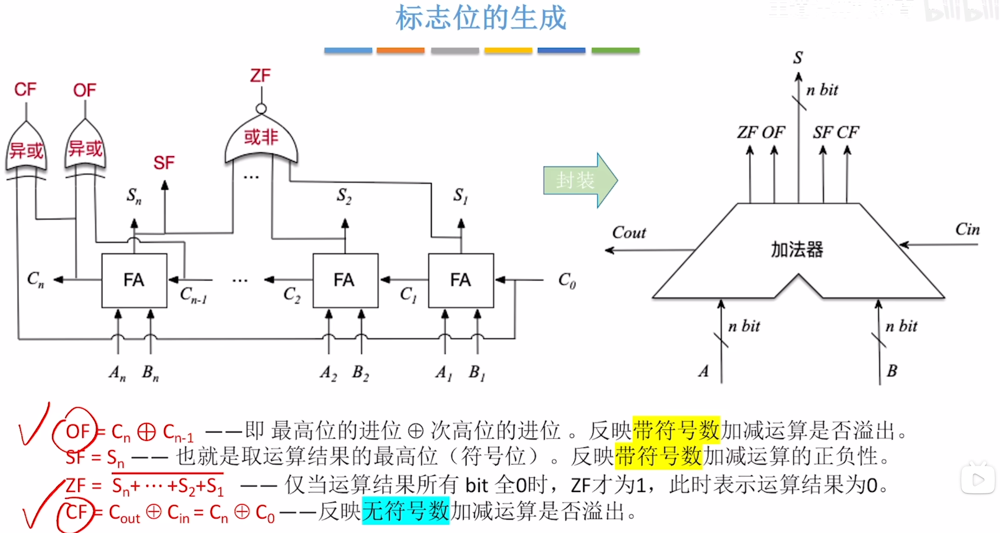

---
tags:
  - 计算机组成原理
  - 溢出
---

## OF（OverFlow Flag）
- 溢出标志，用于判断**带符号数**加减运算是否溢出。OF=1溢出；OF=0 未溢出
- [2. 采用1位符号位并结合进位情况](定点数的加减运算.md#2.%20采用1位符号位并结合进位情况)OF的判断方法与之相同
- [无符号整数的乘法运算](../无符号整数的乘法运算.md)，[带符号整数的乘法运算](带符号整数的乘法运算.md)都是使用OF判断的
## SF（Sign Flag）
- 符号标志，用于判断**带符号数**加减运算结果的正负性。SF=1结果为负；SF=0结果为正
- SF是取最高位，在补码里最高位就是符号位
## ZF(Zero Flag)
- 零标志，用于判断加减运算结果是否为0。ZF=1表示结果为0；ZF=0表示结果不为0
- 对所有位进行或非（先或再非）,这样只有当里面的全为0，再取非才会输出1
## CF（Carry Flag）
- 进位/借位标志，用于判断**无符号数**加减运算是否溢出CF=1溢出；CF=0未溢出
- 原理就是无符号数的加减运算里面的[溢出判断](无符号数的加减运算.md#溢出判断)
## 标志位的生成
