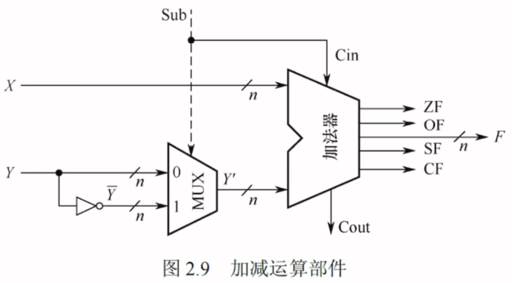
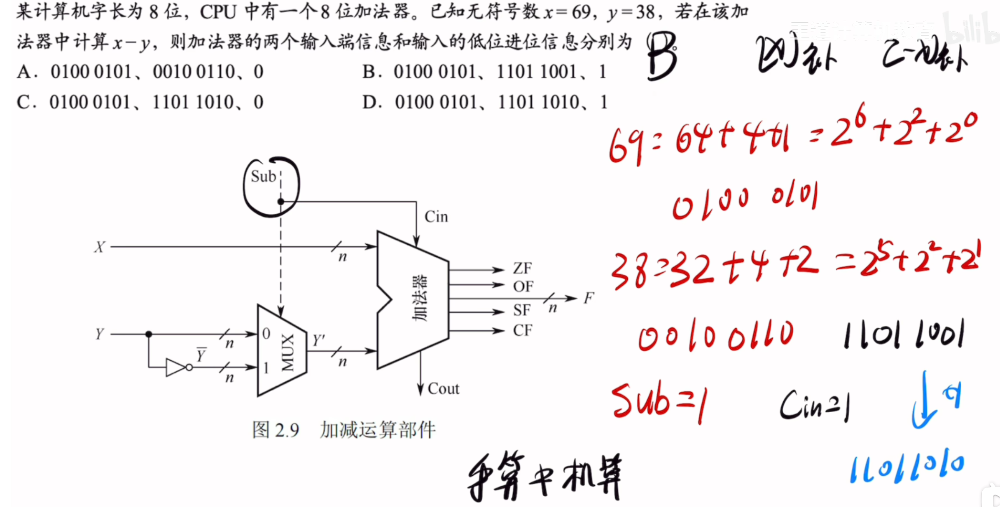

---
tags:
  - 计算机组成原理
  - 溢出
---

## OF（OverFlow Flag）
- 溢出标志，用于判断**带符号数**加减运算是否溢出。OF=1溢出；OF=0 未溢出
- [2. 采用1位符号位并结合进位情况](定点数的加减运算溢出判别.md#2.%20采用1位符号位并结合进位情况)OF的判断方法与之相同
- [无符号整数的乘法运算](无符号整数的乘法运算.md)，[带符号整数的乘法运算](带符号整数的乘法运算.md)都是使用OF判断的
## SF（Sign Flag）
- 符号标志，用于判断**带符号数**加减运算结果的正负性。SF=1结果为负；SF=0结果为正
- SF是取最高位，在补码里最高位就是符号位
## ZF(Zero Flag)
- 零标志，用于判断加减运算结果是否为0。ZF=1表示结果为0；ZF=0表示结果不为0
- 对所有位进行或非（先或再非）,这样只有当里面的全为0，再取非才会输出1
## CF（Carry Flag）
- 进位/借位标志，用于判断**无符号数**加减运算是否溢出CF=1溢出；CF=0未溢出
- 原理就是无符号数的加减运算里面的[溢出判断](无符号数和有符号数的加减运算.md#溢出判断)
## 标志位的生成

---

%%加减运算部件%%

# 帮助理解加法器原理的例题

- 对于x，由图可知x是直接原样输入的，x又是正数，所以x那端的输入就是0100 0101
- 因为执行的是减法**sub=1，并且控制的多路选择器MUX也是1，Cin=1**此时Y是走的MUX=1那条线
- 所以Y那端的输入是对Y取反，也就是1101 1001
- 进位信息也就是Cin=1
- **易错点**：选了C，将Y取反加1然后认为是输入端信息，需要注意的是**在运算部件中，取反+1的操作是分成两步进行的，第一步：输入端分别是X，Y取反。第二步：才是Cin也就是进位为1，再+1**