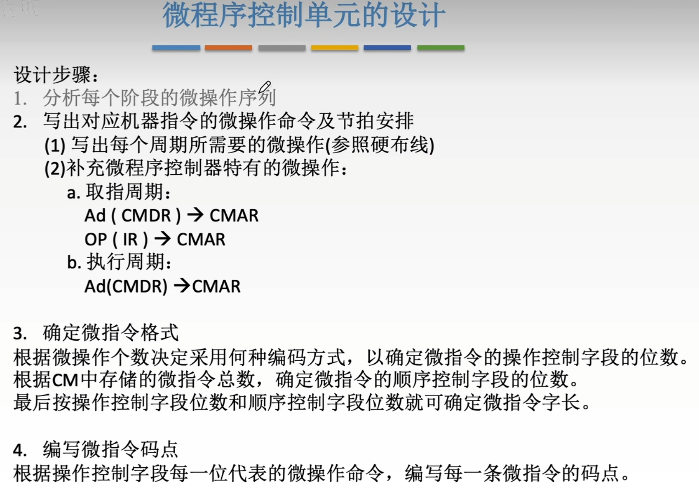
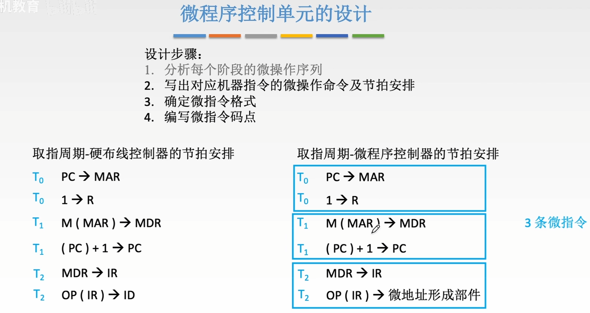
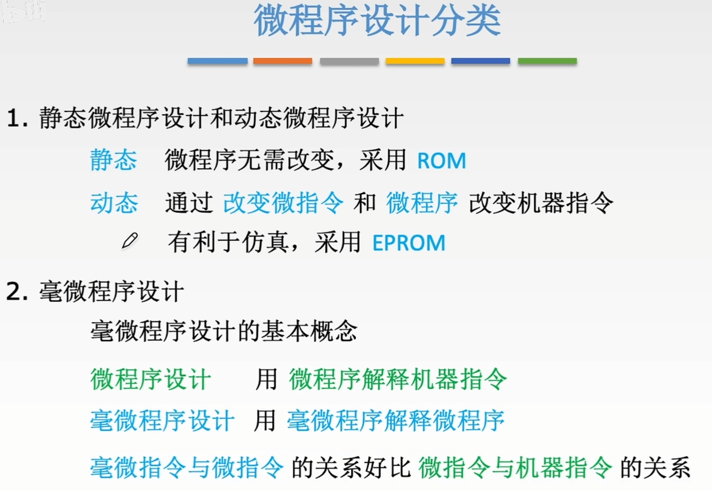
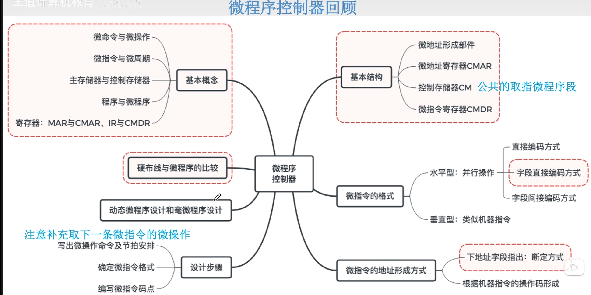
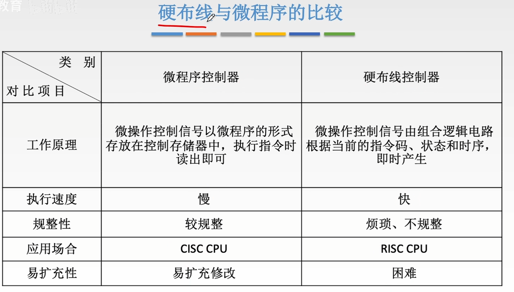

# 设计步骤

1. [每个阶段的微操作序列](硬布线控制器.md#每个阶段的微操作序列)
2. [微操作命令和节拍安排](微程序控制单元的设计.md#微操作命令和节拍安排)
3. [微指令的编码方式](微指令的设计.md#微指令的编码方式)
4. 码点就是[字段直接编码方式](微指令的设计.md#字段直接编码方式)操作控制字段中每一位直接对应一个微命令...P231

## 微操作命令和节拍安排

>微指令结束之后，需要一个节拍去执行 Ad(CMDR)->CMAR 来将下一个微指令的地址放入CMAR中

#### 微程序设计分类

>简单了解即可

# 微程序控制器总结

## 硬布线与微程序的比较

[CISC和RISC](CISC和RISC.md)