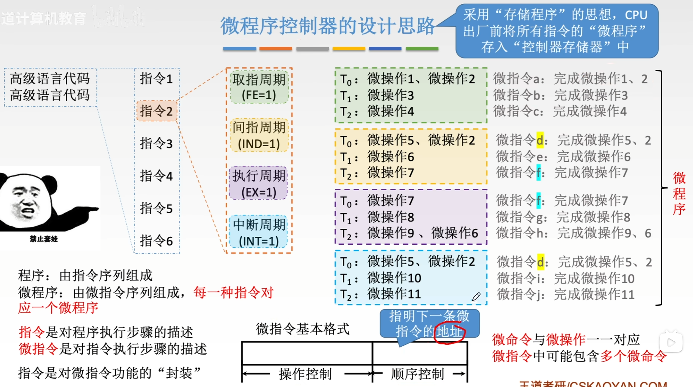
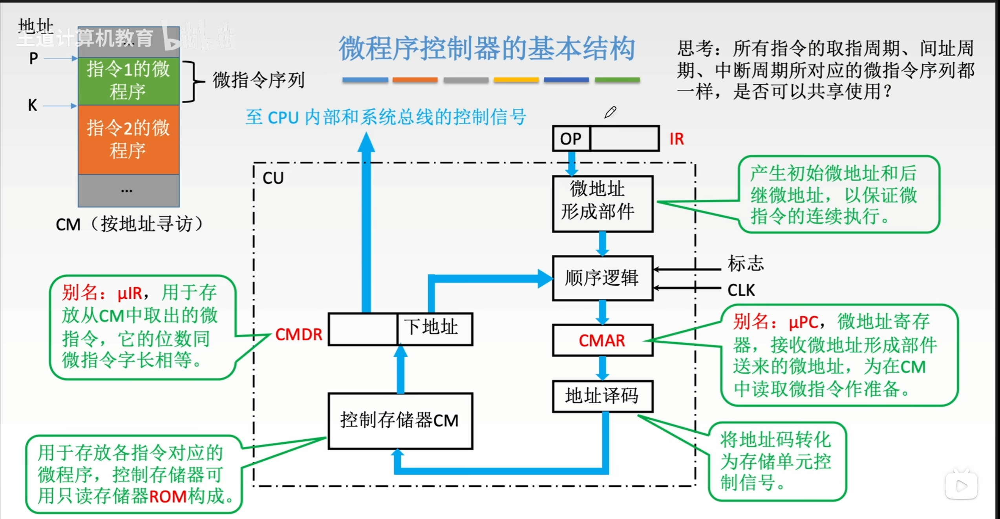
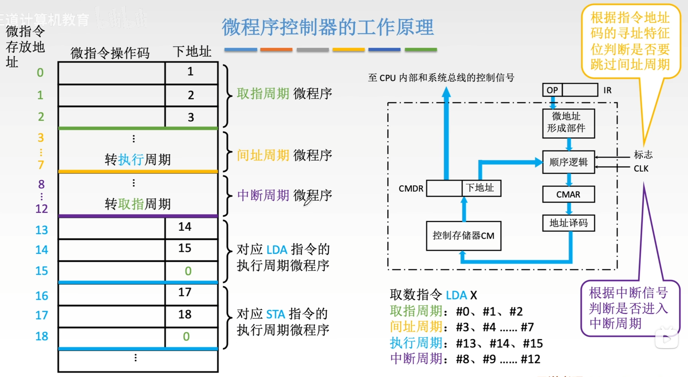
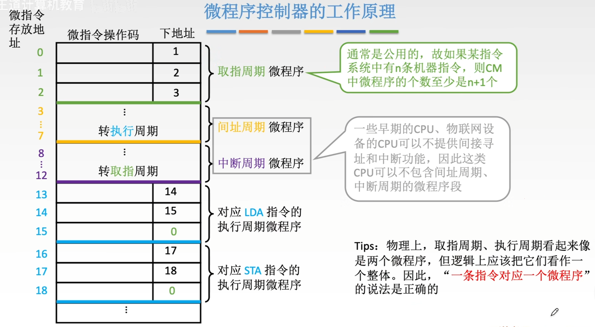

# 微程序控制器的设计思路

>一个程序对应多个指令，一个指令对应多个微指令

>微程序与机器指令是一一对应的，一种机器指令会对应一个微程序，一个微程序由多个微指令的序列来组成

>微命令是与微操作一一对应的如：M(MAR)->MDR
>而微指令可能包含多个微命令

# 微程序控制器的基本结构

### 1. 核心组件及其功能

在捋顺逻辑之前，我们先明确图中各个部件的角色，这有助于理解数据流向：

- **CM (Control Memory，控制存储器)**：
    - **作用**：存放所有的微程序。你可以把它想象成一个“字典”或“剧本库”。
    - **特点**：通常由 ROM 构成，只读，按地址寻访。里面存放的是“指令1的微程序”、“指令2的微程序”等。
- **CMAR (Control Memory Address Register，控制存储器地址寄存器)**：
    - **别名**：$\mu$PC (微程序计数器)。
    - **作用**：存放当前要执行的微指令在 CM 中的地址。它就像书签，标记着当前读到剧本的哪一行了。
- **CMDR (Control Memory Data Register，控制存储器数据寄存器)**：
    - **别名**：$\mu$IR (微指令寄存器)。
    - **作用**：存放从 CM 中读出来的微指令。
    - **内容**：微指令包含两部分——**控制信号**（发给CPU其他部件干活）和**下地址**（告诉控制器下一步去哪）。
- **微地址形成部件**：
    - **作用**：根据机器指令的操作码 (OP) 或其他标志，生成微程序的入口地址（初始微地址）。
- **顺序逻辑**：
    - **作用**：决定下一条微指令的地址。它结合当前微指令的“下地址”字段、标志位 (Flags) 和时钟信号 (CLK)，计算出下一个要执行的微地址。

### 2. 执行逻辑全流程梳理

整个执行过程是一个循环：**取微指令 -> 分析微指令 -> 执行微指令 -> 生成下一条微指令地址**。

具体步骤如下：

#### 第一步：确定入口地址 (启动微程序)

- 当 CPU 需要执行一条机器指令（例如 ADD 指令）时，该指令的操作码 (OP) 会进入**微地址形成部件**。
- **微地址形成部件**根据这个操作码，计算出这条指令对应的**微程序序列**在 CM 中的起始地址（入口地址）。
- 这个地址被送入 **CMAR**。

#### 第二步：读取微指令 (取指)

- **CMAR** 中的地址通过地址译码，去 **CM (控制存储器)** 中找到对应的存储单元。
- 从 CM 中读出该单元的内容（即一条微指令），送入 **CMDR**。

#### 第三步：产生控制信号 (执行)

- **CMDR** 接收到微指令后，将其中的**操作控制字段**（图中向上的蓝色箭头）直接发送到 CPU 内部和系统总线。
- 这些信号控制着 ALU、寄存器、存储器等进行具体的数据通路操作（例如打开某个门的开关，让数据流动）。

#### 第四步：形成下一条微指令地址 (下址)

- 在产生控制信号的同时，**CMDR** 中的**下地址字段**会被送入**顺序逻辑**。
- **顺序逻辑**根据这个下地址、当前的状态标志（如是否有中断、是否进位等）以及时钟信号，计算出下一条微指令的地址。
- 这个新地址被再次送入 **CMAR**。

#### 第五步：循环

- 回到**第二步**，用新的 CMAR 地址去 CM 中取下一条微指令，如此周而复始，直到这条机器指令对应的微程序执行完毕。

---

### 3. 总结：数据流向图解

为了更直观地理解，可以将数据流简化为以下闭环：

1. **IR (OP码)** $\rightarrow$ **微地址形成部件** $\rightarrow$ **CMAR** (确定起点)
2. **CMAR** $\rightarrow$ **CM** (去查表)
3. **CM** $\rightarrow$ **CMDR** (读出微指令)
4. **CMDR** $\rightarrow$ **CPU/总线** (发出控制信号，干活)
5. **CMDR (下地址)** $\rightarrow$ **顺序逻辑** $\rightarrow$ **CMAR** (准备下一步)

# 微程序控制器的工作原理

>对所有指令来说，取指周期，间址周期，中断周期要做的事都是一样的，所以这3个微程序段是公用的

>n条机器指令对应着n个不同的执行周期微程序段。还有一个是公用的取指周期。这里是将取指周期和执行周期这两个微程序段都看作不同的微程序
>严谨一点说应该是微程序段的个数至少是n+1个，微程序的个数是n个