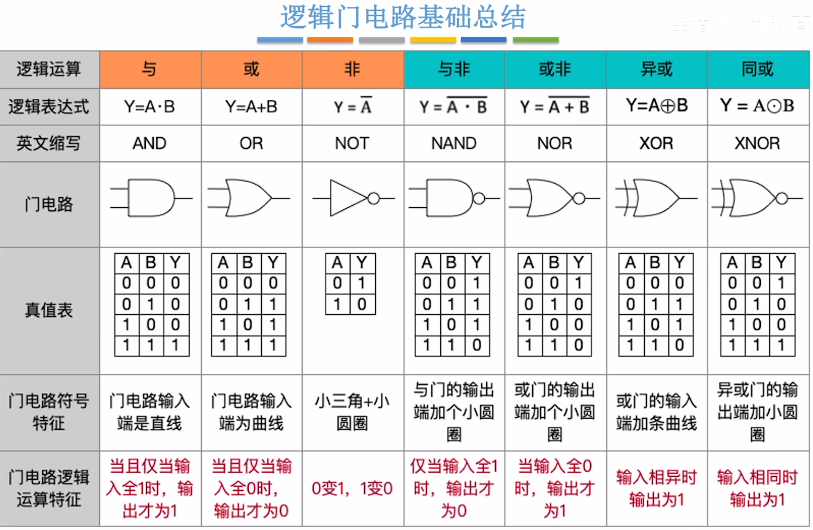
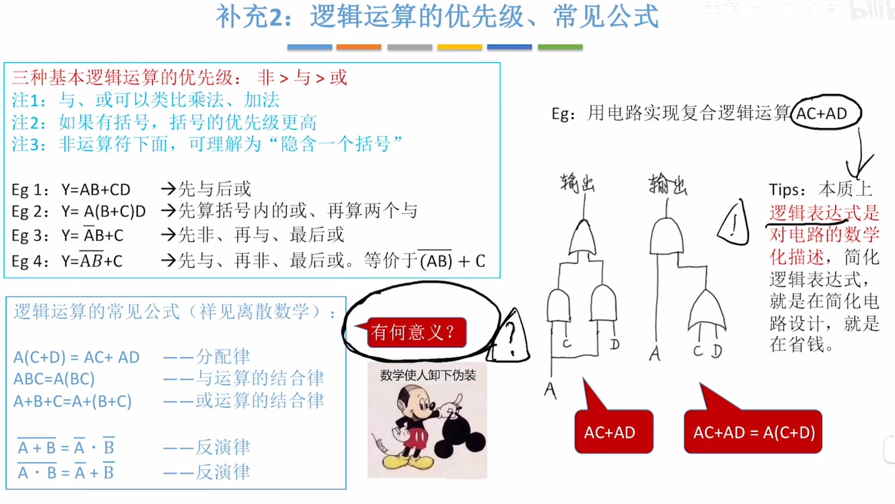
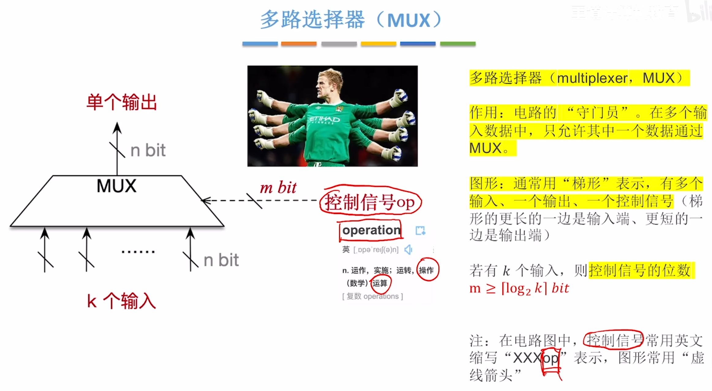
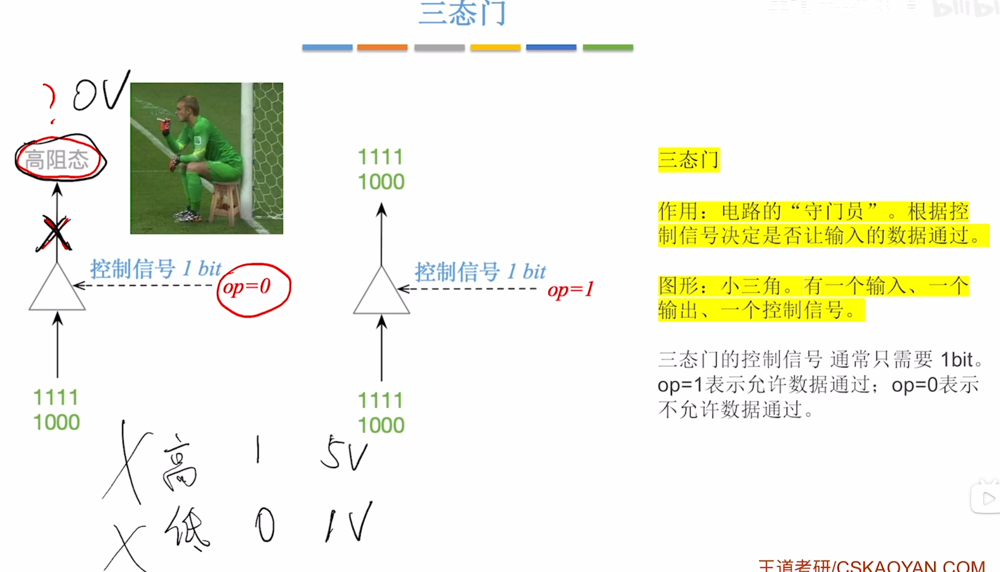
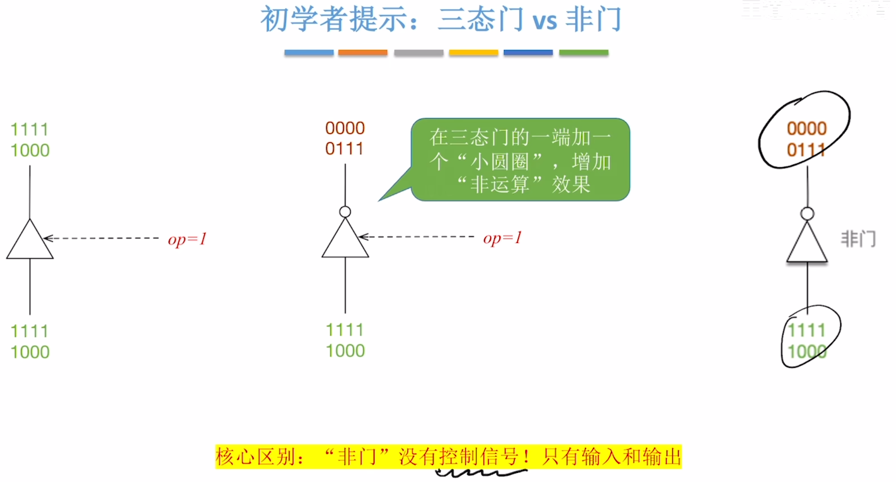

---
tags:
  - "#位运算"
  - 逻辑运算
---

## 一、n个bit位异或运算规则

对任意数量的二进制bit位进行异或操作，最终结果遵循**统计1的个数**的判定规则：

- **奇数个1**：异或最终结果为 **1**
    
- **偶数个1（含0个1）**：异或最终结果为 **0**
    

补充说明：异或运算属于按位运算，多位异或遵循逐位运算规则，单bit结果由该位上1的数量奇偶性决定。

## 二、三种基本逻辑运算优先级

三种基础逻辑运算的执行优先级从高到低排序，严格遵循以下顺序：

**非（NOT）> 与（AND）> 或（OR）**

### 详细说明

1. **非运算**：优先级最高，单独执行，对运算数取反，无结合性冲突
    
2. **与运算**：优先级次之，高于或运算，低于非运算
    
3. **或运算**：优先级最低，最后执行
    

使用技巧：复杂逻辑式中，可通过括号改变运算优先级，括号内内容优先执行。

---
# 多路选择器

- 注：有的多路选择器可能会预留一个控制信号，用于拦截所有输入
# 三态门
