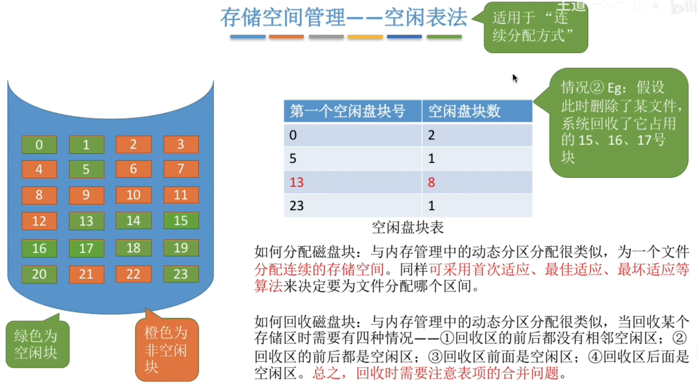
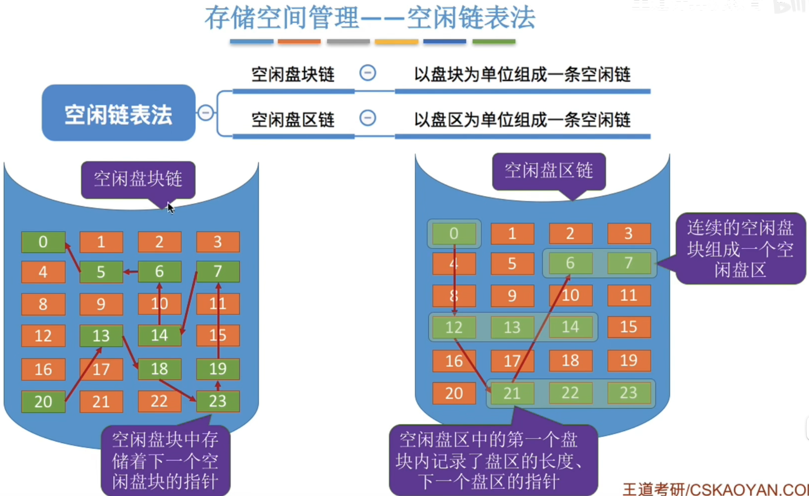
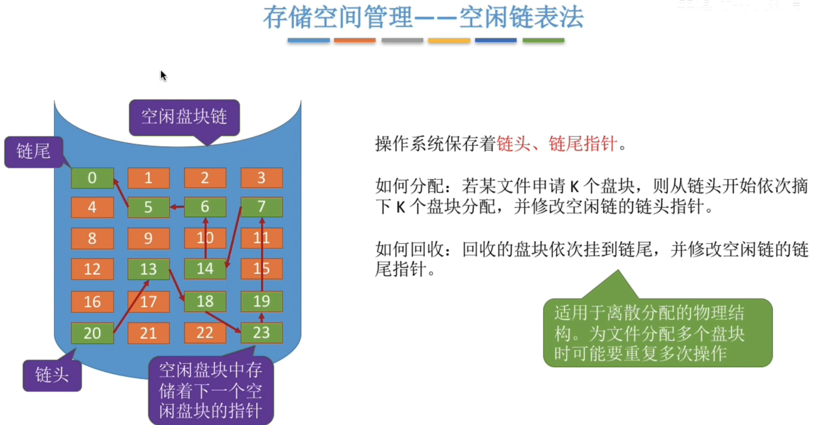
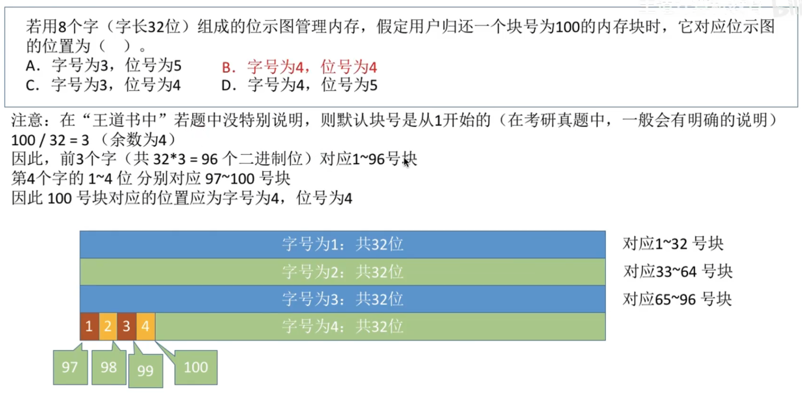
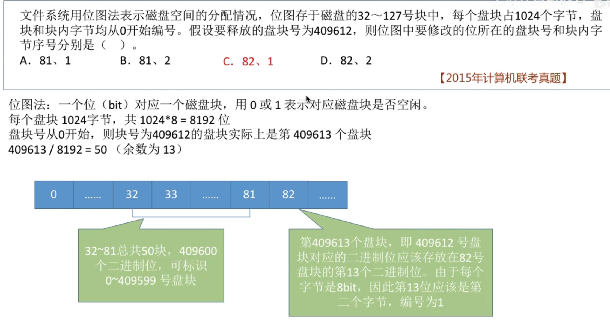
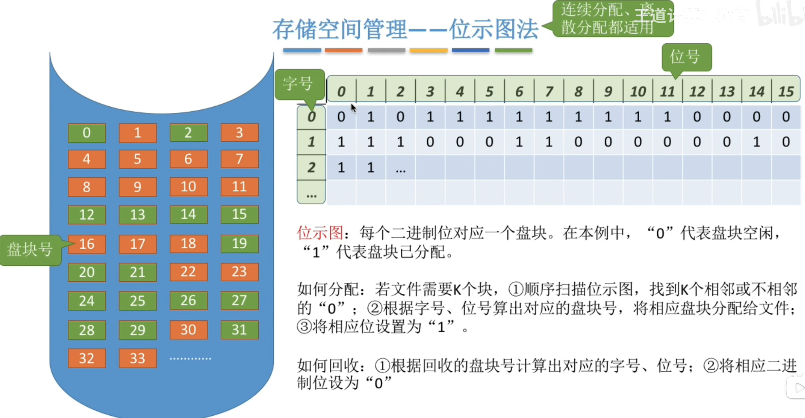
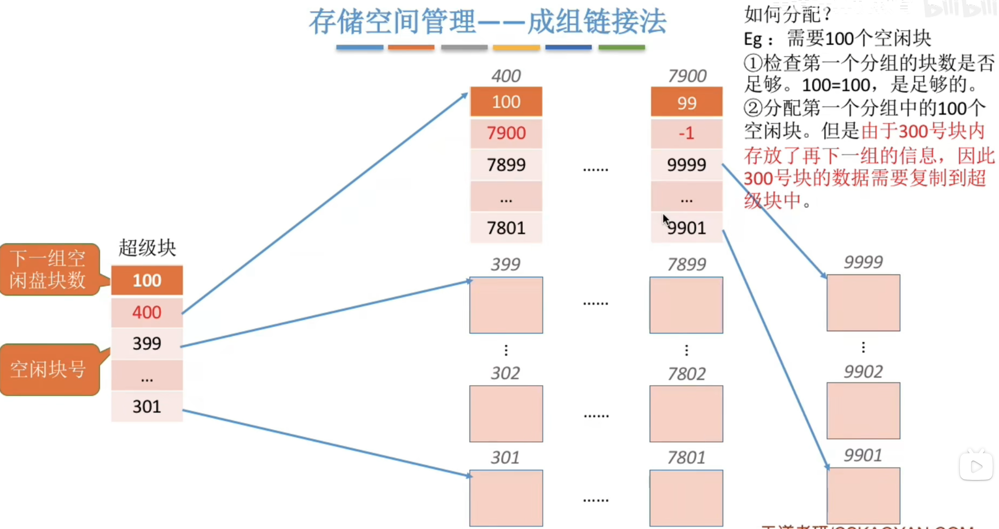
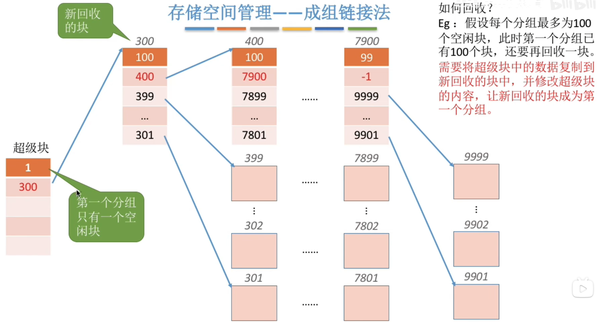
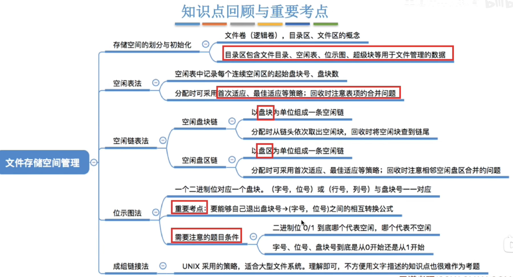
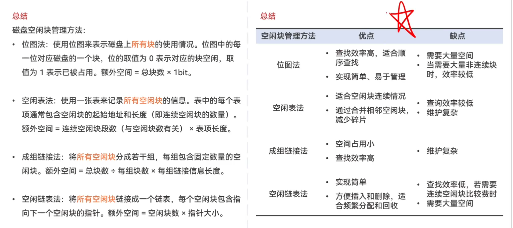

---
tags:
  - 操作系统
---
# 空间的划分

# 空闲表法

# 空闲链表法

空闲盘块链如何分配和回收

空闲盘区链如何分配回收

# 位示图法

>
>

分配和回收

# 成组链接法

>成组链接法最前面是有一个空闲盘块号栈的

如何分配

如何回收

# 总结

>补充
>磁盘扇区一一物理上限制的读/写一次的基本单位
>簇/块一一操作系统限制的存储空间分配基本单位