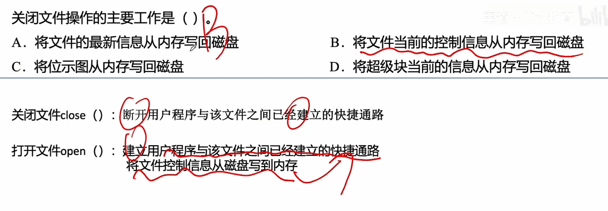

---
tags:
  - 操作系统
---
# 创建文件

# 删除文件

# 打开文件

>打开文件操作的核心流程包括：首先根据文件路径在磁盘目录中查找目标文件，定位其文件控制块（FCB）；然后将该文件的目录信息（即FCB）从磁盘复制到内存中的“打开文件表”或“活跃文件目录表”(系统的打开文件表)，在进程自己的打开文件表建立用户进程与该文件的逻辑关联（系统表索引号指向系统的打开文件表对应的表项）；最后系统返回一个文件描述符（fd也就是进程的打开文件表左边的那个编号），供后续读写操作使用。此过程不涉及文件内容的复制，仅复制目录项以建立访问通道。
>
>进程要打开一个文件，是先去系统打开文件表里查，如果系统打开文件表里没有，就去复制一份，然后进程打开文件表项再指向系统打开文件表的对应表项，如果系统打开文件表已经有了进程将要打开的文件，则只是多一个指针去指向表项，所以A,C，D错误

## 有两种打开文件表

>系统的打开文件表：记录所有的，正在被其他进程使用的文件的一些信息
>进程自己的打开文件表：记录自己的进程此时正在打开的文件有哪一些

# 关闭文件

>
>关闭文件操作的核心目的是确保文件在内存中修改后的**控制信息**（如文件指针位置、文件大小、权限等元数据）被持久化到磁盘，避免数据丢失或系统崩溃导致信息不一致。打开文件时，系统会将文件的控制信息从磁盘加载到内存；关闭时，则需将这些**当前状态的控制信息**写回磁盘，以保持一致性。选项A描述的是“最新信息”，可能包含用户数据，但关闭操作主要处理的是控制信息而非数据内容；选项C和D涉及的是文件系统底层结构（位示图、超级块），并非文件关闭的直接操作对象。因此，正确答案是B。
# 读文件
文件先被打开了，然后才进行读文件

### 读文件操作的标准流程

#### 第一步：查表定位（IV）

- **动作**：按文件描述符（`fd`）在**打开文件表**中找到该文件的目录项（FCB/索引节点信息）。
- **原因**：用户程序发起读请求时，只提供文件描述符（`fd`）。操作系统首先需要利用 `fd` 作为索引，在进程打开文件表和系统打开文件表中查找，获取该文件的核心控制信息（如物理位置、权限、文件大小等）。

#### 第二步：权限校验（II）

- **动作**：按存取控制说明**检查访问的合法性**。
- **原因**：在真正读取数据前，系统必须检查当前进程是否拥有该文件的“读”权限。如果权限不合法，则拒绝读取并返回错误。

#### 第三步：地址转换（III）

- **动作**：根据目录项中该文件的逻辑和物理组织形式，**将逻辑记录号转换成物理块号**。
- **原因**：用户读取文件时使用的是“逻辑地址”（如：读第100个字节，或第5个记录）。操作系统需要根据文件的物理结构（连续分配、链接分配或索引分配），计算出这些数据实际存放在磁盘的哪一个**物理块（柱面/磁头/扇区）**上。

#### 第四步：硬件读取（I）

- **动作**：向**设备驱动程序**发出 I/O 请求，完成数据交换工作。
- **原因**：确定了物理块号后，操作系统将物理地址和读取指令传递给设备驱动程序，由驱动程序控制磁盘硬件进行物理寻道、旋转延迟和数据传输，最终将数据从磁盘读入内存的缓冲区。
# 写文件

# 总结
