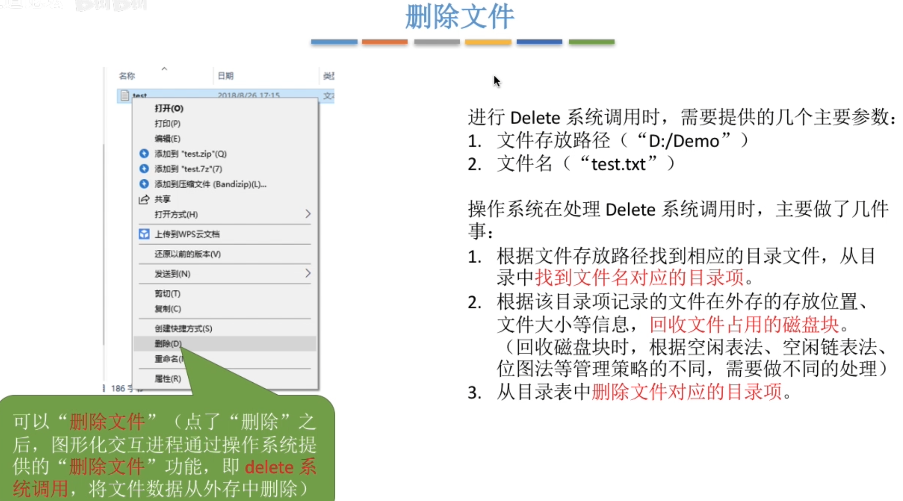
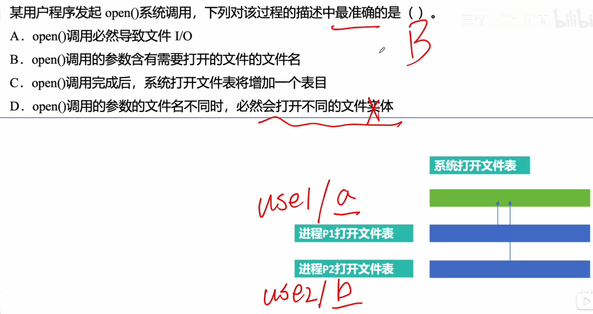
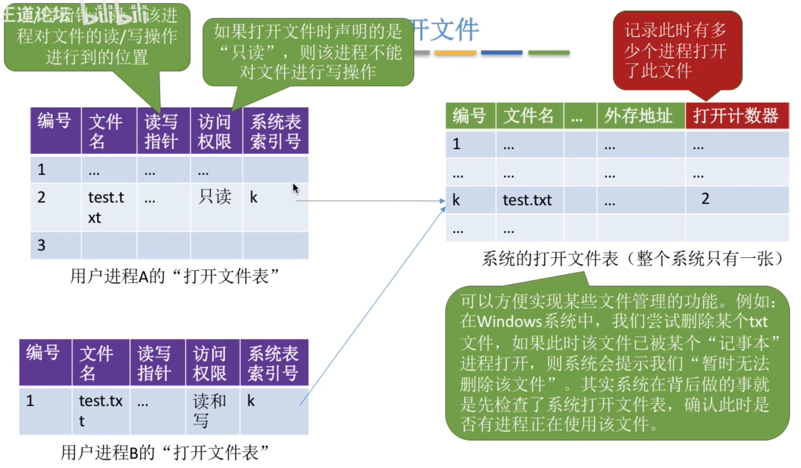
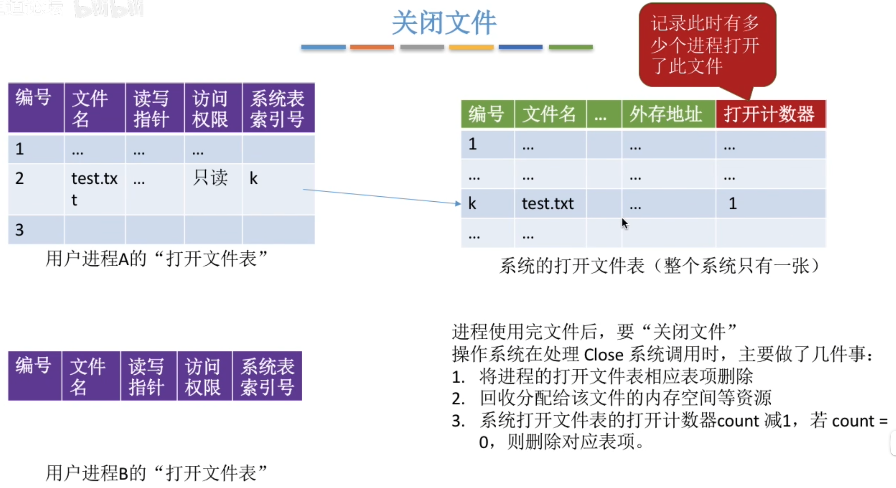
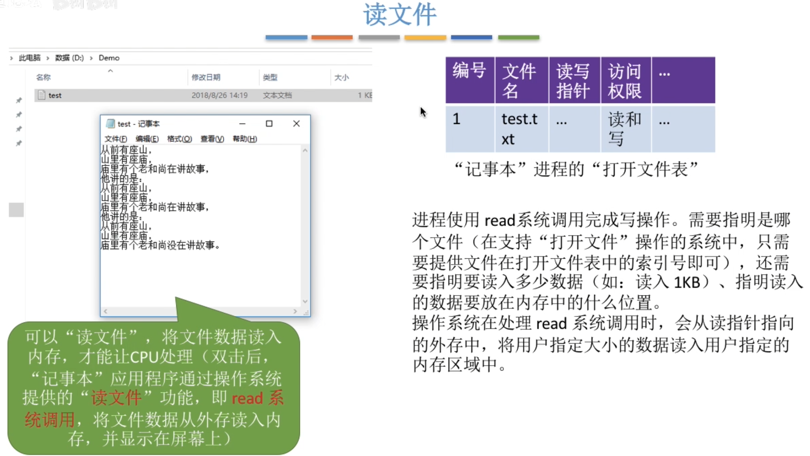
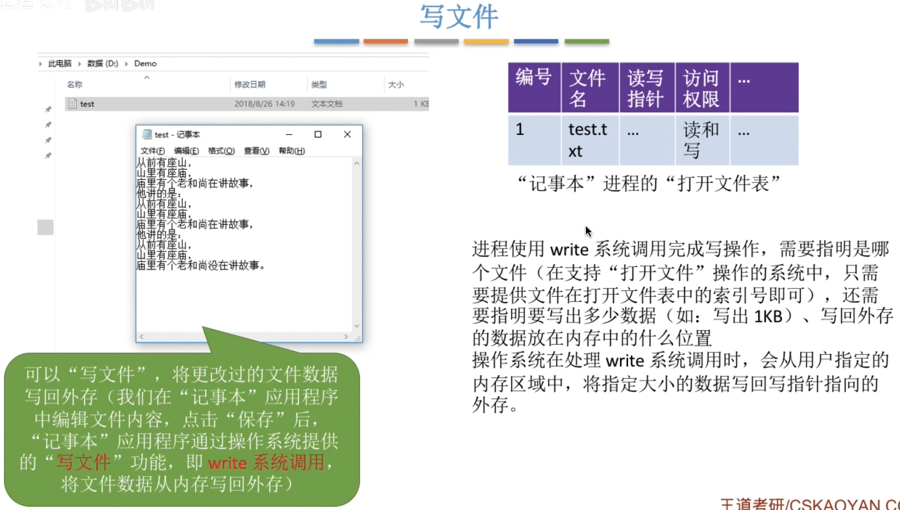
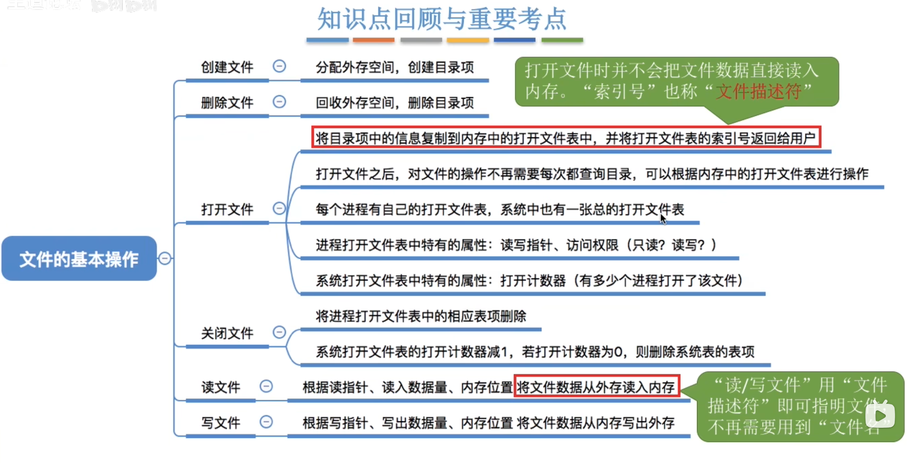

---
tags:
  - 操作系统
---
# 创建文件

# 删除文件

# 打开文件

>打开文件操作的核心流程包括：首先根据文件路径在磁盘目录中查找目标文件，定位其文件控制块（FCB）；然后将该文件的目录信息（即FCB）从磁盘复制到内存中的“打开文件表”或“活跃文件目录表”(系统的打开文件表)，在进程自己的打开文件表建立用户进程与该文件的逻辑关联（系统表索引号指向系统的打开文件表对应的表项）；最后系统返回一个文件描述符（fd也就是进程的打开文件表左边的那个编号），供后续读写操作使用。此过程不涉及文件内容的复制，仅复制目录项以建立访问通道。
>
>进程要打开一个文件，是先去系统打开文件表里查，如果系统打开文件表里没有，就去复制一份，然后进程打开文件表项再指向系统打开文件表的对应表项，如果系统打开文件表已经有了进程将要打开的文件，则只是多一个指针去指向表项，所以A,C，D错误

## 有两种打开文件表

>系统的打开文件表：记录所有的，正在被其他进程使用的文件的一些信息
>进程自己的打开文件表：记录自己的进程此时正在打开的文件有哪一些

# 关闭文件

# 读文件
文件先被打开了，然后才进行读文件

# 写文件

# 总结
