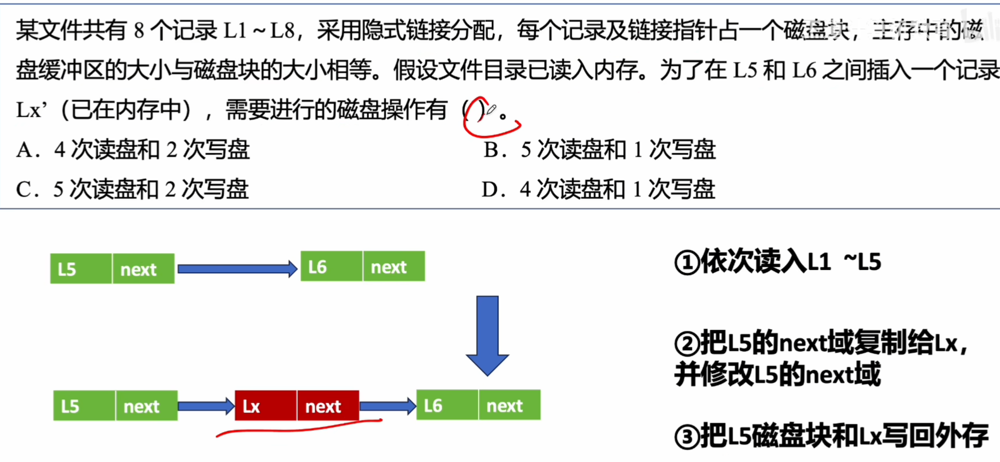
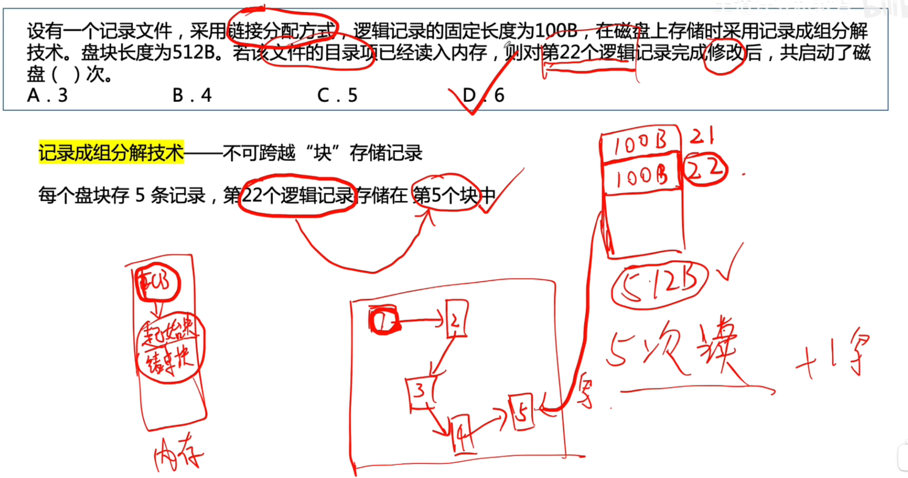
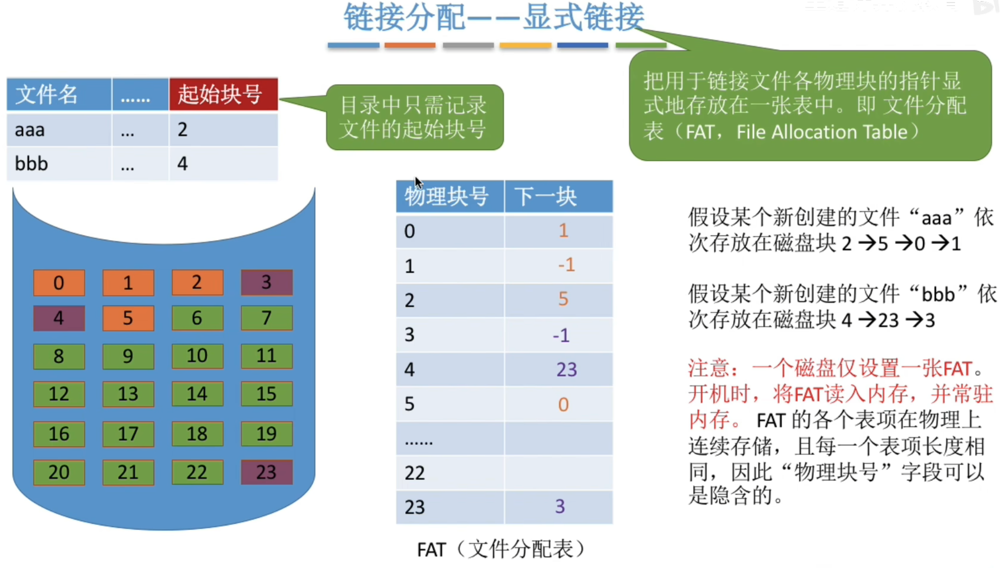
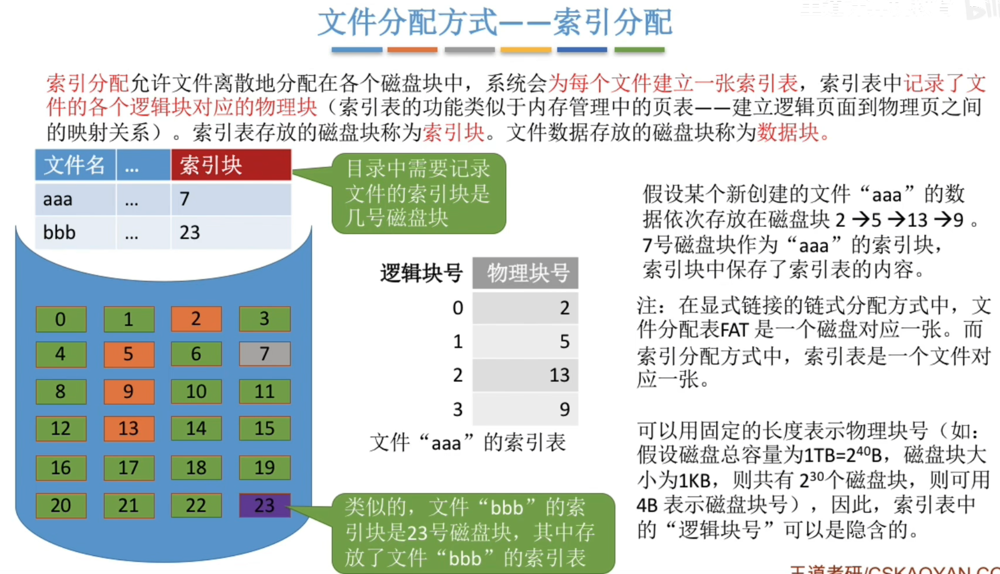
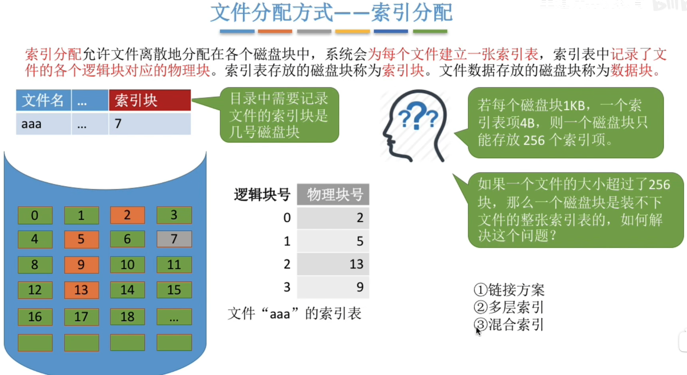
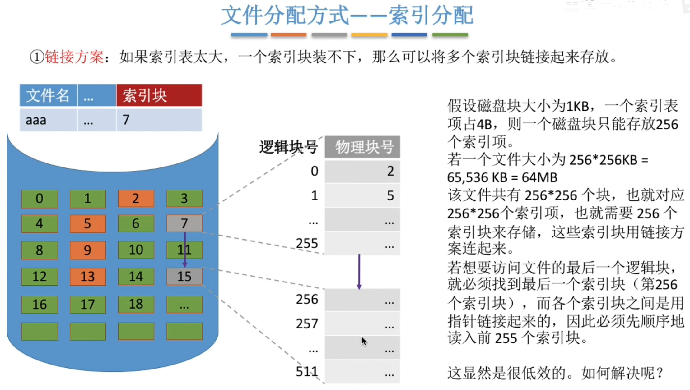
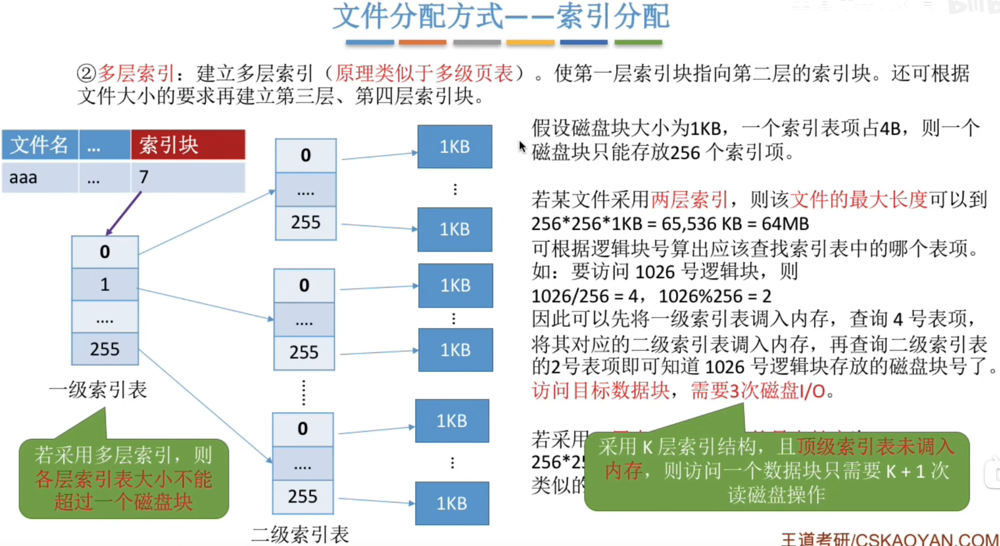
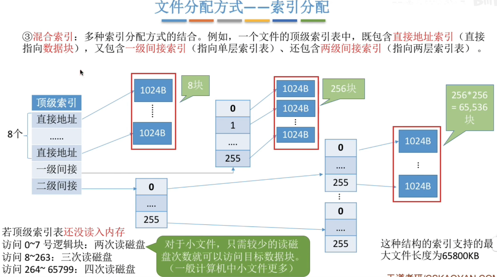
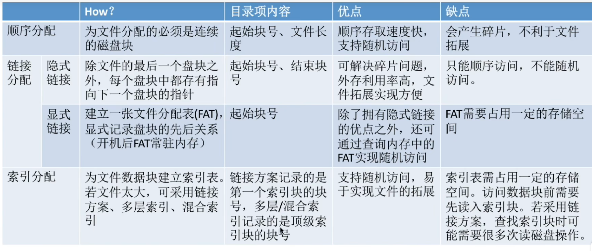

---
tags:
  - 操作系统
---
# 文件块，磁盘块


# 连续分配

>连续分配方式要求每个文件在磁盘上占有一组连续的块。
>优点：支持顺序访问和直接访问（即随机访问）；连续分配的文件在顺序访问时速度最快
>缺点：不方便文件拓展；存储空间利用率低，会产生磁盘碎片

# 链接分配
考试题目中遇到未指明隐式/显式的“链接分配”，默认指的是隐式链接的链接分配
## 隐式链接

>隐式链接一一除文件的最后一个盘块之外，每个盘块中都存有指向下一个盘块的指针。文件目录包括文件第一块的指针和最后一块的指针。
>优点：很方便文件拓展，不会有碎片问题，外存利用率高。
>缺点：只支持顺序访问，不支持随机访问，查找效率低，指向下一个盘块的指针也需要耗费少量的存储空间。

### 读写磁盘次数分析

>先顺序读到L5，读了5次，然后在内存中进行修改，然后写回外存（写了两次，缓冲区大小与磁盘块大小相等）
### 记录成组分解技术

>采用记录成组分解技术之后，一块512的盘只存5条逻辑记录，剩下的12B浪费掉，所以5* 5 = 25 ,读到第5个盘才能读到第22条记录，然后题目说完成修改，此时第22条记录在内存中，还要写回磁盘，所以还要再启动磁盘一次，所以总共是5次读+1次写
## 显式链接

>显式链接一一把用于链接文件各物理块的指针显式地存放在一张表中，即文件分配表（FAT，FileAllocationTable）。
>一个磁盘只会建立一张文件分配表。开机时文件分配表放入内存，并常驻内存。
>优点：很方便文件拓展，不会有碎片问题，外存利用率高，并且支持随机访问。相比于隐式链接来说，地址转换时不需要访问磁盘，因此文件的访问效率更高
>缺点：文件分配表的需要占用一定的存储空间。

>`aaa` 的数据依次存放在物理块 **2 → 5 → 0 → 1**
>```
>aaa → 起始块号 = 2 ↓ 
>FAT[2] = 5 → 0号逻辑块 = 物理块2，
>下一块 = 5 FAT[5] = 0 → 1号逻辑块 = 物理块5，
>下一块 = 0 FAT[0] = 1 → 2号逻辑块 = 物理块0 ← 找到了！ 整个过程只在内存中查表，不需要任何磁盘 I/O
>```

# 索引分配


逻辑块号到物理块号的转换

文件的大小超过了一个磁盘块的索引表能表示的范围该怎么办


## 链接方案


## 多层索引


## 混合索引


## 索引分配总结


# 三种分配方式的优缺点
