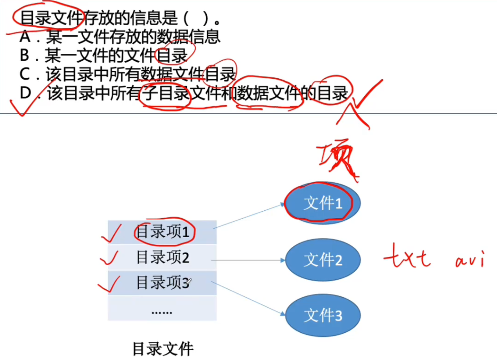
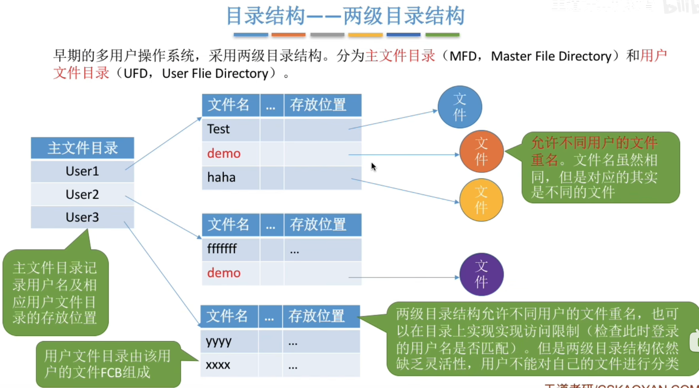
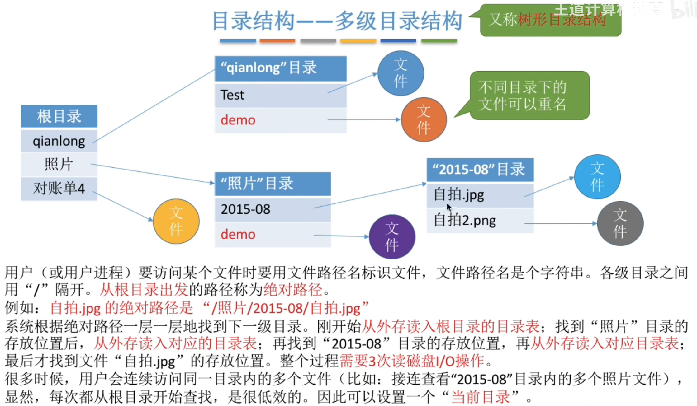
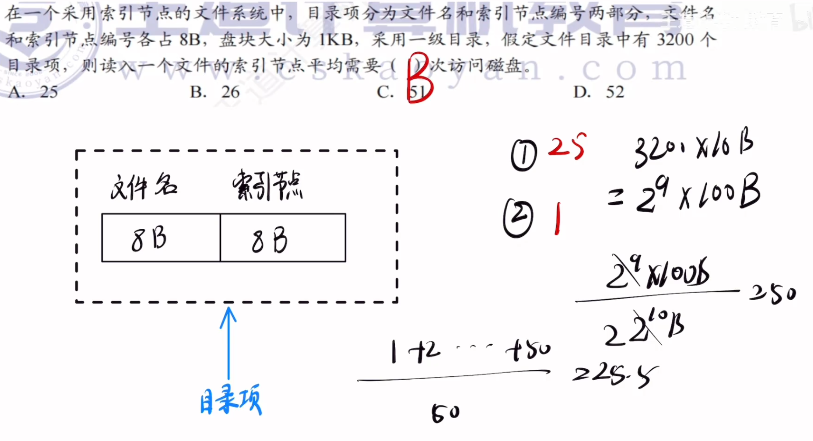
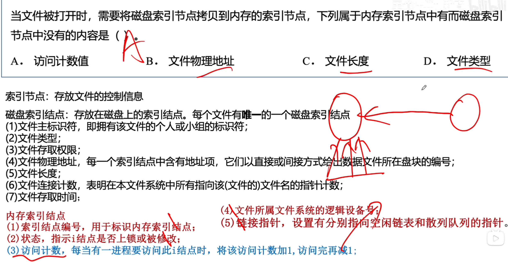

---
tags:
  - 操作系统
---
# 文件控制块

>**目录文件是一种特殊的文件，它的内容就是若干个FCB（目录项）；而目录文件自身作为一个文件，也有自己的FCB，存放在它的上级目录中。**
>目录文件中除了FCB，不会有普通文件。 目录文件的内容就是一个FCB数组，每个FCB指向一个普通文件（或子目录（目录文件）），但普通文件本身的数据并不存放在目录文件内部。
>**FCB（File Control Block，文件控制块）** 是操作系统为管理文件而设置的数据结构，用于存放文件的控制信息（如文件名、大小、物理地址、权限、创建时间等）。每个文件有且仅有一个 FCB 与之对应。

FCB 中通常会包含一个**文件类型**字段，用来标识这个文件属于什么类型。

## 目录文件存放的信息

- A：错误。目录文件不存放文件的数据内容。
    
- B：错误。它不是存放“某一个文件”的目录，而是存放“该目录下所有文件”的目录。
    
- C：错误。它遗漏了“子目录文件”，只提到“数据文件”。
    
- D：**正确**。目录文件存放的是该目录中所有子目录文件和数据文件的目录项（即它们的目录信息）。
    

**关键点**：目录文件的内容是“目录项的集合”，每个目录项指向一个子目录或数据文件，因此它存放的是“所有子目录和数据文件的目录”，而非文件内容。
# 单级目录

# 两级目录结构

# 多级目录结构

## 当前目录

>相对路径和当前目录

# 索引结点

>当找到文件名对应的目录项时，才需要将索引结点调入内存，索引结点中记录了文件的各种信息，包括文件在外存中的存放位置，根据“存放位置”即可找到文件。存放在外存中的索引结点称为“**磁盘索引结点**”，当索引结点放入内存后称为“**内存索引结点**”。
相比之下内存索引结点中需要增加一些信息，比如：文件是否被修改、此时有几个进程正在访问该文件等。

## 计算索引结点访问磁盘数目

>在算出25之后，是找到目录项需要的访问磁盘次数
- 为了打开文件或获取文件属性，系统必须知道文件数据存在磁盘的哪个块上。
- 这些信息全都在 **inode（索引节点）** 里。
- 所以，系统必须根据刚才拿到的 inode 号，去磁盘的 inode 区把 `vim` 的 inode 读入内存。这就是那额外的 **1次** 磁盘访问。
>所以答案是25+1=26
## 磁盘索引节点与内存索引节点

# 总结

