---
tags:
  - 操作系统
---
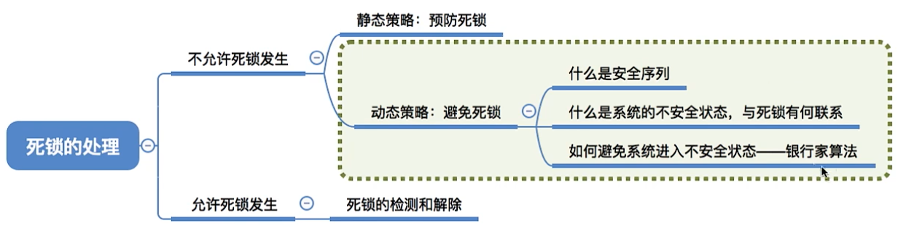
# 预防死锁
## 破坏互斥条件

>互斥条件一般视为不可被破坏的
>SPOOLing技术

## 破坏不剥夺条件

## 破坏请求和保持条件
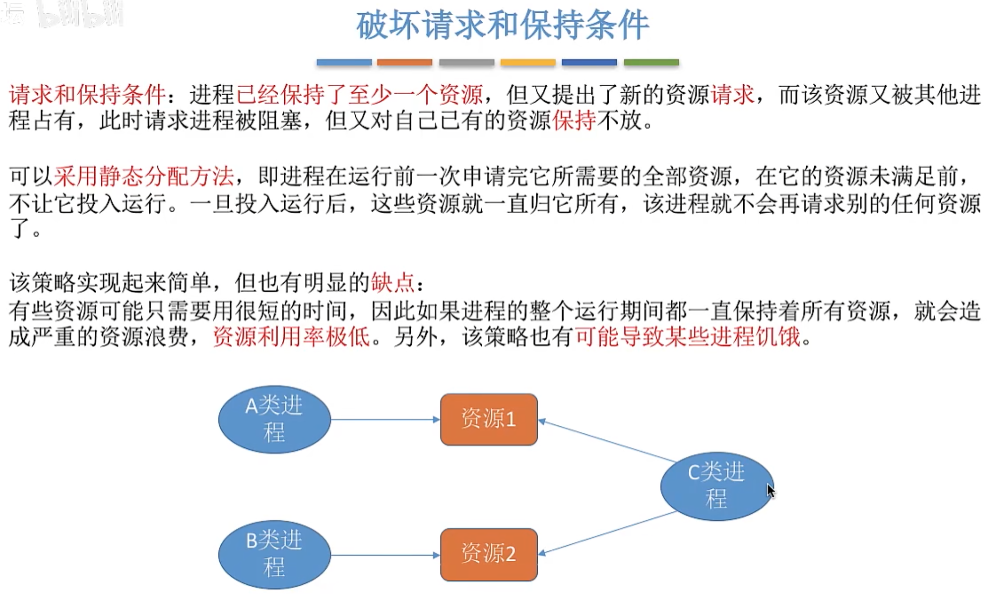

## 破坏循环等待条件

---

# 避免死锁
## 银行家算法
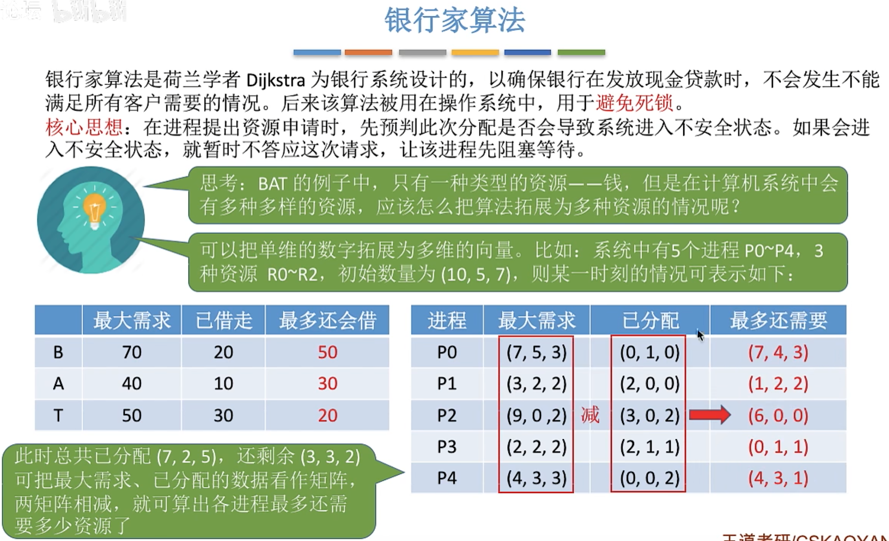
>need=max-allocation
### 安全性算法
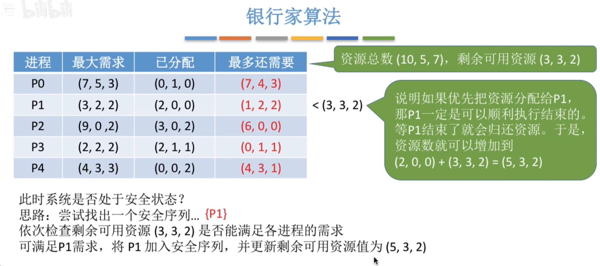
- **借出：** 系统为了满足P1的 `Need (1,2,2)`，从现有的 `Available (3,3,2)` 中拿出了这些资源给P1。此时系统剩 `(2,1,0)`。
- **使用与归还：** P1拿着这些资源运行完毕，把它手里的所有资源（原来的 `Allocation` + 刚借的 `Need`）全部还给系统。
- **计算：** `(3,3,2) - (1,2,2) + (2,0,0) + (1,2,2)`。
- 所以如果资源足够某个进程使用，使用后的剩余资源就是
- 新Available=旧Available+P1的Allocation

>通过逐次循环比较，可以得到将所有进程都包含的安全序列。说明系统处于安全状态
#### 手算安全序列
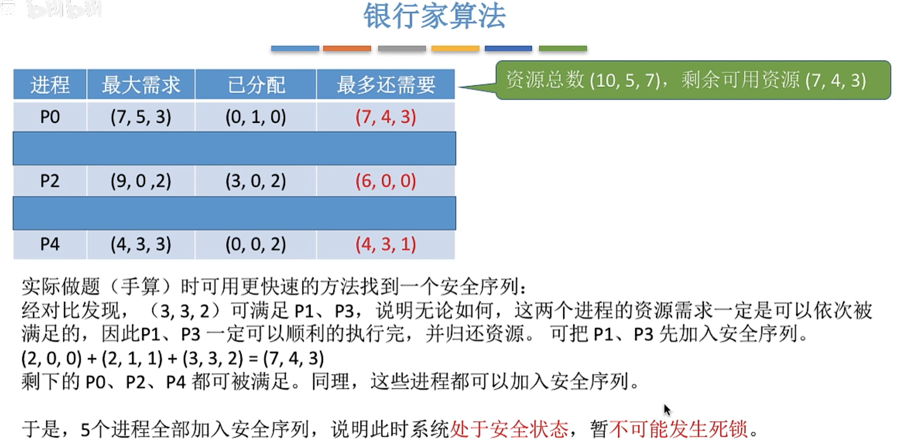
>不用逐次循环比较，只要满足当前资源需求的就可以直接同时加入安全序列
#### 找不到安全序列的例子

## 银行家算法流程
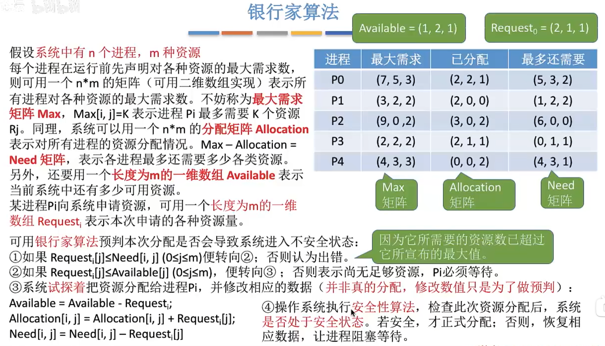
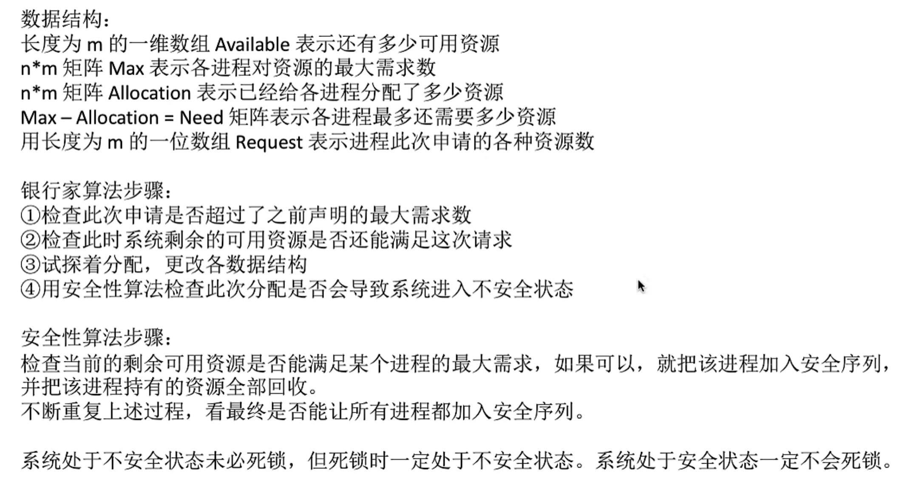

# 检测和解除
## 检测死锁
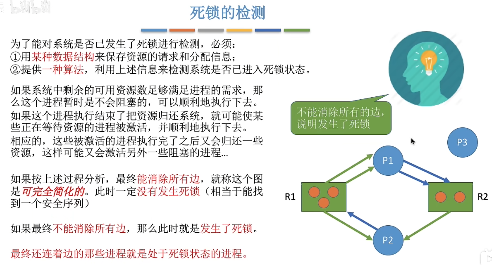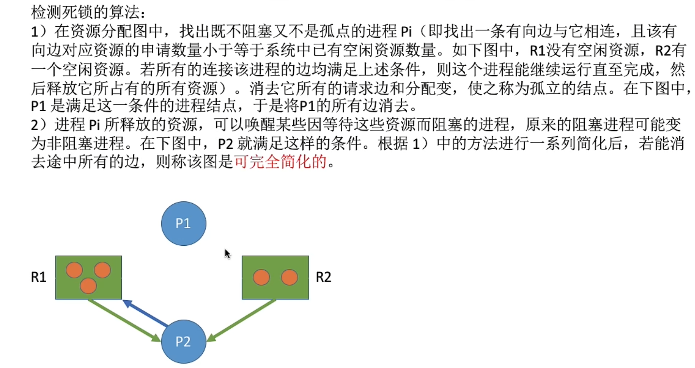
>死锁定理：如果某时刻系统的资源分配图是不可完全简化的，那么此时系统死锁

## 死锁的解除
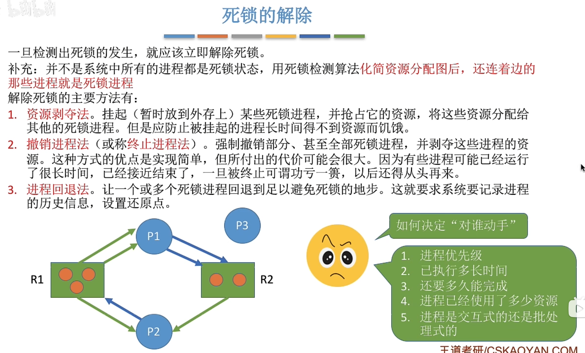
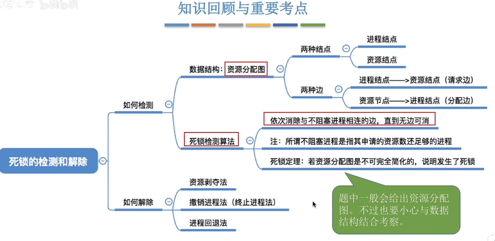