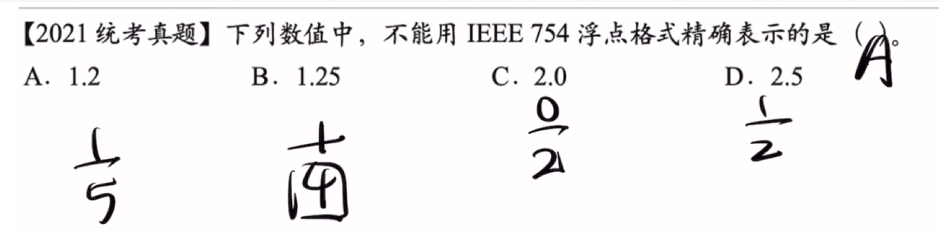
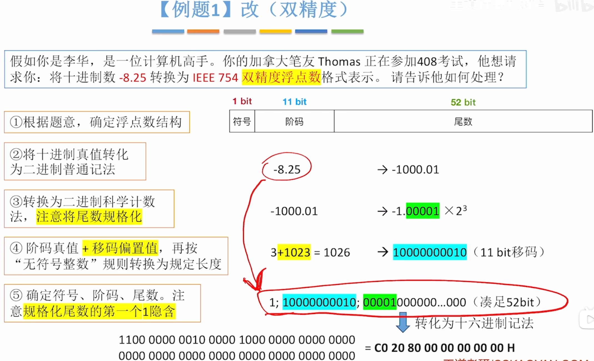
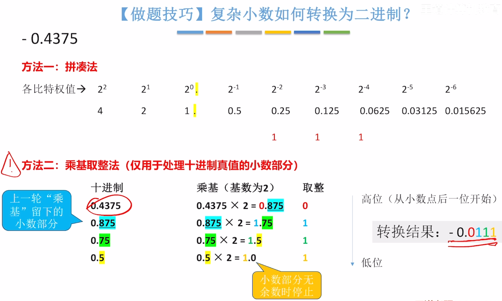
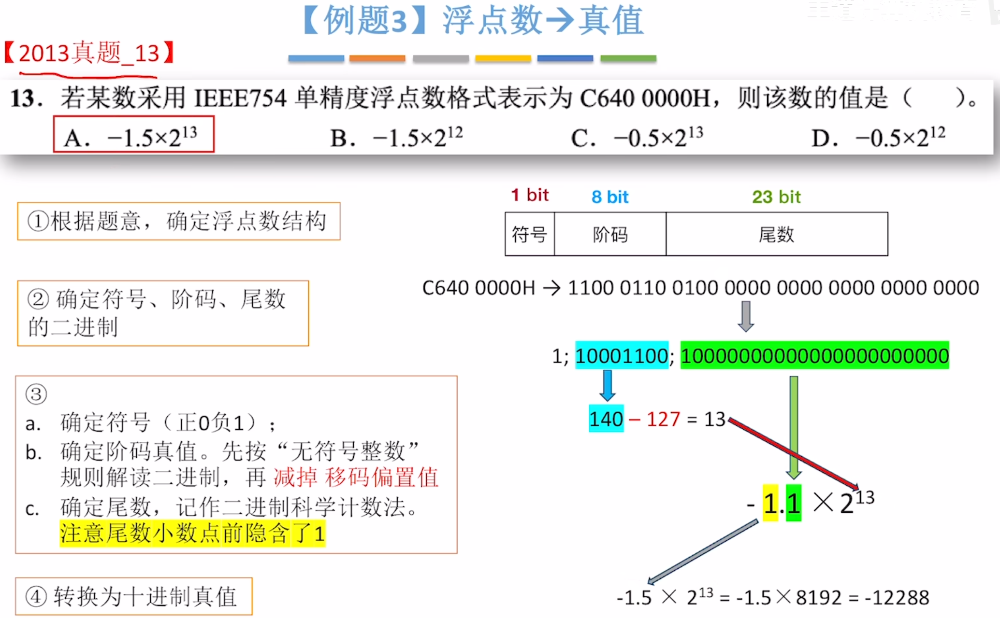

---
tags:
  - 计算机组成原理
---
# 真值转为浮点数

## float单精度

>要判断一个数能否精确的用浮点数来表示，就将这个小数部分转化为分数的形式，然后看这个分母能否用2^n来表示
>
# double双精度

# 复杂小数转换为二进制数
%%图：拼凑法，乘积取整法%%

# 浮点数转化为真值
>仅当==阶码不全为0，也不全为1时==表示这是一个‘’规格化浮点数‘
>阶码全为0，全为1留作特殊用途，需要按照[[特殊状态的浮点数]]去解读真值

