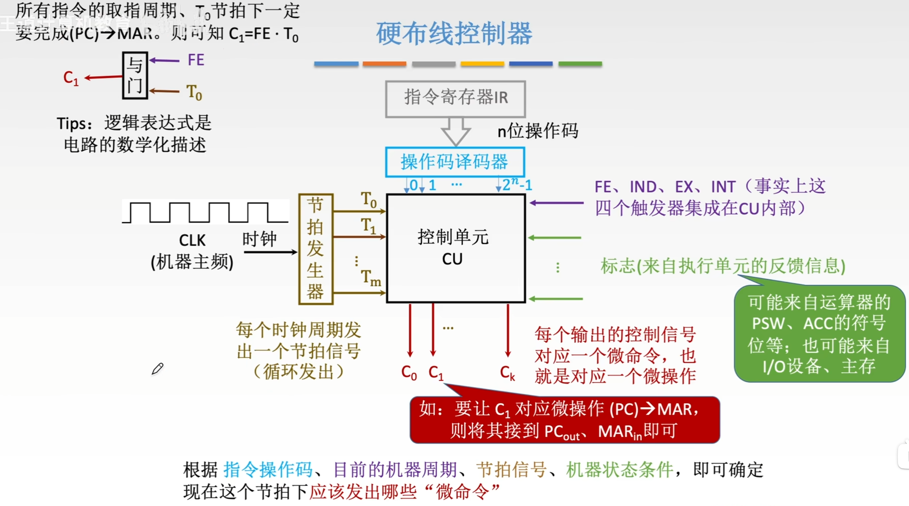
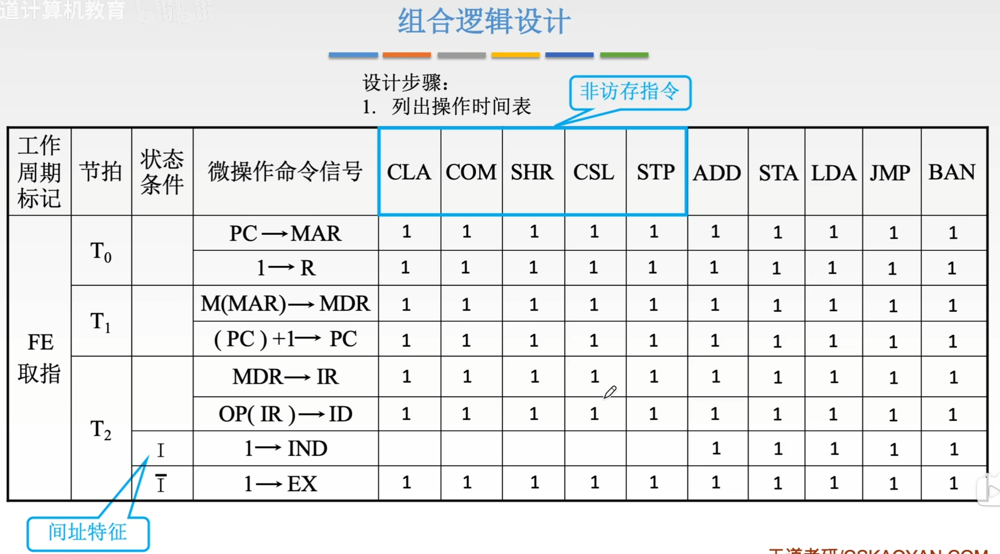
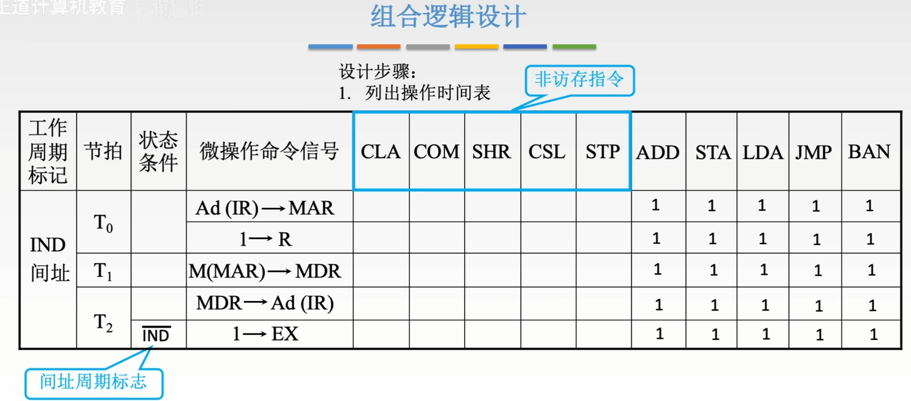
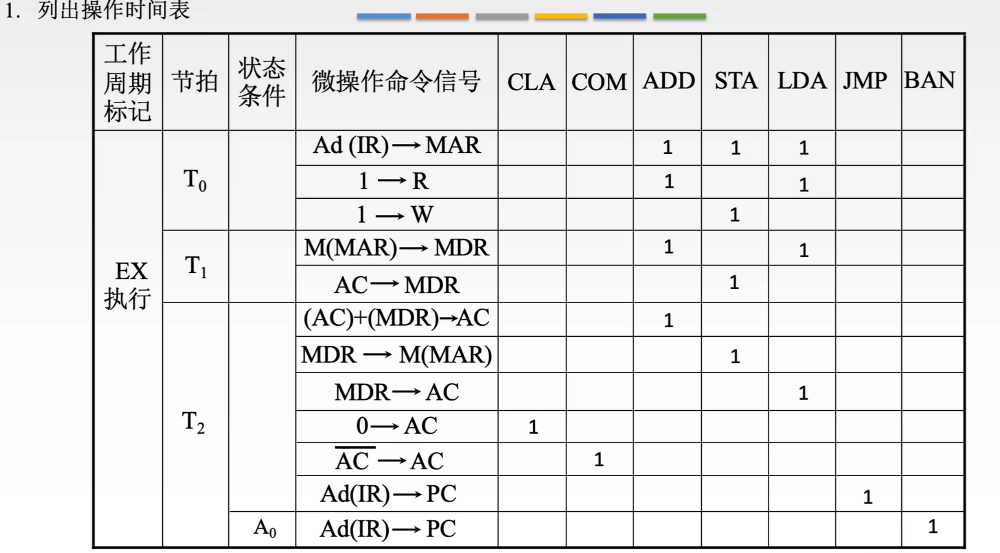
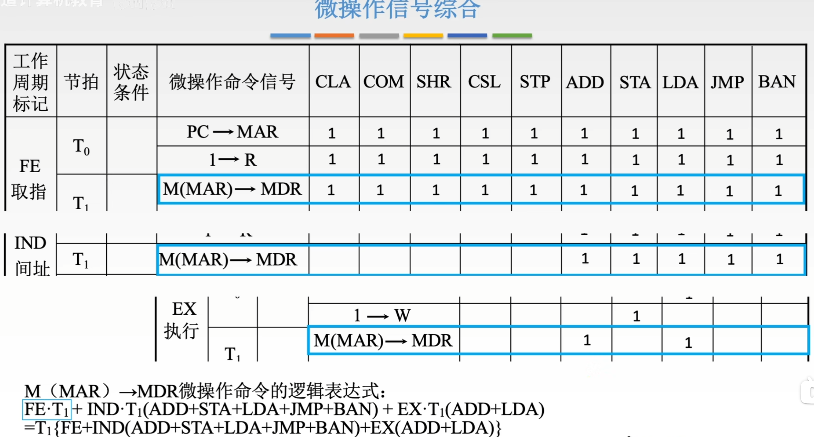
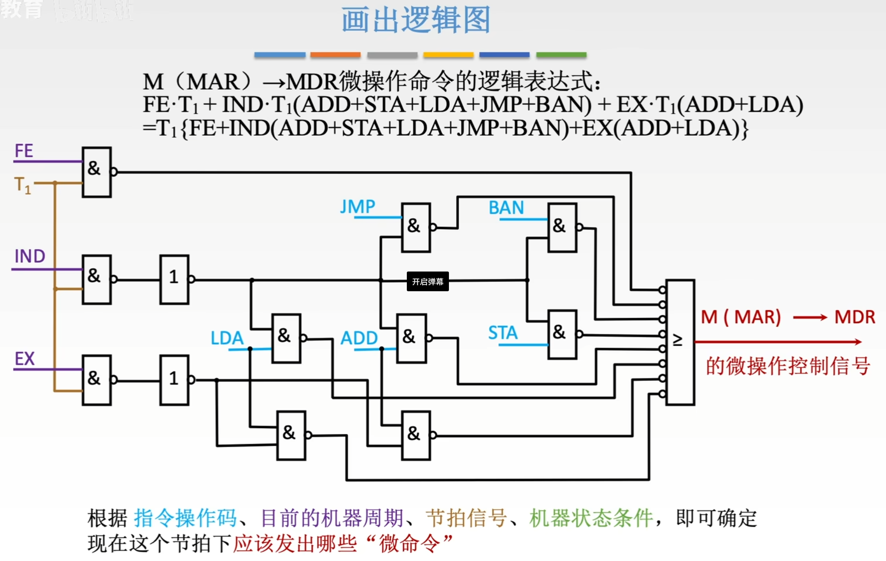
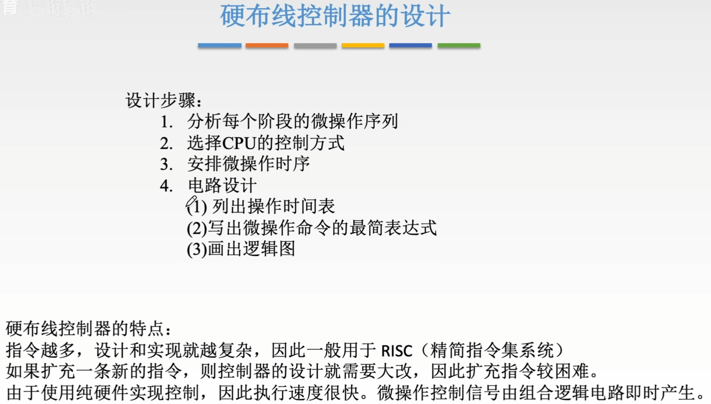

---
tags:
  - 计算机组成原理
---
# 硬布线控制器(组合逻辑控制器)

>要让$C_1$对应微操作(PC)->MAR。在所有指令的[取址周期](指令周期.md#取址周期)，取址周期时[标志触发器](指令周期.md#标志触发器)FE为1，且是第一个节拍T0为1，所以让C1接到一个与门后面

>CU的两种主要实现方式对比

1. **组合逻辑控制器（硬连线控制）**

- **工作原理**：
    - 通过**逻辑门电路直接实现控制信号的布尔表达式**（如 `C₀ = OP(ADD) · T₁`）。
    - 输入信号：**指令操作码、节拍信号、状态标志**；输出信号：**微命令序列**。
- **典型应用**：
    - **RISC架构**（如ARM早期版本）中用于高频指令（如加法、跳转），**追求极致速度**。

2. [微程序控制器](微程序控制器.md)

- **工作原理**：
    - 将控制逻辑**存储在控制存储器（CM）中**，通过读取微指令生成控制信号。
    - 每条机器指令对应一段**微程序**，微程序由多条**微指令**组成。
- **典型应用**：
    - **CISC架构**（如x86）中用于复杂指令，**便于扩展和调试**。

# 硬布线控制器的设计

## 每个阶段的微操作序列

>罗列出在不同指令操作码，机器周期，机器状态条件下，会使用到相同的微命令（注意区分微指令与微命令），图中的是M(MAR)->MDR

## 安排微操作时序
### 取指周期

>安排3个节拍，让一个周期里的微操作序列可以在这3个节拍内完成

### 间址周期

### 执行周期

## 电路设计
### 设计步骤

### 列出操作时间表
#### 取指周期

>IND是表示是否处于间址周期的触发器
>非访存指令不会间址，所以1->IND微操作命令信号是0

#### 间址周期

>可能会有多次间址，所以只有间址周期标志为0时，表示进入了最后一次间址，才会执行1->EX表示进入执行周期

#### 执行周期

### 由操作时间表得到逻辑表达式

>操作时间表表示了，M(MAR)->MDR这个微命令在哪个工作周期内，哪一个节拍里，有哪些指令会用到。

### 画出电路图

## 硬布线控制器设计总结

>硬布线控制器执行速度很快