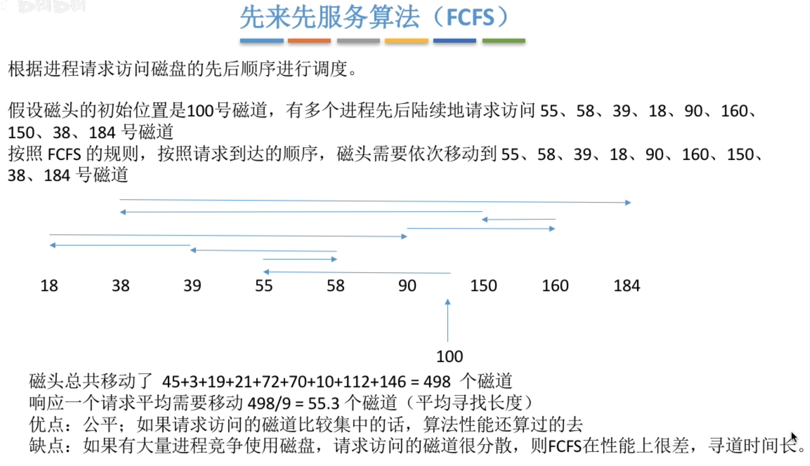
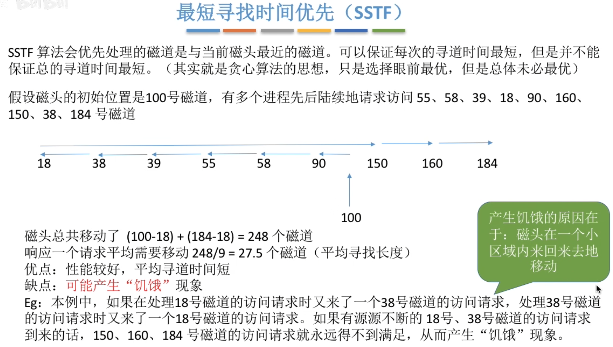
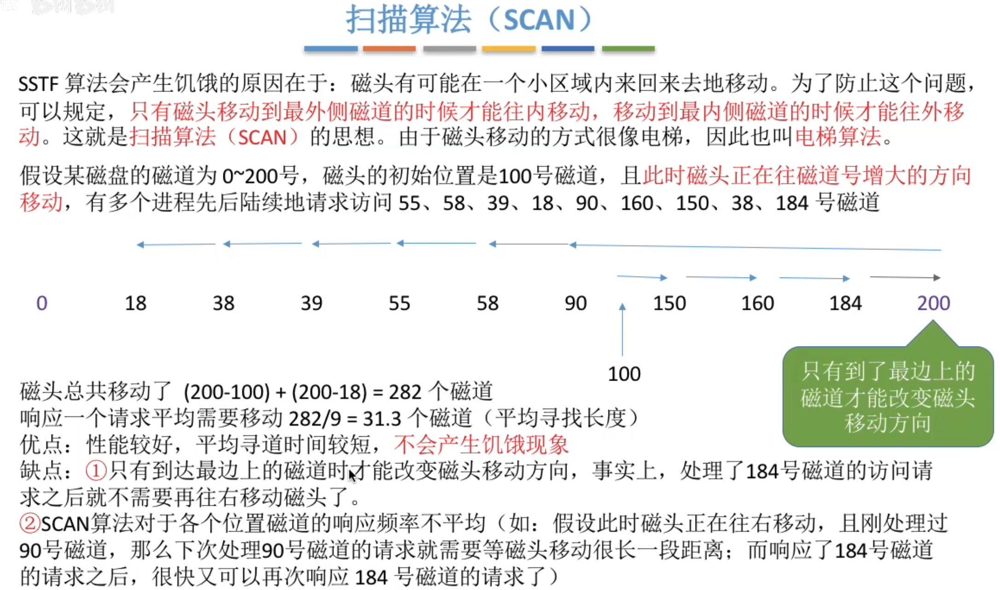
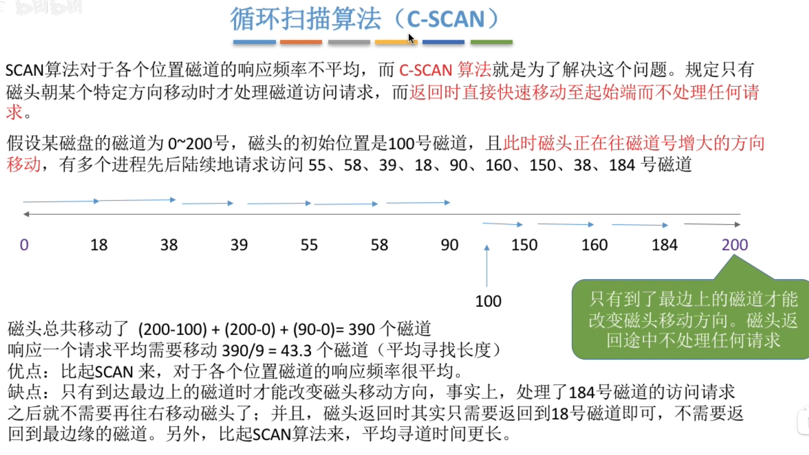
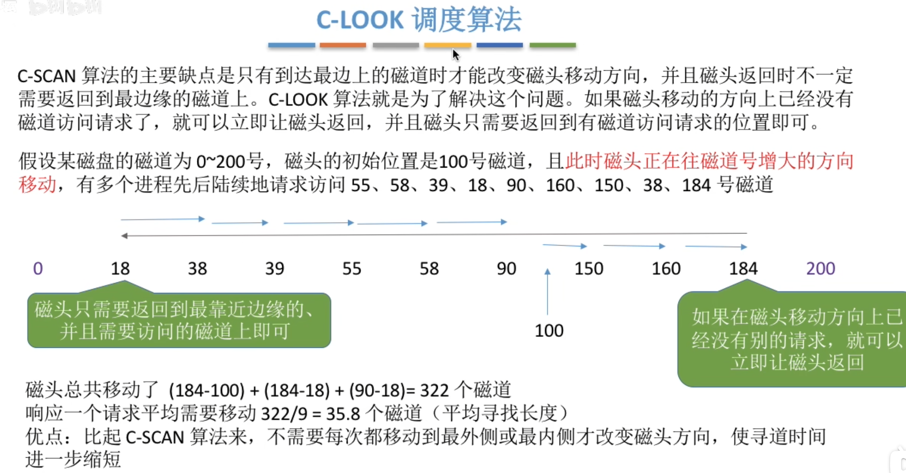
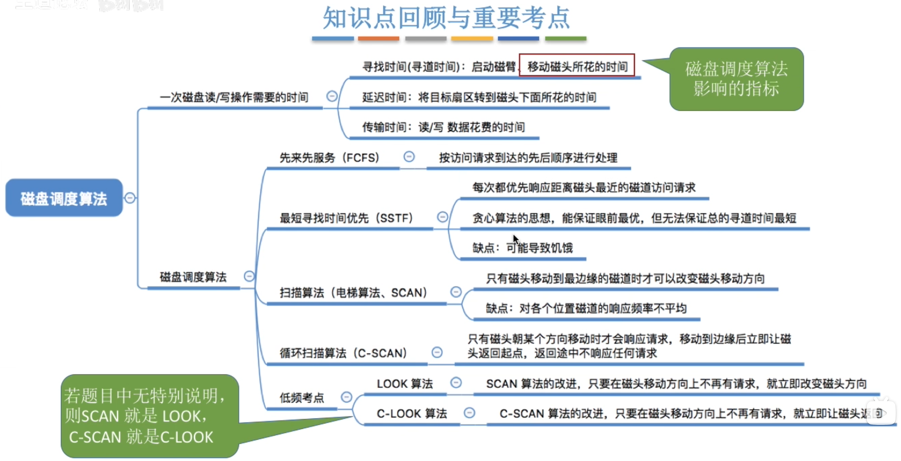

---
tags:
  - 操作系统
---
# 一次读写操作需要的时间

>寻道时间是影响最大的
# 先来先服务算法（FCFS）

# 最短寻找时间优先（SSTF）

# 扫描算法（SCAN）

## LOOK调度算法

>改进了[扫描算法（SCAN）](磁盘调度算法.md#扫描算法（SCAN）)的第一个缺点

## 循环扫描算法（C-SCAN）

>改进了[扫描算法（SCAN）](磁盘调度算法.md#扫描算法（SCAN）)的第二个缺点
>但是自己本身还有新的缺点

### C-LOOK调度算法

>对[循环扫描算法（C-SCAN）](磁盘调度算法.md#循环扫描算法（C-SCAN）)的改进

# 总结
