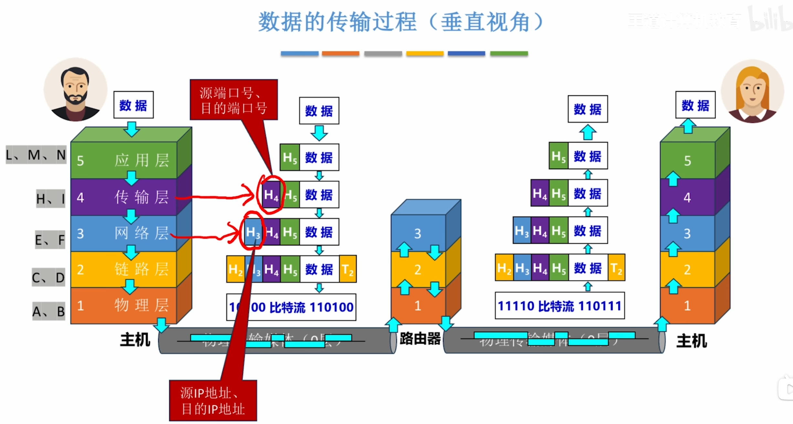
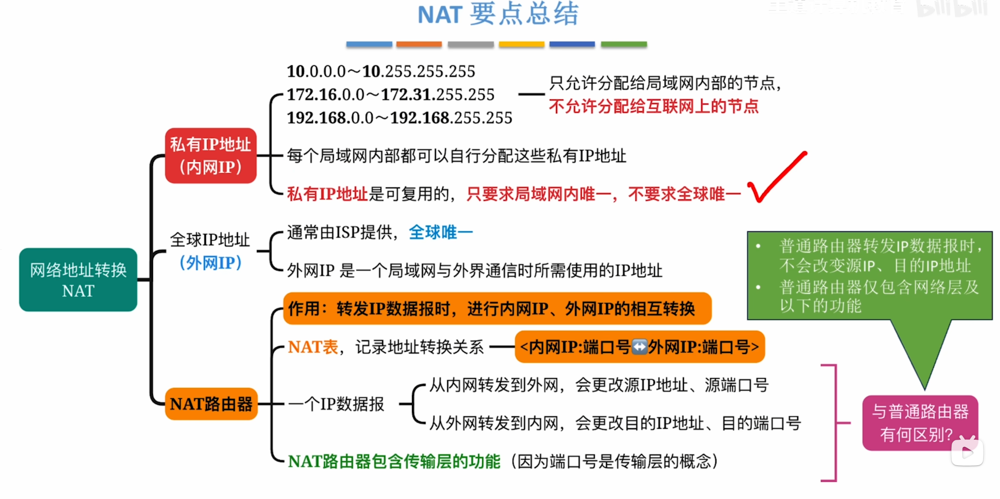
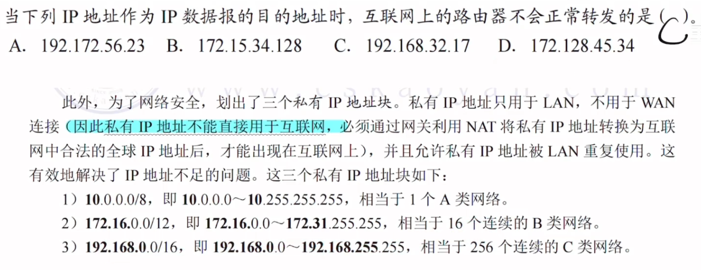
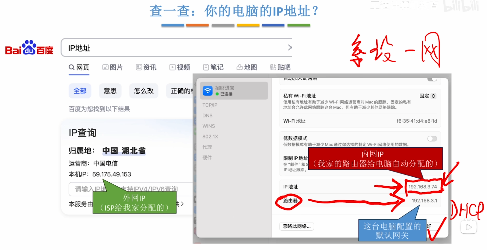
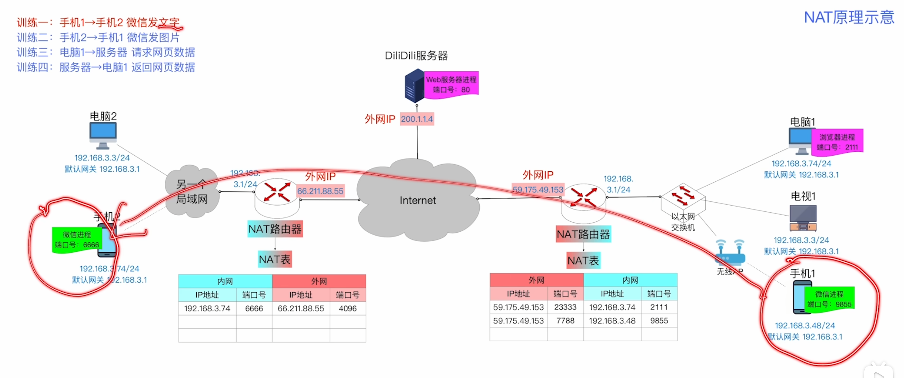
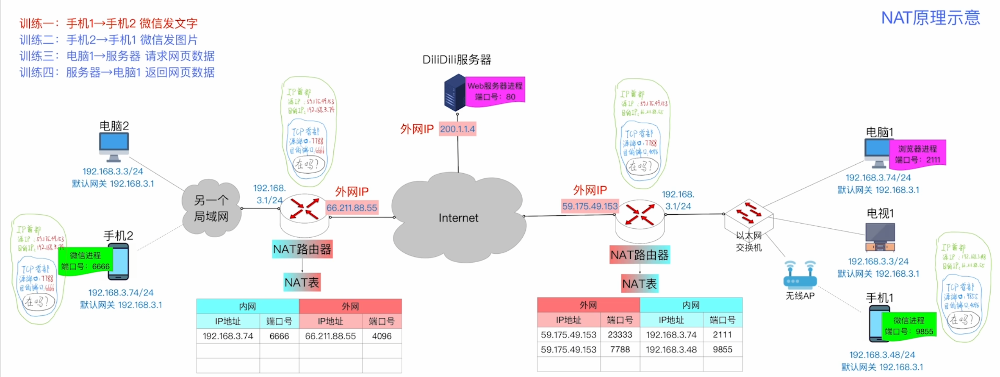
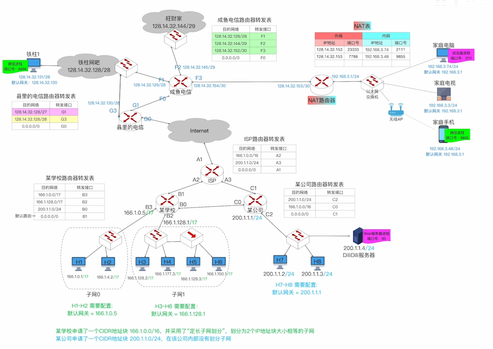

---
tags:
  - 计算机网络
---
# 传输层端口号的概念

>[无连接UDP和面向连接TCP](无连接UDP和面向连接TCP.md)

>图里的标注是教学简化，实际 H3 是完整的 IP 数据报首部，IPv4 最少 20 字节，包含的内容远不止源/目的 IP。

# NAT缓解IP地址不够用的思路

>让局域网内的各个主机共享一个IP地址，然后通过IP地址+端口号去映射到某个进程
>一个局域网对外暴露出的IP地址称为外网IP（公网IP）
>

>私有IP地址块，路由器不会正常转发

>

# NAT 原理

>从手机1发送到手机2

1. 源端口和源IP是自己在内网的，目的端口和目的IP发送方只知道接收方暴露在外的外网IP和端口
2. 经过NAT路由器 ，内网->外网，将自己的源端口和源IP（内网）通过查NAT表转换成自己外网的源端口和源IP（外网）
3. 又到了NAT路由器，外网->内网，将目的IP和目的端口（外网）转换成 内网的目的IP和目的端口（内网）
4. 通过内网的目的IP找到手机2，手机2拆掉IP数据报首部得到传输层数据，再根据传输层的目的端口就可以知道里面应用层的数据应该交给微信进程
>NAT路由器包含传输层的功能，可以修改端口号，端口是传输层的概念

# 一张综合大图
