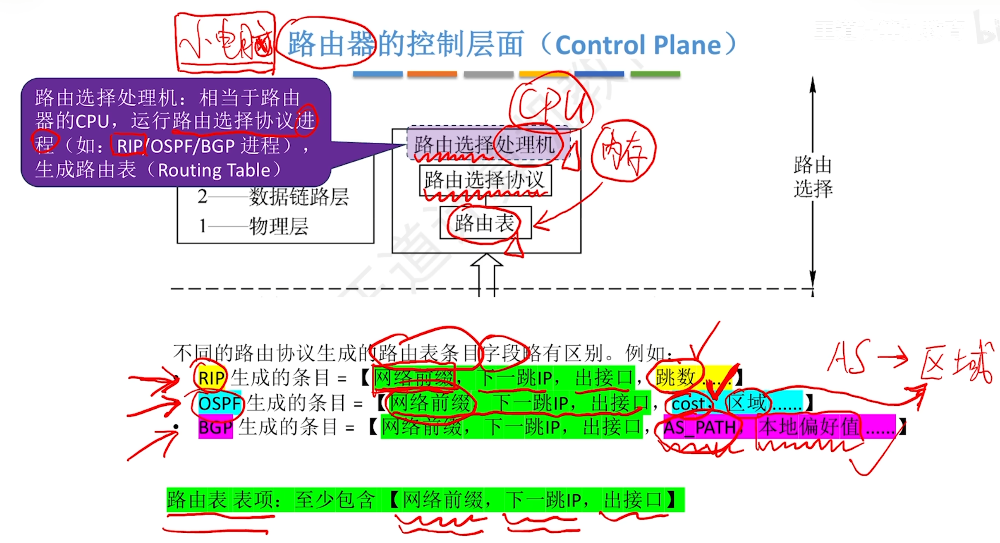
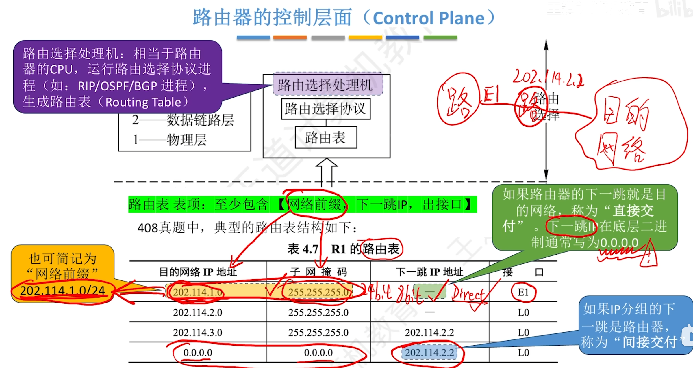
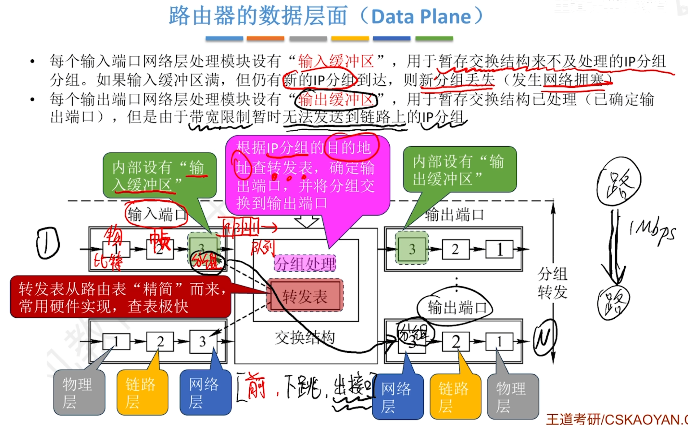
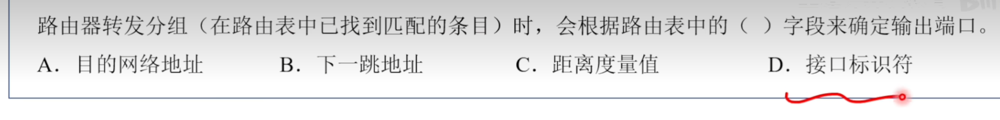
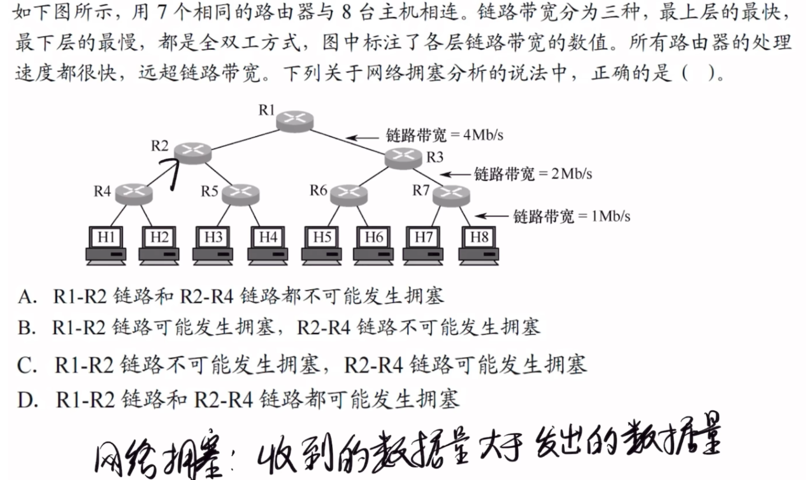
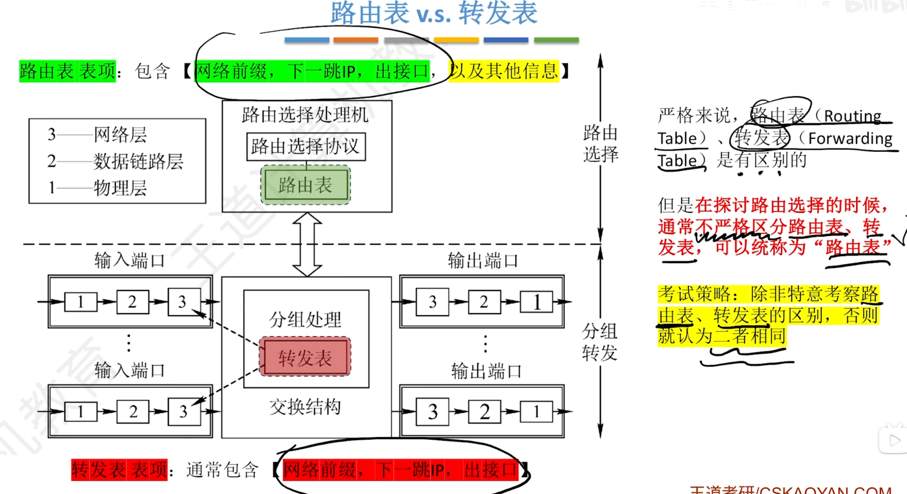
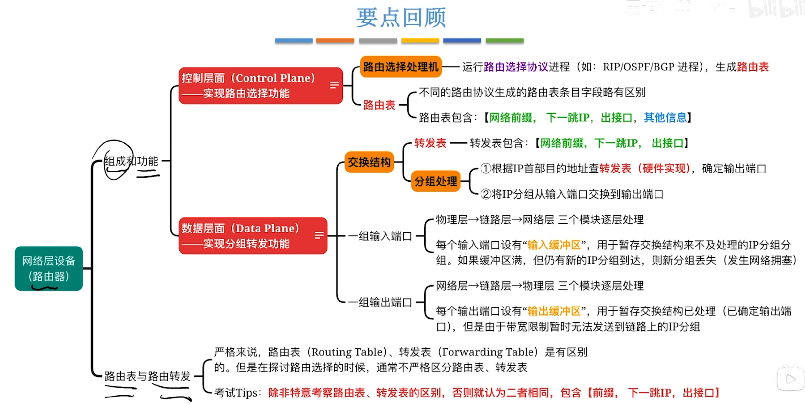

---
tags:
  - 计算机网络
---
网络层设备其实就是路由器

# 路由器的组成和功能

## 路由器的控制层面

>典型的路由表结构

## 路由器的数据层面

>分组转发部分
>
>路由器根据路由表中的接口标识符确定输出端口

### 网络拥塞

>R1-R2最多发送就是H5678全部发送到R2，也就是4Mb，不会拥塞，而R2-R4最多可能是H345678一起发送给R4是6Mb，会拥塞

## 路由表和转发表

# 总结
