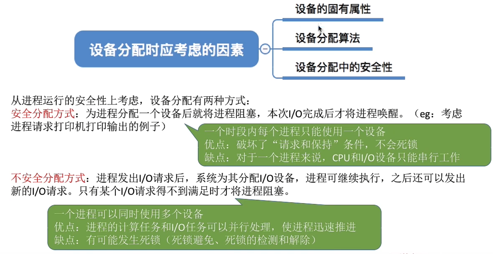
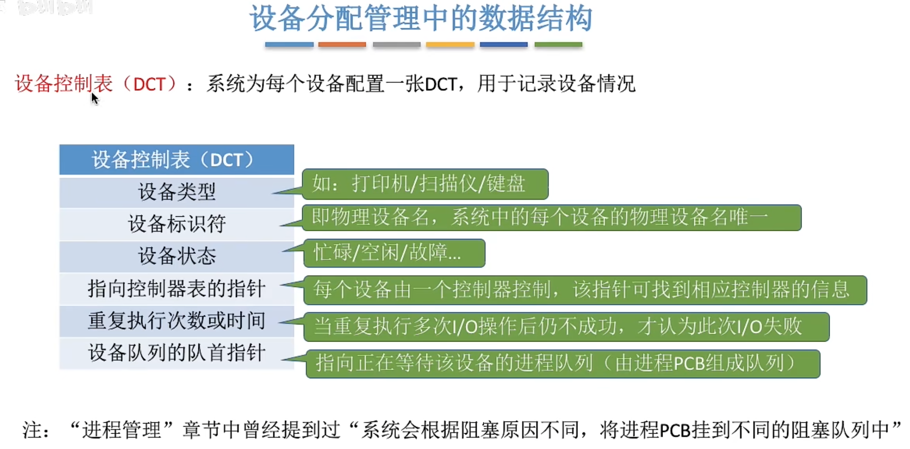
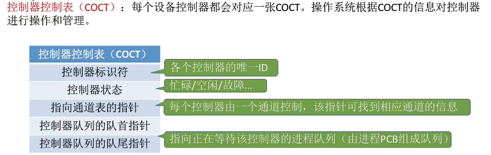
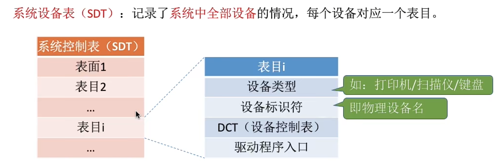
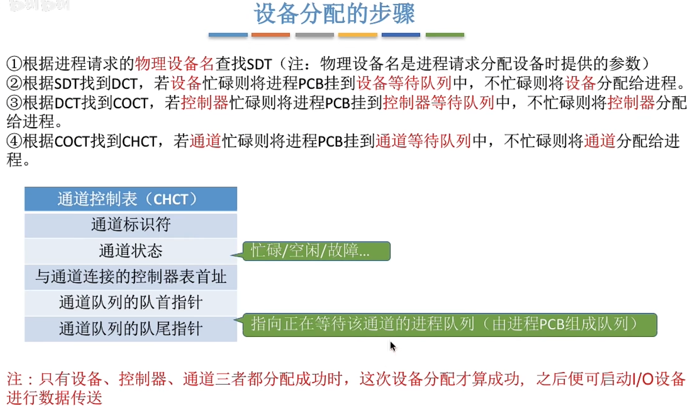
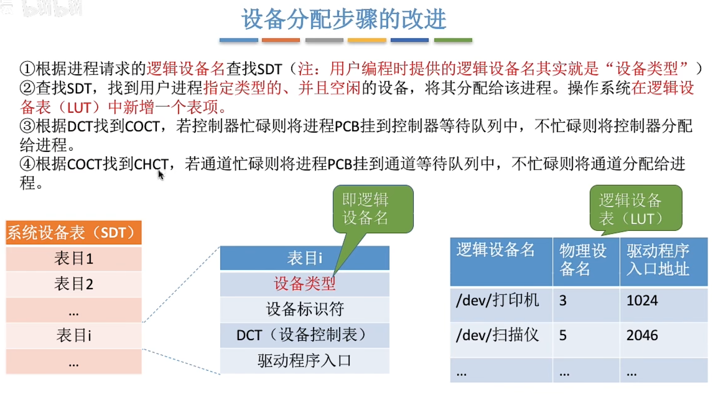
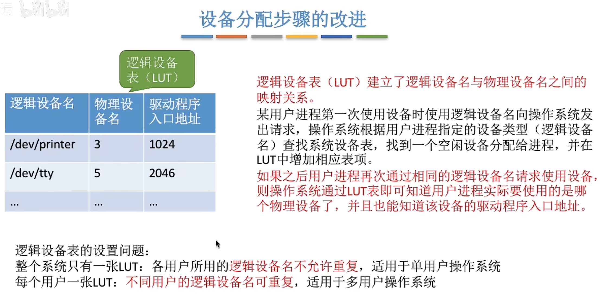
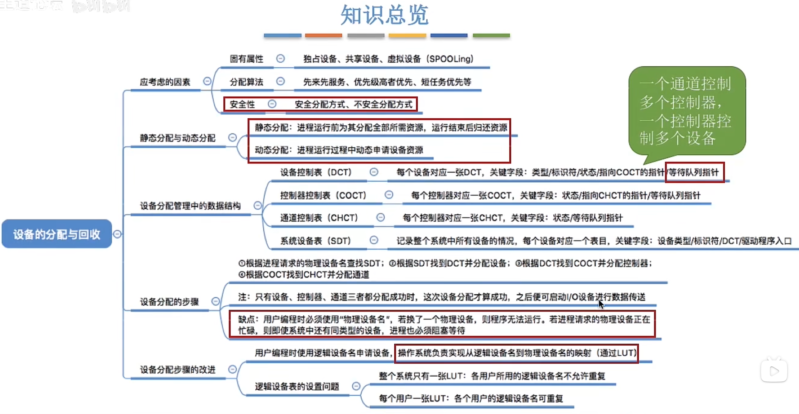

---
tags:
  - 操作系统
---
# 设备分配时应考虑的因素
## 固有属性

## 安全性

>[破坏请求和保持条件](死锁的处理策略.md#破坏请求和保持条件)

## 静态分配和动态分配
**静态分配**：进程运行前为其分配全部所需资源，运行结束后归还资源
破坏了“请求和保持”条件，不会发生死锁
**动态分配**：进程运行过程中动态申请设备资源

# 设备分配管理中的数据结构
## 设备控制表（DCT）

## 控制器控制表（COCT）

## 通道控制表（CHCT）

## 系统设备表（SDT）

## 设备分配的步骤

>[系统设备表（SDT）](设备的分配与回收.md#系统设备表（SDT）) -> [设备控制表（DCT）](设备的分配与回收.md#设备控制表（DCT）) ->[控制器控制表（COCT）](设备的分配与回收.md#控制器控制表（COCT）) -> [通道控制表（CHCT）](设备的分配与回收.md#通道控制表（CHCT）) 

# 设备分配步骤的改进

# 总结
