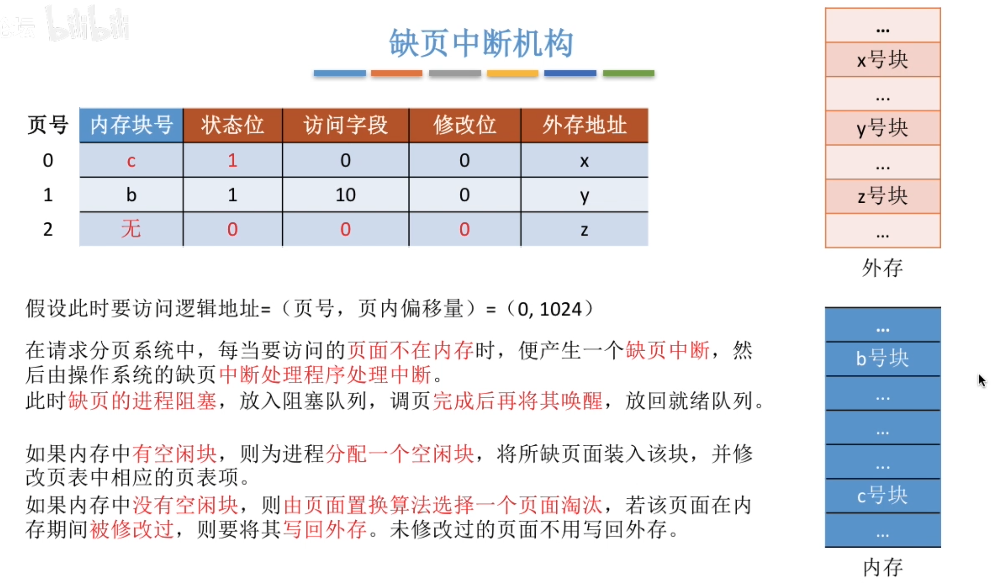
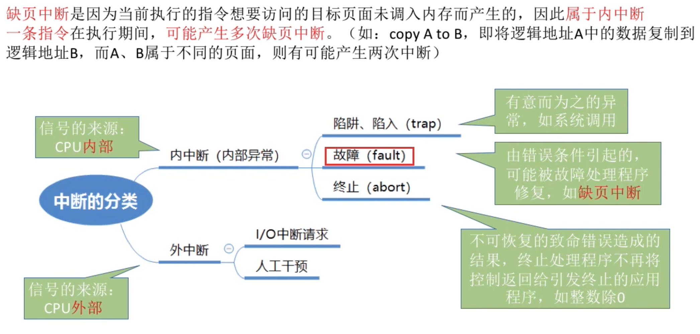
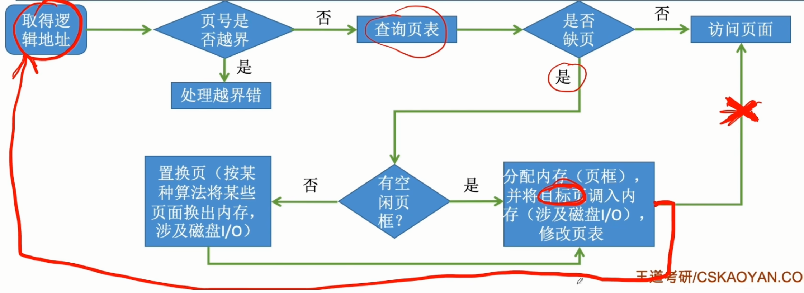
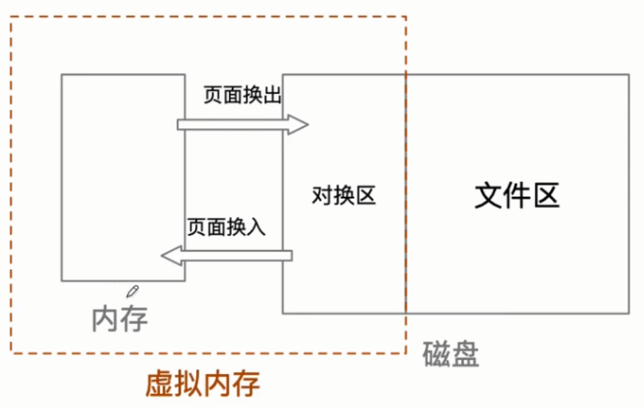
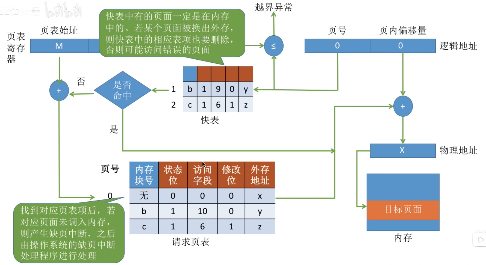
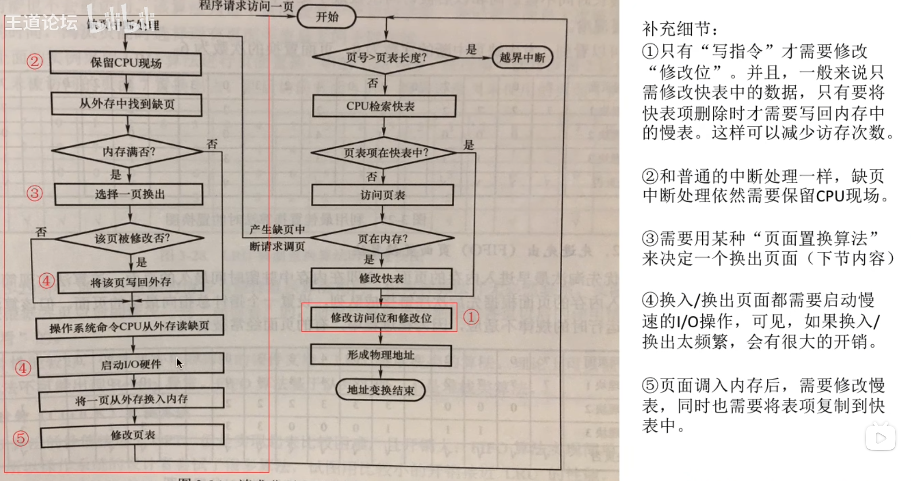
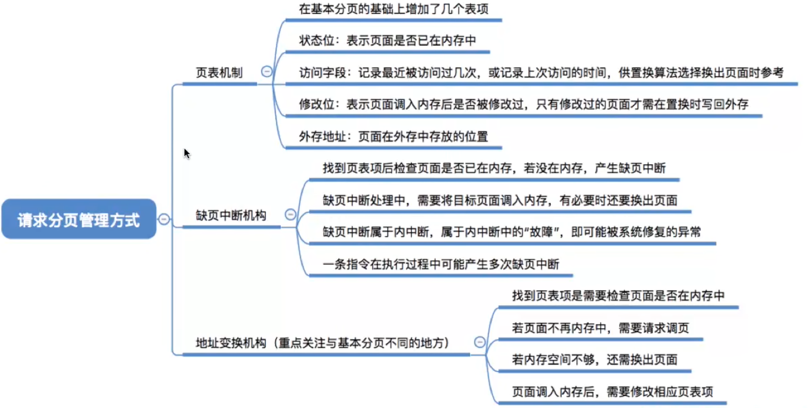

---
tags:
  - 操作系统
---

# 请求页表的结构
>
# 缺页中断机构

>缺页中断是内中断里的故障

>对换区在磁盘
# 地址变换机构

## 访问请求页表流程

>在具有快表机构的请求分页系统中，访问一个逻辑地址
>时，若发生缺页，则地址变换步骤是：
>查快表（未命中）一一查慢表（发现未调入内存）一一调页（调
>入的页面对应的表项会直接加入快表）一一查快表（命中）一一访问目标内存单元

# 总结
