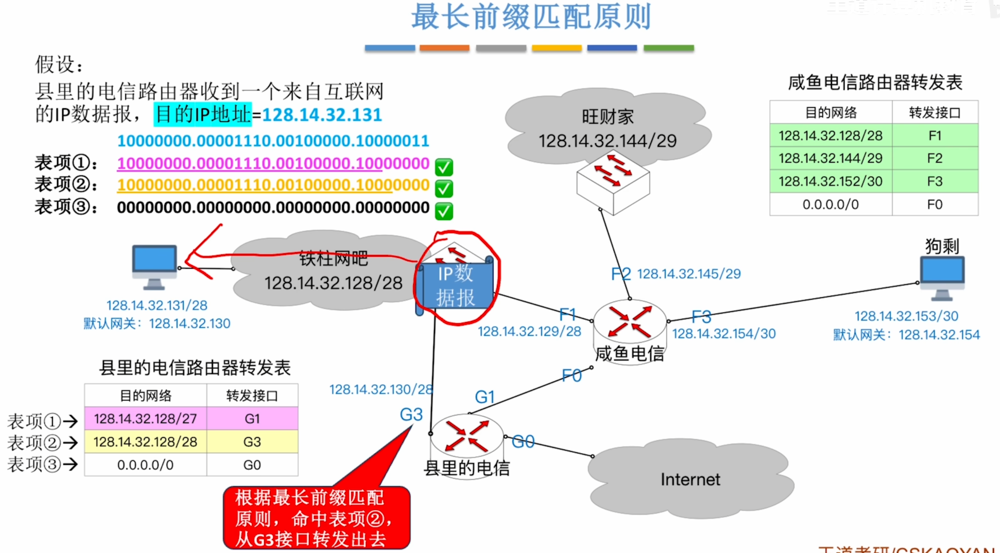
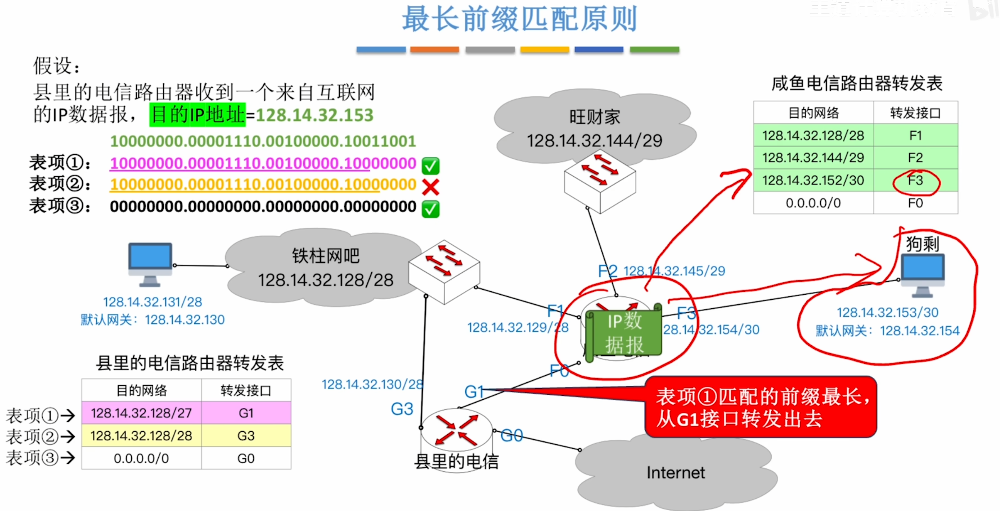
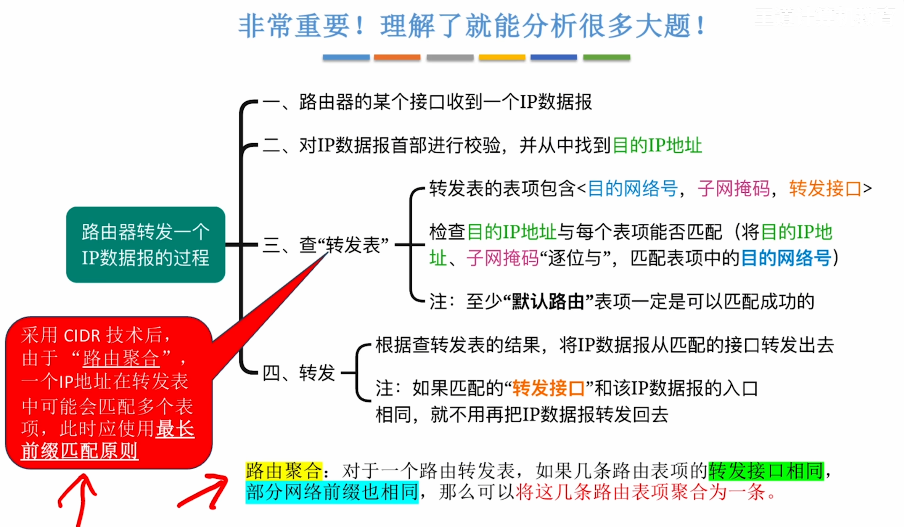
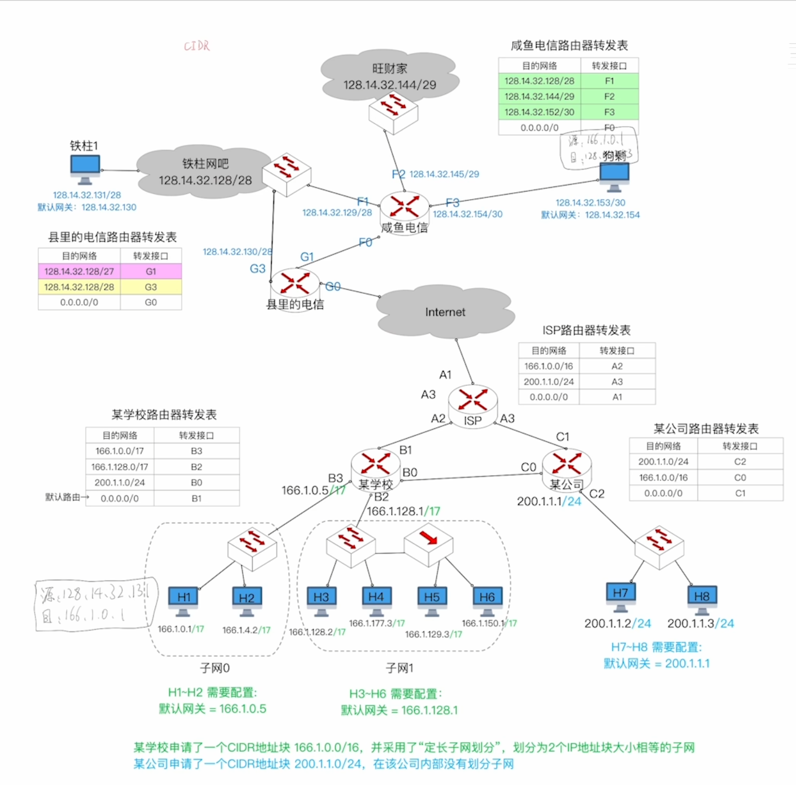
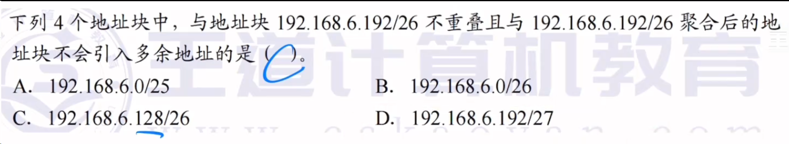
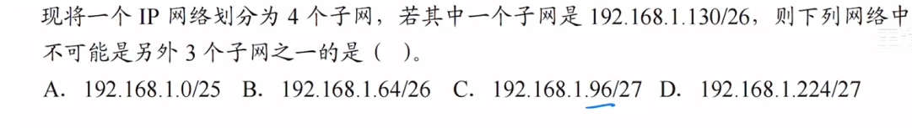
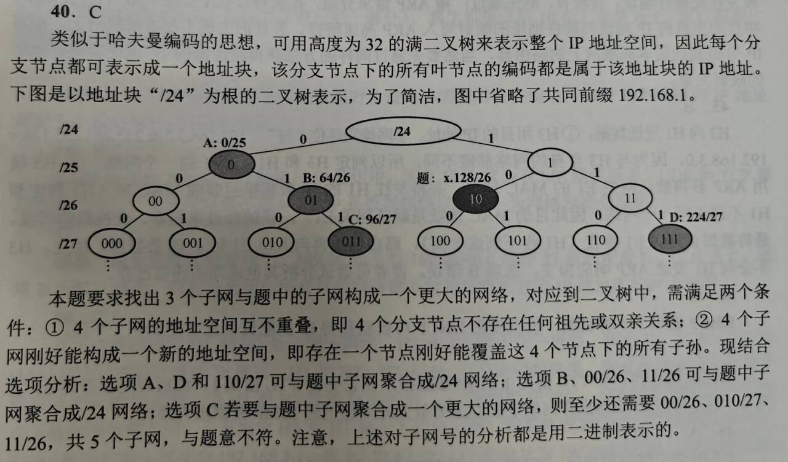

---
tags:
  - 计算机网络
---

>无效地址：就是这个地址的前缀(只看网络前缀)是（前27位）是一样的可以匹配上这个聚合的表项，但是这个地址所指的是一个无效的没有被分配的地址，这个地址进入咸鱼电信的路由，发现只能匹配上默认路由那项，又发现与转发接口与来的接口一致，那么就会丢弃

# 最长前缀匹配原则




采用[无分类编址CIDR](无分类编址CIDR.md)和路由聚合之后

>需要使用最长前缀匹配原则

# 一张综合大图


# 重叠与引入多余地址

## 解题思路

本题考察的是 IP 地址块的划分、聚合（路由聚合/超网）以及 CIDR 地址空间的理解。

- **重叠**：指两个地址块包含的 IP 地址范围有交集。
- **引入多余地址**：指将两个地址块聚合为一个更大的地址块时，新地址块中包含的 IP 地址总数，大于这两个原地址块包含的 IP 地址数之和。

## 核心解题步骤

### 1. 分析已知地址块

题目给定的地址块为：`192.168.6.192/26`

- 子网掩码为 `/26`，即前 26 位是网络位，后 6 位是主机位。
- 地址块的大小为 $2^6 = 64$ 个 IP 地址。
- 第四字节（即最后一个字节）的起始地址是 192。
- 该地址块的 IP 范围是：`192.168.6.192` 到 `192.168.6.255`（包含 64 个地址）。

### 2. 理解“不重叠”与“引入多余地址”

- **不重叠**：要求待选地址块的 IP 范围与 `192.168.6.192 ~ 192.168.6.255` 没有交集。
- **引入多余地址**：将待选地址块与已知地址块聚合。聚合通常是指找到一个包含这两个地址块的最小的、连续的 CIDR 地址块。
    - 如果聚合后的地址块大小 **等于** 两个原地址块大小之和，说明没有引入多余地址。
    - 如果聚合后的地址块大小 **大于** 两个原地址块大小之和，说明引入了多余地址（即聚合后的地址块中，包含了一些不属于这两个原地址块的 IP 地址）。

### 3. 逐项分析选项

**A. `192.168.6.0/25`**

- 掩码 `/25`，大小为 $2^7 = 128$ 个 IP 地址。
- 范围是：`192.168.6.0` 到 `192.168.6.127`。
- 与已知地址块（192~255）不重叠。
- 聚合：将 `0~127` 和 `192~255` 聚合。
    - 这两个块之间还隔着 `128~191` 的区间。
    - 包含 `0~127` 和 `192~255` 的最小块，必须覆盖整个 `0~255` 的范围，即 `192.168.6.0/24`（256 个地址）。
    - 两个原地址块大小之和：$128 + 64 = 192$。
    - 聚合后大小：$256$。
    - 引入了 $256 - 192 = 64$ 个多余地址（即 128~191 的区间）。不符合题意。

**B. `192.168.6.0/26`**

- 掩码 `/26`，大小为 $2^6 = 64$ 个 IP 地址。
- 范围是：`192.168.6.0` 到 `192.168.6.63`。
- 与已知地址块（192~255）不重叠。
- 聚合：将 `0~63` 和 `192~255` 聚合。
    - 这两个块之间隔着 `64~191` 的区间。
    - 包含它们的最小块是 `192.168.6.0/24`（256 个地址）。
    - 两个原地址块大小之和：$64 + 64 = 128$。
    - 聚合后大小：$256$。
    - 引入了 $256 - 128 = 128$ 个多余地址。不符合题意。

**C. `192.168.6.128/26`**

- 掩码 `/26`，大小为 64 个 IP 地址。
- 范围是：`192.168.6.128` 到 `192.168.6.191`。
- 与已知地址块（192~255）不重叠（刚好紧挨着，191 后面是 192）。
- 聚合：将 `128~191` 和 `192~255` 聚合。
    - 这两个块是连续的，合并后刚好覆盖 `192.168.6.128` 到 `192.168.6.255`。
    - 这个合并后的范围大小为 $64 + 64 = 128$ 个地址。
    - 128 个地址对应的 CIDR 是 `/25`（因为 $2^7 = 128$）。
    - 聚合后的地址块为 `192.168.6.128/25`。
    - 聚合后大小（128）等于两个原地址块大小之和（$64 + 64 = 128$）。
    - 没有引入多余地址。符合题意。

**D. `192.168.6.192/27`**

- 掩码 `/27`，大小为 $2^5 = 32$ 个 IP 地址。
- 范围是：`192.168.6.192` 到 `192.168.6.223`。
- 已知地址块范围是 `192.168.6.192` 到 `192.168.6.255`。
- 显然，`192~223` 完全包含在 `192~255` 之中。
- 这两个地址块存在**重叠**，直接不符合题目“不重叠”的条件。

### 4. 结论

通过上述分析，只有选项 C 既与已知地址块不重叠，且两者聚合后刚好形成一个完整的 CIDR 地址块，没有引入任何多余的地址。

---

## 标准答案

C. 192.168.6.128/26

```
目标地址块： 192.168.6.192/26 → 范围 192~255，主机号6位共 64 个 IP 

选项 C： 192.168.6.128/26 → 范围 128~191，主机号6位共 64 个 IP 

───────────────────────────── 
两者拼起来 → 范围 128~255，共 128 个 IP 

聚合结果 /25 → 范围 128~255，共 128 个 IP 
多余 = 128 - 128 = 0 ✅
```

```
选项 A： 192.168.6.0/25 → 范围 0~127，共 128 个 IP 
───────────────────────────── 
两者拼起来 → 128 + 64 = 192 个 IP 

但聚合结果 /24 → 范围 0~255，共 256 个 IP 多余 = 256 - 192 = 64 ❌ （这 64 个就是 128~191 这一段）
```

# 画二叉树例题


>P169