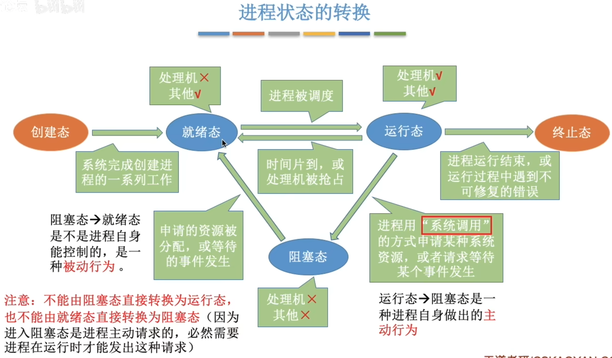
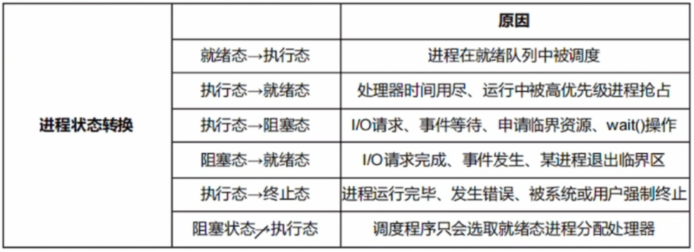
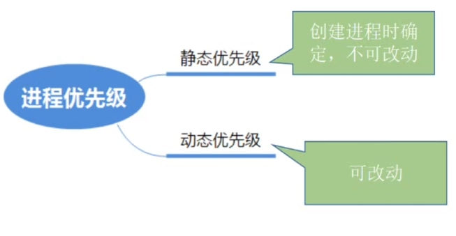
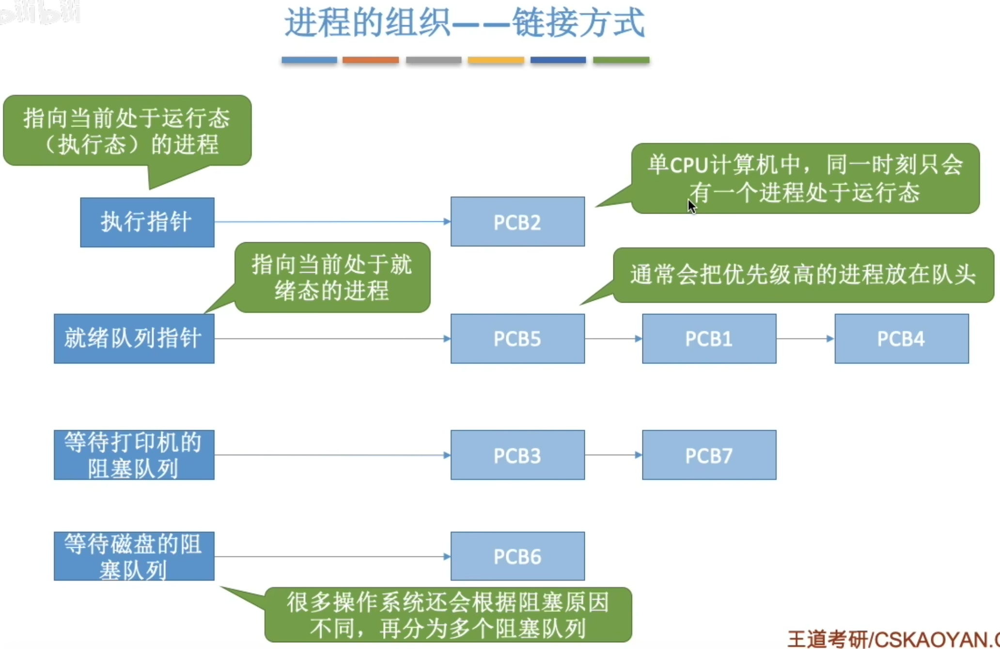
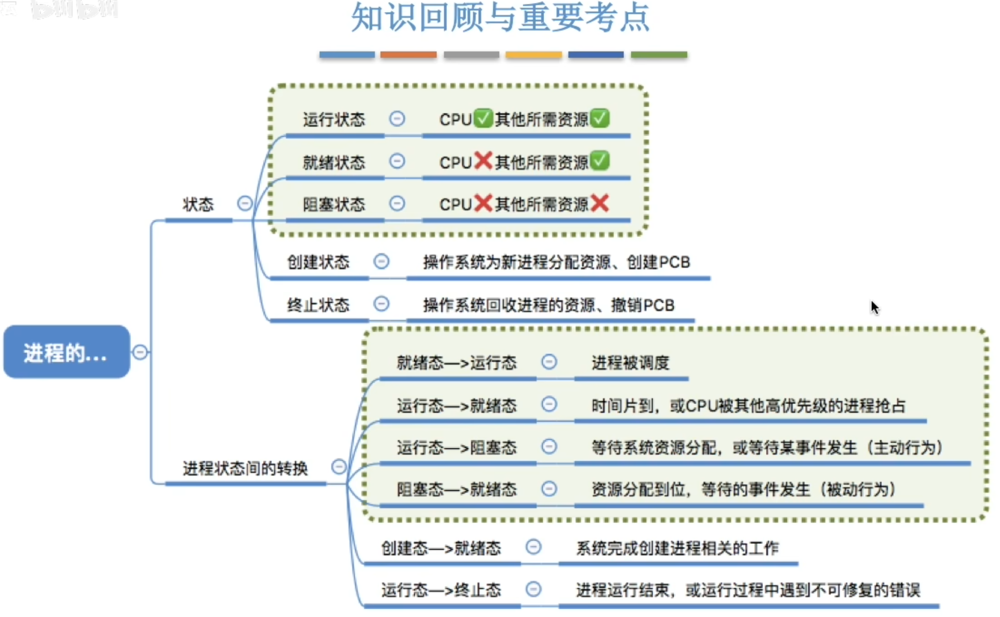

---
tags:
  - 操作系统
---

>进程状态转换的具体实现[[进程控制]]
# 进程的状态

>阻塞进程,执行CPU调度,唤醒进程都涉及到安全问题，所以必须要在内核态执行，执行前、执行时、执行后都是内核态。
>而系统调用则是处于用户态的进程想要申请做一些超出他权限的事情，所以执行前是用户态，执行时是内核态，执行后是用户态。
# 进程的优先级

# 进程的组织
## 链接方式

>大部分操作系统都是使用的链接方式
## 索引方式

# 小结
