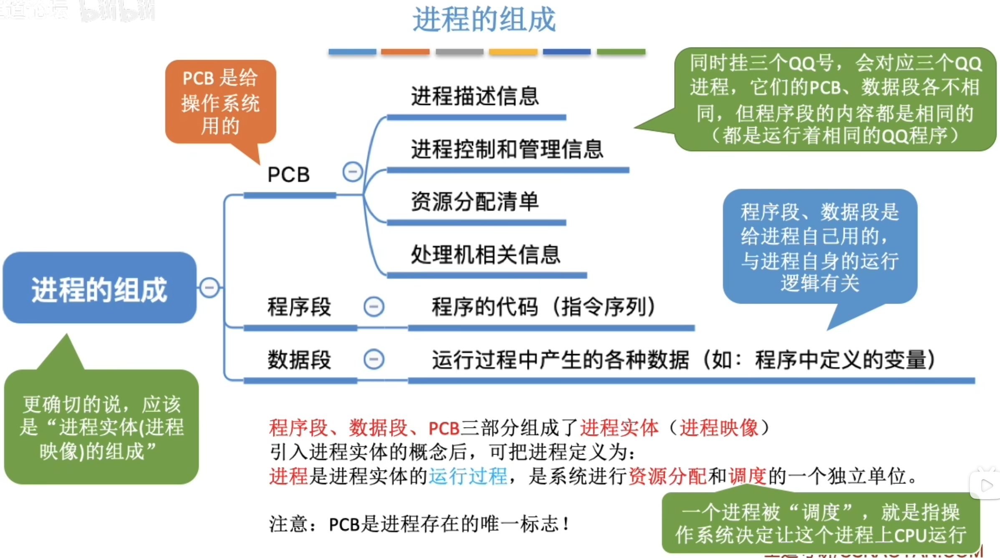
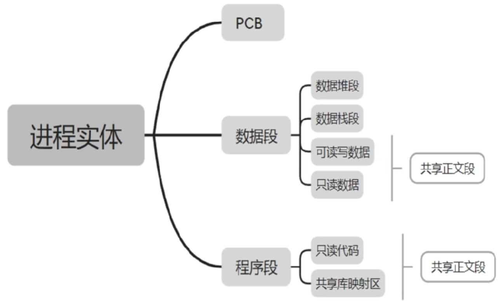
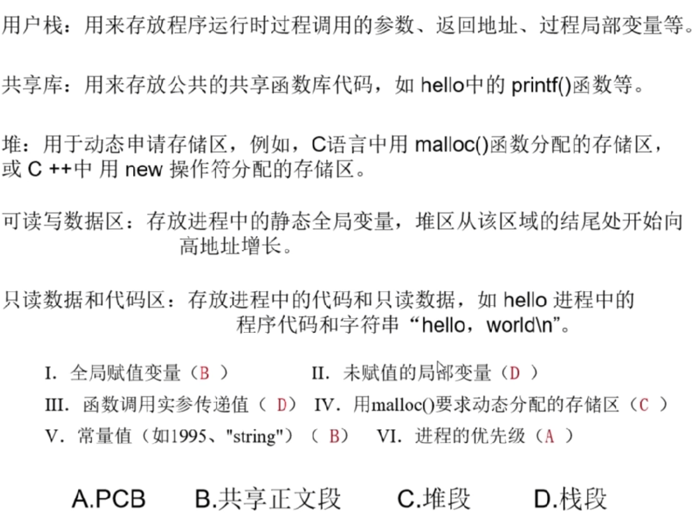
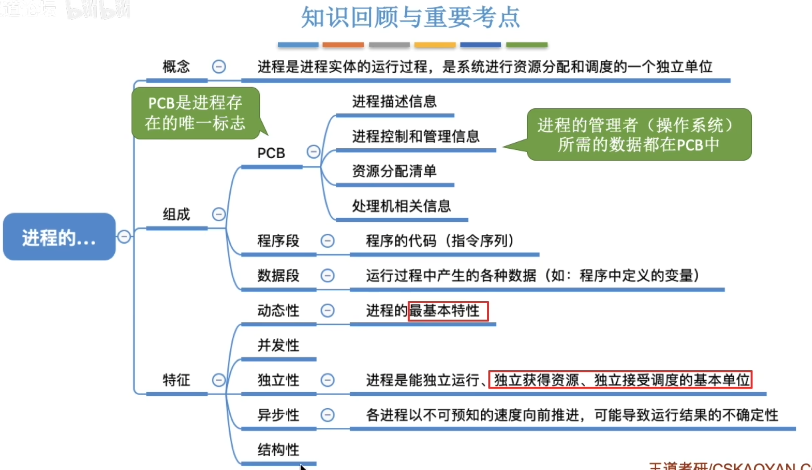

---
tags:
  - 操作系统
---
程序：是静态的，就是个存放在磁盘里的
可执行文件，如：QQ.exe。
进程：是动态的，是程序的一次执行过程，
如：可同时启动多次QQ程序

>进程三个组成部分：PCB、程序段、数据段。其中，数据段包含的是与程序逻辑本身相关的数据；
>程序段即为执行的代码数据。因此，若不属于程序段、数据段，则必属于PCB。
>PCB存在的意义：操作系统通过PCB来管理和控制进程，因此管理、控制进程所需的参数一定是放在PCB中的。

>进程映像=PCB+程序段+数据段

>PCB(一个专门的数据结构)
>PID：系统为每个进程分配的唯一编号（P39）

# 父进程
- 父进程和子进程是相互独立的，可以并发执行
- 每个进程的地址空间都是独立的，即每个进程都有自己的专属地址空间