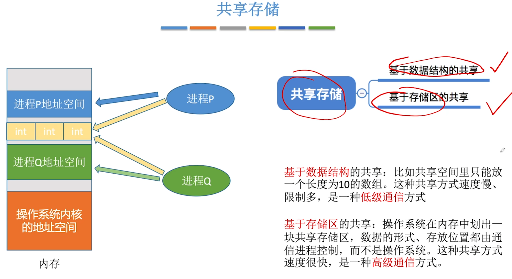
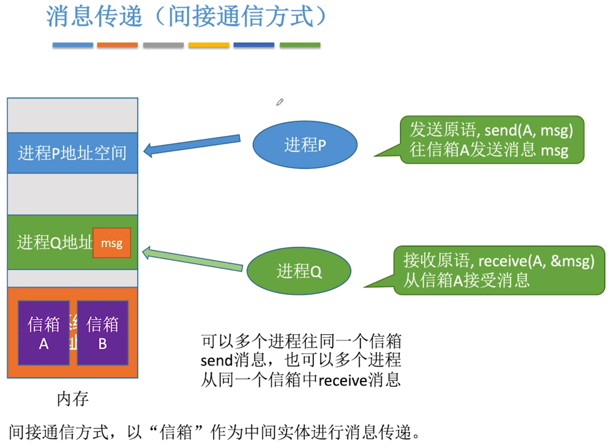
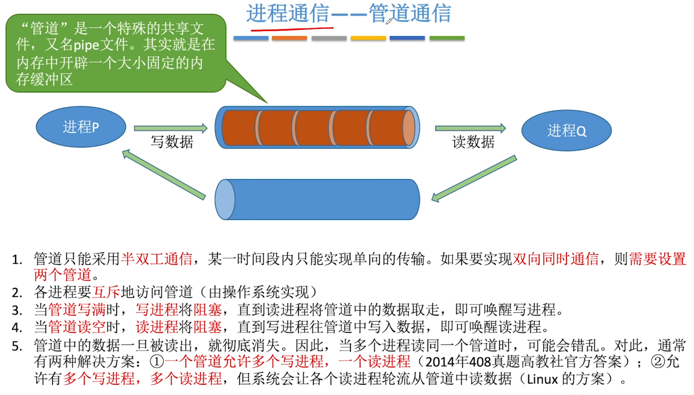
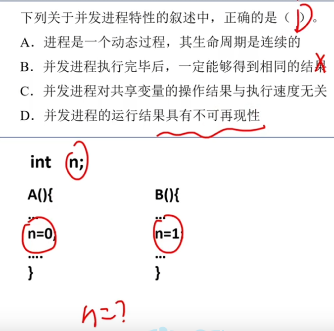

---
tags:
  - 操作系统
---
# 共享存储

# 消息传递
## 直接通信方式

## 间接通信方式

>两种通信方式的区别是：直接通信的原语是指名道姓的指出要发送给哪个进程，而间接通信的原语是指出要发送到哪个信箱

# 管道通信

>管道内的数据是先进先出的

# 并发进程
两个进程同时并发的进行

A进程和B进程并发的进行，共享变量n的结果取决于最后一次运行的是A进程还是B进程，所以与执行速度有关且结果不可预测